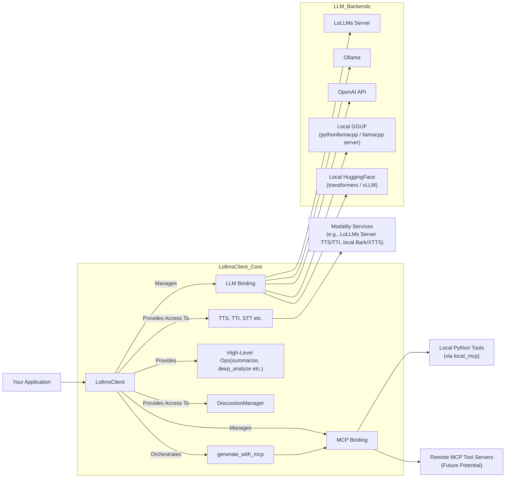

# LoLLMs Client Library

[](https://opensource.org/licenses/Apache-2.0)
[](https://badge.fury.io/py/lollms_client)
[](https://pypi.org/project/lollms_client/)
[](https://pepy.tech/project/lollms-client)
[](DOC_USE.md)
[](DOC_DEV.md)
[](https://github.com/ParisNeo/lollms_client/stargazers/)
[](https://github.com/ParisNeo/lollms_client/issues)

**`lollms_client`** is a powerful and flexible Python library designed to simplify interactions with the **LoLLMs (Lord of Large Language Models)** ecosystem and various other Large Language Model (LLM) backends. It provides a unified API for text generation, multimodal operations (text-to-image, text-to-speech, etc.), and robust function calling through the Model Context Protocol (MCP).

Whether you're connecting to a remote LoLLMs server, an Ollama instance, the OpenAI API, or running models locally using GGUF (via `llama-cpp-python` or a managed `llama.cpp` server), Hugging Face Transformers, or vLLM, `lollms-client` offers a consistent and developer-friendly experience.

## Key Features

*   🔌 **Versatile Binding System:** Seamlessly switch between different LLM backends (LoLLMs, Ollama, OpenAI, Llama.cpp, Transformers, vLLM, OpenLLM) without major code changes.
*   🗣️ **Multimodal Support:** Interact with models capable of processing images and generate various outputs like speech (TTS) and images (TTI).
*   🤖 **Function Calling with MCP:** Empowers LLMs to use external tools and functions through the Model Context Protocol (MCP), with built-in support for local Python tool execution via `local_mcp` binding and its default tools (file I/O, internet search, Python interpreter, image generation).
*   🎭 **Personalities as Agents:** Personalities can now define their own set of required tools (MCPs) and have access to static or dynamic knowledge bases (`data_source`), turning them into self-contained, ready-to-use agents.
*   🚀 **Streaming & Callbacks:** Efficiently handle real-time text generation with customizable callback functions, including during MCP interactions.
*   📑 **Sequential Summarization:** A `summarize` method to process and summarize texts that exceed the model's context window.
*   📝 **Advanced Structured Content Generation:** Reliably generate structured JSON output from natural language prompts using the `generate_structured_content` helper method.
*   💬 **Advanced Discussion Management:** Robustly manage conversation histories with `LollmsDiscussion`, featuring branching, context exporting, and automatic pruning.
*   🧠 **Persistent Memory & Data Zones:** `LollmsDiscussion` now supports multiple, distinct data zones (`user_data_zone`, `discussion_data_zone`, `personality_data_zone`) and a long-term `memory` field. This allows for sophisticated context layering and state management.
*   ✍️ **Automatic Memorization:** A new `memorize()` method allows the AI to analyze a conversation and extract key facts, appending them to the long-term `memory` for recall in future sessions.
*   📊 **Detailed Context Analysis:** The `get_context_status()` method now provides a rich, detailed breakdown of the prompt context, showing the content and token count for each individual component (system prompt, data zones, message history).
*   ⚙️ **Configuration Management:** Flexible ways to configure bindings and generation parameters.
*   🧩 **Extensible:** Designed to easily incorporate new LLM backends and modality services, including custom MCP toolsets.
*   📝 **High-Level Operations:** Includes convenience methods for complex tasks like sequential summarization and deep text analysis directly within `LollmsClient`.

## Installation

You can install `lollms_client` directly from PyPI:

```bash
pip install lollms-client
```

This will install the core library. Some bindings may require additional dependencies (e.g., `llama-cpp-python`, `torch`, `transformers`, `ollama`, `vllm`). The library attempts to manage these using `pipmaster`, but for complex dependencies (especially those requiring compilation like `llama-cpp-python` with GPU support), manual installation might be preferred.

## Quick Start

Here's a very basic example of how to use `LollmsClient` to generate text with a LoLLMs server (ensure one is running at `http://localhost:9600`):

```python
from lollms_client import LollmsClient, MSG_TYPE
from ascii_colors import ASCIIColors

# Callback for streaming output
def simple_streaming_callback(chunk: str, msg_type: MSG_TYPE, params=None, metadata=None) -> bool:
    if msg_type == MSG_TYPE.MSG_TYPE_CHUNK:
        print(chunk, end="", flush=True)
    elif msg_type == MSG_TYPE.MSG_TYPE_EXCEPTION:
        ASCIIColors.error(f"\nStreaming Error: {chunk}")
    return True # True to continue streaming

try:
    # Initialize client to connect to a LoLLMs server
    # For other backends, change 'binding_name' and provide necessary parameters.
    # See DOC_USE.md for detailed initialization examples.
    lc = LollmsClient(
        binding_name="lollms",
        host_address="http://localhost:9600"
    )

    prompt = "Tell me a fun fact about space."
    ASCIIColors.yellow(f"Prompt: {prompt}")

    # Generate text with streaming
    ASCIIColors.green("Streaming Response:")
    response_text = lc.generate_text(
        prompt,
        n_predict=100,
        stream=True,
        streaming_callback=simple_streaming_callback
    )
    print("\n--- End of Stream ---")

    # The 'response_text' variable will contain the full concatenated text
    # if streaming_callback returns True throughout.
    if isinstance(response_text, str):
        ASCIIColors.cyan(f"\nFull streamed text collected: {response_text[:100]}...")
    elif isinstance(response_text, dict) and "error" in response_text:
        ASCIIColors.error(f"Error during generation: {response_text['error']}")

except ValueError as ve:
    ASCIIColors.error(f"Initialization Error: {ve}")
    ASCIIColors.info("Ensure a LoLLMs server is running or configure another binding.")
except ConnectionRefusedError:
    ASCIIColors.error("Connection refused. Is the LoLLMs server running at http://localhost:9600?")
except Exception as e:
    ASCIIColors.error(f"An unexpected error occurred: {e}")

```

### Advanced Structured Content Generation

The `generate_structured_content` method is a powerful utility for forcing an LLM's output into a specific JSON format. It's ideal for extracting information, getting consistent tool parameters, or any task requiring reliable, machine-readable output.

```python
from lollms_client import LollmsClient
import json

lc = LollmsClient(binding_name="ollama", model_name="llama3")

text_block = "John Doe is a 34-year-old software engineer from New York. He loves hiking and Python programming."

# Define the exact JSON structure you want
output_template = {
    "full_name": "string",
    "age": "integer",
    "profession": "string",
    "city": "string",
    "hobbies": ["list", "of", "strings"]
}

# Generate the structured data
extracted_data = lc.generate_structured_content(
    prompt=f"Extract the relevant information from the following text:\n\n{text_block}",
    output_format=output_template
)

if extracted_data:
    print(json.dumps(extracted_data, indent=2))
# Expected output:
# {
#   "full_name": "John Doe",
#   "age": 34,
#   "profession": "software engineer",
#   "city": "New York",
#   "hobbies": ["hiking", "Python programming"]
# }
```

### Putting It All Together: An Advanced Agentic Example

Let's create a **Python Coder Agent**. This agent will use a set of coding rules from a local file as its knowledge base and will be equipped with a tool to execute the code it writes. This demonstrates the synergy between `LollmsPersonality` (with `data_source` and `active_mcps`), `LollmsDiscussion`, and the MCP system.

#### Step 1: Create the Knowledge Base (`coding_rules.txt`)

Create a simple text file with the rules our agent must follow.

```text
# File: coding_rules.txt

1.  All Python functions must include a Google-style docstring.
2.  Use type hints for all function parameters and return values.
3.  The main execution block should be protected by `if __name__ == "__main__":`.
4.  After defining a function, add a simple example of its usage inside the main block.
5.  Print the output of the example usage to the console.
```

#### Step 2: The Main Script (`agent_example.py`)

This script will define the personality, initialize the client, and run the agent.

```python
from pathlib import Path
from lollms_client import LollmsClient, LollmsPersonality, LollmsDiscussion, MSG_TYPE, trace_exception
from ascii_colors import ASCIIColors
import json

# A detailed callback to visualize the agent's process
def agent_callback(chunk: str, msg_type: MSG_TYPE, params: dict = None, **kwargs) -> bool:
    if not params: params = {}
    
    if msg_type == MSG_TYPE.MSG_TYPE_STEP:
        ASCIIColors.yellow(f"\n>> Agent Step: {chunk}")
    elif msg_type == MSG_TYPE.MSG_TYPE_STEP_START:
        ASCIIColors.yellow(f"\n>> Agent Step Start: {chunk}")
    elif msg_type == MSG_TYPE.MSG_TYPE_STEP_END:
        result = params.get('result', '')
        ASCIIColors.green(f"<< Agent Step End: {chunk} -> Result: {json.dumps(result)[:150]}...")
    elif msg_type == MSG_TYPE.MSG_TYPE_THOUGHT_CONTENT:
        ASCIIColors.magenta(f"🤔 Agent Thought: {chunk}")
    elif msg_type == MSG_TYPE.MSG_TYPE_TOOL_CALL:
        ASCIIColors.blue(f"🛠️  Agent Action: {chunk}")
    elif msg_type == MSG_TYPE.MSG_TYPE_OBSERVATION:
        ASCIIColors.cyan(f"👀 Agent Observation: {chunk}")
    elif msg_type == MSG_TYPE.MSG_TYPE_CHUNK:
        print(chunk, end="", flush=True) # Final answer stream
    return True

try:
    # --- 1. Load the knowledge base from the file ---
    rules_path = Path("coding_rules.txt")
    if not rules_path.exists():
        raise FileNotFoundError("Please create the 'coding_rules.txt' file.")
    coding_rules = rules_path.read_text()

    # --- 2. Define the Coder Agent Personality ---
    coder_personality = LollmsPersonality(
        name="Python Coder Agent",
        author="lollms-client",
        category="Coding",
        description="An agent that writes and executes Python code according to specific rules.",
        system_prompt=(
            "You are an expert Python programmer. Your task is to write clean, executable Python code based on the user's request. "
            "You MUST strictly follow all rules provided in the 'Personality Static Data' section. "
            "First, think about the plan. Then, use the `python_code_interpreter` tool to write and execute the code. "
            "Finally, present the code and its output to the user."
        ),
        # A) Attach the static knowledge base
        data_source=coding_rules,
        # B) Equip the agent with a code execution tool
        active_mcps=["python_code_interpreter"]
    )

    # --- 3. Initialize the Client and Discussion ---
    lc = LollmsClient(
        binding_name="ollama",          # Or any capable model binding
        model_name="codellama",         # A code-specialized model is recommended
        mcp_binding_name="local_mcp"    # Enable the local tool execution engine
    )
    discussion = LollmsDiscussion.create_new(lollms_client=lc)
    
    # --- 4. The User's Request ---
    user_prompt = "Write a Python function that takes two numbers and returns their sum."

    ASCIIColors.yellow(f"User Prompt: {user_prompt}")
    print("\n" + "="*50 + "\nAgent is now running...\n" + "="*50)

    # --- 5. Run the Agentic Chat Turn ---
    response = discussion.chat(
        user_message=user_prompt,
        personality=coder_personality,
        streaming_callback=agent_callback
    )

    print("\n\n" + "="*50 + "\nAgent finished.\n" + "="*50)
    
    # --- 6. Inspect the results ---
    ai_message = response['ai_message']
    ASCIIColors.green("\n--- Final Answer from Agent ---")
    print(ai_message.content)
    
    ASCIIColors.magenta("\n--- Tool Calls Made ---")
    print(json.dumps(ai_message.metadata.get("tool_calls", []), indent=2))

except Exception as e:
    trace_exception(e)

```

#### Step 3: What Happens Under the Hood

When you run `agent_example.py`, a sophisticated process unfolds:

1.  **Initialization:** The `LollmsDiscussion.chat()` method is called with the `coder_personality`.
2.  **Knowledge Injection:** The `chat` method sees that `personality.data_source` is a string. It automatically takes the content of `coding_rules.txt` and injects it into the discussion's data zones.
3.  **Tool Activation:** The method also sees `personality.active_mcps`. It enables the `python_code_interpreter` tool for this turn.
4.  **Context Assembly:** The `LollmsClient` assembles a rich prompt for the LLM that includes:
    *   The personality's `system_prompt`.
    *   The content of `coding_rules.txt` (from the data zones).
    *   The list of available tools (including `python_code_interpreter`).
    *   The user's request ("Write a function...").
5.  **Reason and Act:** The LLM, now fully briefed, reasons that it needs to use the `python_code_interpreter` tool. It formulates the Python code *according to the rules it was given*.
6.  **Tool Execution:** The `local_mcp` binding receives the code and executes it in a secure local environment. It captures any output (`stdout`, `stderr`) and results.
7.  **Observation:** The execution results are sent back to the LLM as an "observation."
8.  **Final Synthesis:** The LLM now has the user's request, the rules, the code it wrote, and the code's output. It synthesizes all of this into a final, comprehensive answer for the user.

This example showcases how `lollms-client` allows you to build powerful, knowledgeable, and capable agents by simply composing personalities with data and tools.

### Building Stateful Agents with Memory and Data Zones

The latest version of `LollmsDiscussion` introduces powerful features for creating agents that can remember information across conversations. This is achieved through structured data zones and a new `memorize()` method.

Let's build a "Personal Assistant" agent that learns about the user over time.

```python
from lollms_client import LollmsClient, LollmsDataManager, LollmsDiscussion, MSG_TYPE
from ascii_colors import ASCIIColors
import json

# --- 1. Setup a persistent database for our discussion ---
db_manager = LollmsDataManager('sqlite:///my_assistant.db')
lc = LollmsClient(binding_name="ollama", model_name="llama3")

# Try to load an existing discussion or create a new one
discussion_id = "user_assistant_chat_1"
discussion = db_manager.get_discussion(lc, discussion_id)
if not discussion:
    ASCIIColors.yellow("Creating a new discussion...")
    discussion = LollmsDiscussion.create_new(
        lollms_client=lc,
        db_manager=db_manager,
        id=discussion_id,
        autosave=True # Important for persistence
    )
    # Let's preset some user data
    discussion.user_data_zone = "User's Name: Alex\nUser's Goal: Learn about AI development."
    discussion.commit()
else:
    ASCIIColors.green("Loaded existing discussion.")


def run_chat_turn(prompt: str):
    """Helper function to run a single chat turn and print details."""
    ASCIIColors.cyan(f"\n> User: {prompt}")

    # --- A. Check context status BEFORE the turn ---
    ASCIIColors.magenta("\n--- Context Status (Before Generation) ---")
    status = discussion.get_context_status()
    print(f"Max Tokens: {status.get('max_tokens')}, Current Approx. Tokens: {status.get('current_tokens')}")
    for zone, data in status.get('zones', {}).items():
        print(f"  - Zone: {zone}, Tokens: {data['tokens']}")
        # print(f"    Content: {data['content'][:80]}...") # Uncomment for more detail
    print("------------------------------------------")

    # --- B. Run the chat ---
    ASCIIColors.green("\n< Assistant:")
    response = discussion.chat(
        user_message=prompt,
        streaming_callback=lambda chunk, type, **k: print(chunk, end="", flush=True) if type==MSG_TYPE.MSG_TYPE_CHUNK else None
    )
    print() # Newline after stream

    # --- C. Trigger memorization ---
    ASCIIColors.yellow("\nTriggering memorization process...")
    discussion.memorize()
    discussion.commit() # Save the new memory to the DB
    ASCIIColors.yellow("Memorization complete.")

# --- Run a few turns ---
run_chat_turn("Hi there! Can you recommend a good Python library for building web APIs?")
run_chat_turn("That sounds great. By the way, my favorite programming language is Rust, I find its safety features amazing.")
run_chat_turn("What was my favorite programming language again?")

# --- Final Inspection ---
ASCIIColors.magenta("\n--- Final Context Status ---")
status = discussion.get_context_status()
print(f"Max Tokens: {status.get('max_tokens')}, Current Approx. Tokens: {status.get('current_tokens')}")
for zone, data in status.get('zones', {}).items():
    print(f"  - Zone: {zone}, Tokens: {data['tokens']}")
    print(f"    Content: {data['content'][:150].replace(chr(10), ' ')}...")
print("------------------------------------------")

```

#### How it Works:

1.  **Persistence:** The `LollmsDataManager` and `autosave=True` ensure that all changes to the discussion, including the data zones and memory, are saved to the `my_assistant.db` file. When you re-run the script, it loads the previous state.
2.  **`user_data_zone`:** We pre-filled this zone with basic user info. This context is provided to the AI in every turn.
3.  **`get_context_status()`:** Before each generation, we call this method to get a detailed breakdown of the prompt. This is excellent for debugging and understanding how the context window is being used.
4.  **`memorize()`:** After the user mentions their favorite language, `memorize()` is called. The LLM analyzes the last turn, identifies this new, important fact ("user's favorite language is Rust"), and appends it to the `discussion.memory` field.
5.  **Recall:** In the final turn, when asked to recall the favorite language, the AI has access to the `memory` zone and can correctly answer "Rust", even if that information had scrolled out of the recent conversation history. This demonstrates true long-term memory.

## Documentation

For more in-depth information, please refer to:

*   **[Usage Guide (DOC_USE.md)](DOC_USE.md):** Learn how to use `LollmsClient`, different bindings, modality features, function calling with MCP, and high-level operations.
*   **[Developer Guide (DOC_DEV.md)](DOC_DEV.md):** Understand the architecture, how to create new bindings (LLM, modality, MCP), and contribute to the library.

## Core Concepts



*   **`LollmsClient`**: The central class for all interactions. It holds the currently active LLM binding, an optional MCP binding, and provides access to modality bindings and high-level operations.
*   **LLM Bindings**: These are plugins that allow `LollmsClient` to communicate with different LLM backends. You choose a binding (e.g., `"ollama"`, `"lollms"`, `"pythonllamacpp"`) when you initialize `LollmsClient`.
*   **🔧 MCP Bindings**: Enable tool use and function calling. `lollms-client` includes `local_mcp` for executing Python tools. It discovers tools from a specified folder (or uses its default set), each defined by a `.py` script and a `.mcp.json` metadata file.
*   **Modality Bindings**: Similar to LLM bindings, but for services like Text-to-Speech (`tts`), Text-to-Image (`tti`), etc.
*   **High-Level Operations**: Methods directly on `LollmsClient` (e.g., `sequential_summarize`, `summarize`, `deep_analyze`, `generate_code`, `yes_no`) for performing complex, multi-step AI tasks.
*   **`LollmsDiscussion`**: Helps manage and format conversation histories. Now includes sophisticated context layering through multiple data zones (`user_data_zone`, `discussion_data_zone`, `personality_data_zone`) and a long-term `memory` field for stateful, multi-session interactions.

## Examples

The `examples/` directory in this repository contains a rich set of scripts demonstrating various features:
*   Basic text generation with different bindings.
*   Streaming and non-streaming examples.
*   Multimodal generation (text with images).
*   Using built-in methods for summarization and Q&A.
*   Implementing and using function calls with **`generate_with_mcp`** and the `local_mcp` binding (see `examples/function_calling_with_local_custom_mcp.py` and `examples/local_mcp.py`).
*   Text-to-Speech and Text-to-Image generation.

Explore these examples to see `lollms-client` in action!

## Using LoLLMs Client with Different Bindings

`lollms-client` supports a wide range of LLM backends through its binding system. This section provides practical examples of how to initialize `LollmsClient` for each of the major supported bindings.

### A Note on Configuration

The recommended way to provide credentials and other binding-specific settings is through the `llm_binding_config` dictionary during `LollmsClient` initialization. While many bindings can fall back to reading environment variables (e.g., `OPENAI_API_KEY`), passing them explicitly in the config is clearer and less error-prone.

```python
# General configuration pattern
lc = LollmsClient(
    binding_name="your_binding_name",
    model_name="a_model_name",
    llm_binding_config={
        "specific_api_key_param": "your_api_key_here",
        "another_specific_param": "some_value"
    }
)
```

---

### 1. Local Bindings

These bindings run models directly on your local machine, giving you full control and privacy.

#### **Ollama**

The `ollama` binding connects to a running Ollama server instance on your machine or network.

**Prerequisites:**
*   [Ollama installed and running](https://ollama.com/).
*   Models pulled, e.g., `ollama pull llama3`.

**Usage:**

```python
from lollms_client import LollmsClient

# Configuration for a local Ollama server
lc = LollmsClient(
    binding_name="ollama",
    model_name="llama3",  # Or any other model you have pulled
    host_address="http://localhost:11434" # Default Ollama address
)

# Now you can use lc.generate_text(), lc.chat(), etc.
response = lc.generate_text("Why is the sky blue?")
print(response)
```

#### **PythonLlamaCpp (Local GGUF Models)**

The `pythonllamacpp` binding loads and runs GGUF model files directly using the powerful `llama-cpp-python` library. This is ideal for high-performance, local inference on CPU or GPU.

**Prerequisites:**
*   A GGUF model file downloaded to your machine.
*   `llama-cpp-python` installed. For GPU support, it must be compiled with the correct flags (e.g., `CMAKE_ARGS="-DLLAMA_CUBLAS=on" pip install llama-cpp-python`).

**Usage:**

```python
from lollms_client import LollmsClient

# --- Configuration for Llama.cpp ---
# Path to your GGUF model file
MODEL_PATH = "/path/to/your/model.gguf" 

# Binding-specific configuration
LLAMACPP_CONFIG = {
    "n_gpu_layers": -1,  # -1 for all layers to GPU, 0 for CPU
    "n_ctx": 4096,       # Context size
    "seed": -1,          # -1 for random seed
    "chat_format": "chatml" # Or another format like 'llama-2'
}

try:
    lc = LollmsClient(
        binding_name="pythonllamacpp",
        model_name=MODEL_PATH, # For this binding, model_name is the file path
        llm_binding_config=LLAMACPP_CONFIG
    )

    response = lc.generate_text("Write a recipe for a great day.")
    print(response)

except Exception as e:
    print(f"Error initializing Llama.cpp binding: {e}")
    print("Please ensure llama-cpp-python is installed and the model path is correct.")

```

---

### 2. Cloud Service Bindings

These bindings connect to hosted LLM APIs from major providers.

#### **OpenAI**

Connects to the official OpenAI API to use models like GPT-4o, GPT-4, and GPT-3.5.

**Prerequisites:**
*   An OpenAI API key.

**Usage:**

```python
from lollms_client import LollmsClient

OPENAI_CONFIG = {
    "service_key": "your_openai_api_key_here" # sk-...
}

lc = LollmsClient(
    binding_name="openai",
    model_name="gpt-4o",
    llm_binding_config=OPENAI_CONFIG
)

response = lc.generate_text("What is the difference between AI and machine learning?")
print(response)
```

#### **Google Gemini**

Connects to Google's Gemini family of models via the Google AI Studio API.

**Prerequisites:**
*   A Google AI Studio API key.

**Usage:**

```python
from lollms_client import LollmsClient

GEMINI_CONFIG = {
    "service_key": "your_google_api_key_here"
}

lc = LollmsClient(
    binding_name="gemini",
    model_name="gemini-1.5-pro-latest",
    llm_binding_config=GEMINI_CONFIG
)

response = lc.generate_text("Summarize the plot of 'Dune' in three sentences.")
print(response)
```

#### **Anthropic Claude**

Connects to Anthropic's API to use the Claude family of models, including Claude 3.5 Sonnet, Opus, and Haiku.

**Prerequisites:**
*   An Anthropic API key.

**Usage:**

```python
from lollms_client import LollmsClient

CLAUDE_CONFIG = {
    "service_key": "your_anthropic_api_key_here"
}

lc = LollmsClient(
    binding_name="claude",
    model_name="claude-3-5-sonnet-20240620",
    llm_binding_config=CLAUDE_CONFIG
)

response = lc.generate_text("What are the core principles of constitutional AI?")
print(response)
```

---

### 3. API Aggregator Bindings

These bindings connect to services that provide access to many different models through a single API.

#### **OpenRouter**

OpenRouter provides a unified, OpenAI-compatible interface to access models from dozens of providers (Google, Anthropic, Mistral, Groq, etc.) with one API key.

**Prerequisites:**
*   An OpenRouter API key (starts with `sk-or-...`).

**Usage:**
Model names must be specified in the format `provider/model-name`.

```python
from lollms_client import LollmsClient

OPENROUTER_CONFIG = {
    "open_router_api_key": "your_openrouter_api_key_here"
}

# Example using a Claude model through OpenRouter
lc = LollmsClient(
    binding_name="open_router",
    model_name="anthropic/claude-3-haiku-20240307",
    llm_binding_config=OPENROUTER_CONFIG
)

response = lc.generate_text("Explain what an API aggregator is, as if to a beginner.")
print(response)
```

#### **Groq**

While Groq is a direct provider, it's famous as an aggregator of speed. It runs open-source models on custom LPU hardware for exceptionally fast inference.

**Prerequisites:**
*   A Groq API key.

**Usage:**

```python
from lollms_client import LollmsClient

GROQ_CONFIG = {
    "groq_api_key": "your_groq_api_key_here"
}

lc = LollmsClient(
    binding_name="groq",
    model_name="llama3-8b-8192",
    llm_binding_config=GROQ_CONFIG
)

response = lc.generate_text("Write a 3-line poem about incredible speed.")
print(response)
```

#### **Hugging Face Inference API**

This connects to the serverless Hugging Face Inference API, allowing experimentation with thousands of open-source models without local hardware.

**Note:** This API can have "cold starts," so the first request might be slow.

**Prerequisites:**
*   A Hugging Face User Access Token (starts with `hf_...`).

**Usage:**

```python
from lollms_client import LollmsClient

HF_CONFIG = {
    "hf_api_key": "your_hugging_face_token_here"
}

lc = LollmsClient(
    binding_name="hugging_face_inference_api",
    model_name="google/gemma-1.1-7b-it",
    llm_binding_config=HF_CONFIG
)

response = lc.generate_text("Write a short story about a robot who discovers music.")
print(response)
```

### Sequential Summarization for Long Texts

When dealing with a document, article, or transcript that is too large to fit into a model's context window, the `summarize` method is the solution. It intelligently chunks the text, summarizes each piece, and then synthesizes those summaries into a final, coherent output.

```python
from lollms_client import LollmsClient, MSG_TYPE, LollmsPersonality
from ascii_colors import ASCIIColors

# --- A very long text (imagine this is 10,000+ tokens) ---
long_text = """
The history of computing is a fascinating journey from mechanical contraptions to the powerful devices we use today. 
It began with devices like the abacus, used for arithmetic tasks. In the 19th century, Charles Babbage conceived 
the Analytical Engine, a mechanical computer that was never fully built but laid the groundwork for modern computing. 
...
(many, many paragraphs later)
...
Today, quantum computing promises to revolutionize the field once again, tackling problems currently intractable 
for even the most powerful supercomputers. Researchers are exploring qubits and quantum entanglement to create 
machines that will redefine what is computationally possible, impacting fields from medicine to materials science.
""" * 50 # Simulate a very long text

# --- Callback to see the process in action ---
def summary_callback(chunk: str, msg_type: MSG_TYPE, params: dict = None, **kwargs):
    if msg_type in [MSG_TYPE.MSG_TYPE_STEP_START, MSG_TYPE.MSG_TYPE_STEP_END]:
        ASCIIColors.yellow(f">> {chunk}")
    elif msg_type == MSG_TYPE.MSG_TYPE_STEP:
        ASCIIColors.cyan(f"   {chunk}")
    return True

try:
    lc = LollmsClient(binding_name="ollama", model_name="llama3")

    # The contextual prompt guides the focus of the summary
    context_prompt = "Summarize the text, focusing on the key technological milestones and their inventors."

    ASCIIColors.blue("--- Starting Sequential Summarization ---")
    
    final_summary = lc.summarize(
        text_to_summarize=long_text,
        contextual_prompt=context_prompt,
        chunk_size_tokens=1000, # Adjust based on your model's context size
        overlap_tokens=200,
        streaming_callback=summary_callback,
        temperature=0.1 # Good for factual summarization
    )
    
    ASCIIColors.blue("\n--- Final Comprehensive Summary ---")
    ASCIIColors.green(final_summary)

except Exception as e:
    print(f"An error occurred: {e}")
```
## Contributing

Contributions are welcome! Whether it's bug reports, feature suggestions, documentation improvements, or new bindings, please feel free to open an issue or submit a pull request on our [GitHub repository](https://github.com/ParisNeo/lollms_client).

## License

This project is licensed under the **Apache 2.0 License**. See the [LICENSE](LICENSE) file for details (assuming you have a LICENSE file, if not, state "Apache 2.0 License").

## Changelog

For a list of changes and updates, please refer to the [CHANGELOG.md](CHANGELOG.md) file.
```

---
### Phase 2: Update `docs/md/lollms_discussion.md`

```markdown
# LollmsDiscussion Class

The `LollmsDiscussion` class is a cornerstone of the `lollms-client` library, designed to represent and manage a single conversation. It provides a robust interface for handling message history, conversation branching, context formatting, and persistence.

## Overview

A `LollmsDiscussion` can be either **in-memory** or **database-backed**, offering flexibility for different use cases.

-   **In-Memory:** Ideal for temporary or transient conversations. The discussion exists only for the duration of the application's runtime.
-   **Database-Backed:** Provides persistence by saving the entire conversation, including all branches and metadata, to a database file (e.g., SQLite). This is perfect for applications that need to retain user chat history.

## Key Features

-   **Message Management:** Add user and AI messages, which are automatically linked to form a conversation tree.
-   **Branching:** The conversation is a tree, not a simple list. This allows for exploring different conversational paths from any point. You can regenerate an AI response, and it will create a new branch.
-   **Context Exporting:** The `export()` method formats the conversation history for various LLM backends (`openai_chat`, `ollama_chat`, `lollms_text`, `markdown`), ensuring compatibility.
-   **Automatic Pruning:** To prevent exceeding the model's context window, it can automatically summarize older parts of the conversation without losing the original data.
-   **Sophisticated Context Layering:** Manage conversation state with multiple, distinct data zones (`user_data_zone`, `discussion_data_zone`, `personality_data_zone`) and a long-term `memory` field, allowing for rich and persistent context.

## Creating a Discussion

The recommended way to create a discussion is using the `LollmsDiscussion.create_new()` class method.

```python
from lollms_client import LollmsClient, LollmsDataManager, LollmsDiscussion

# For an in-memory discussion (lost when the app closes)
lc = LollmsClient(binding_name="ollama", model_name="llama3")
discussion = LollmsDiscussion.create_new(lollms_client=lc, id="my-temp-discussion")

# For a persistent, database-backed discussion
# This will create a 'discussions.db' file if it doesn't exist
db_manager = LollmsDataManager('sqlite:///discussions.db')
discussion_db = LollmsDiscussion.create_new(
    lollms_client=lc, 
    db_manager=db_manager,
    discussion_metadata={"title": "My First DB Chat"}
)
```

## Core Properties

### Data and Memory Zones

`LollmsDiscussion` moves beyond a single `data_zone` to a more structured system of context layers. These string properties allow you to inject specific, persistent information into the AI's system prompt, separate from the main conversational flow. The content of all non-empty zones is automatically formatted and included in the prompt.

#### `system_prompt`
The main instruction set for the AI's persona and core task. It's the foundation of the prompt.
- **Purpose:** Defines who the AI is and what its primary goal is.
- **Example:** `"You are a helpful and friendly assistant."`

#### `memory`
A special zone for storing long-term, cross-discussion information about the user or topics. It is designed to be built up over time.
- **Purpose:** To give the AI a persistent memory that survives across different chat sessions.
- **Example:** `"User's name is Alex.\nUser's favorite programming language is Rust."`

#### `user_data_zone`
Holds information specific to the current user that might be relevant for the session.
- **Purpose:** Storing user preferences, profile details, or session-specific goals.
-- **Example:** `"Current project: API development.\nUser is a beginner in Python."`

#### `discussion_data_zone`
Contains context relevant only to the current discussion.
- **Purpose:** Holding summaries, state information, or data relevant to the current conversation topic that needs to be kept in front of the AI.
- **Example:** `"The user has already tried libraries A and B and found them too complex."`

#### `personality_data_zone`
This is where static or dynamic knowledge from a `LollmsPersonality`'s `data_source` is loaded.
- **Purpose:** To provide personalities with their own built-in knowledge bases or rulesets.
- **Example:** `"Rule 1: All code must be documented.\nRule 2: Use type hints."`

#### Example: How Zones are Combined

The `export()` method intelligently combines these zones. If all zones were filled, the effective system prompt would look something like this:

```
!@>system:
You are a helpful and friendly assistant.

-- Memory --
User's name is Alex.
User's favorite programming language is Rust.

-- User Data Zone --
Current project: API development.
User is a beginner in Python.

-- Discussion Data Zone --
The user has already tried libraries A and B and found them too complex.

-- Personality Data Zone --
Rule 1: All code must be documented.
Rule 2: Use type hints.
```
### Other Important Properties

-   `id`: The unique identifier for the discussion.
-   `metadata`: A dictionary for storing any custom metadata, like a title.
-   `active_branch_id`: The ID of the message at the "tip" of the current conversation branch.
-   `messages`: A list of all `LollmsMessage` objects in the discussion.

## Main Methods

### `chat()`
The `chat()` method is the primary way to interact with the discussion. It handles a full user-to-AI turn, including invoking the advanced agentic capabilities of the `LollmsClient`.

#### Personalities, Tools, and Data Sources

The `chat` method intelligently handles tool activation and data loading when a `LollmsPersonality` is provided. This allows personalities to be configured as self-contained agents with their own default tools and knowledge bases.

**Tool Activation (`use_mcps`):**

1.  **Personality has tools, `use_mcps` is not set:** The agent will use the tools defined in `personality.active_mcps`.
2.  **Personality has tools, `use_mcps` is also set:** The agent will use a *combination* of tools from both the personality and the `use_mcps` parameter for that specific turn. Duplicates are automatically handled. This allows you to augment a personality's default tools on the fly.
3.  **Personality has no tools, `use_mcps` is set:** The agent will use only the tools specified in the `use_mcps` parameter.
4.  **Neither are set:** The agentic turn is not triggered (unless a data store is used), and a simple chat generation occurs.

**Knowledge Loading (`data_source`):**

Before generation, the `chat` method checks for `personality.data_source`:

-   **If it's a `str` (static data):** The string is loaded into the `discussion.personality_data_zone`, making it part of the system context for the current turn.
-   **If it's a `Callable` (dynamic data):**
    1.  The AI first generates a query based on the current conversation.
    2.  The `chat` method calls your function with this query.
    3.  The returned string is loaded into the `discussion.personality_data_zone`.
    4.  The final response generation proceeds with this newly added context.

This makes it easy to create powerful, reusable agents. For a complete, runnable example of building a **Python Coder Agent** that uses both `active_mcps` and a static `data_source`, **please see the "Putting It All Together" section in the main `README.md` file.**

### New Methods for State and Context Management

#### `memorize()`
This method empowers the AI to build its own long-term memory. It analyzes the current conversation, extracts key facts or preferences, and appends them to the `memory` data zone.

- **How it works:** It uses the LLM itself to summarize the most important, long-term takeaways from the recent conversation.
- **Use Case:** Perfect for creating assistants that learn about the user over time, remembering their name, preferences, or past projects without the user needing to repeat themselves.

```python
# User has just said: "My company is called 'Innovatech'."
discussion.chat("My company is called 'Innovatech'.")

# Now, trigger memorization
discussion.memorize() 
discussion.commit() # Save the updated memory to the database

# The discussion.memory field might now contain:
# "... previous memory ...
#
# --- Memory entry from 2024-06-27 10:30:00 UTC ---
# - User's company is named 'Innovatech'."
```

#### `get_context_status()`
Provides a detailed, real-time breakdown of the current prompt context, showing exactly what will be sent to the model and how many tokens each part occupies.

- **Return Value:** A dictionary containing the `max_tokens`, `current_tokens`, and a `zones` dictionary with the content and token count for each component.
- **Use Case:** Essential for debugging context issues, understanding token usage, and visualizing how different data zones contribute to the final prompt.

```python
import json

status = discussion.get_context_status()
print(json.dumps(status, indent=2))

# Expected Output Structure:
# {
#   "max_tokens": 8192,
#   "current_tokens": 521,
#   "zones": {
#     "system_prompt": {
#       "content": "You are a helpful assistant.",
#       "tokens": 12
#     },
#     "memory": {
#       "content": "User's favorite color is blue.",
#       "tokens": 15
#     },
#     "message_history": {
#       "content": "!@>user:\nHi there!\n!@>assistant:\nHello! How can I help?\n",
#       "tokens": 494,
#       "message_count": 2
#     }
#   }
# }
```

### Other Methods
-   `add_message(sender, content, ...)`: Adds a new message.
-   `export(format_type, ...)`: Exports the discussion to a specific format.
-   `commit()`: Saves changes to the database (if DB-backed).
-   `summarize_and_prune()`: Automatically handles context window limits.
-   `count_discussion_tokens()`: Counts the tokens for a given format.