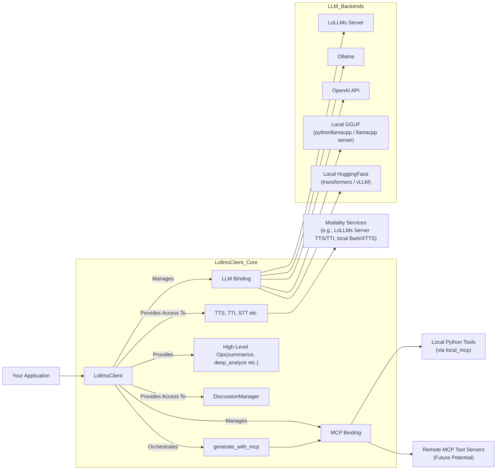

# LoLLMs Client Library

[](https://opensource.org/licenses/Apache-2.0)
[](https://badge.fury.io/py/lollms_client)
[](https://pypi.org/project/lollms_client/)
[](https://pepy.tech/project/lollms-client)
[](DOC_USE.md)
[](DOC_DEV.md)
[](https://github.com/ParisNeo/lollms_client/stargazers/)
[](https://github.com/ParisNeo/lollms_client/issues)

**`lollms_client`** is a powerful and flexible Python library designed to simplify interactions with the **LoLLMs (Lord of Large Language Models)** ecosystem and various other Large Language Model (LLM) backends. It provides a unified API for text generation, multimodal operations (text-to-image, text-to-speech, etc.), and robust function calling through the Model Context Protocol (MCP).

Whether you're connecting to a remote LoLLMs server, an Ollama instance, the OpenAI API, or running models locally using GGUF (via `llama-cpp-python` or a managed `llama.cpp` server), Hugging Face Transformers, or vLLM, `lollms-client` offers a consistent and developer-friendly experience.

## Key Features

*   🔌 **Versatile Binding System:** Seamlessly switch between different LLM backends (LoLLMs, Ollama, OpenAI, Llama.cpp, Transformers, vLLM, OpenLLM) without major code changes.
*   🗣️ **Multimodal Support:** Interact with models capable of processing images and generate various outputs like speech (TTS) and images (TTI).
*   🤖 **Function Calling with MCP:** Empowers LLMs to use external tools and functions through the Model Context Protocol (MCP), with built-in support for local Python tool execution via `local_mcp` binding and its default tools (file I/O, internet search, Python interpreter, image generation).
*   🚀 **Streaming & Callbacks:** Efficiently handle real-time text generation with customizable callback functions, including during MCP interactions.
*   💬 **Discussion Management:** Utilities to easily manage and format conversation histories for chat applications.
*   ⚙️ **Configuration Management:** Flexible ways to configure bindings and generation parameters.
*   🧩 **Extensible:** Designed to easily incorporate new LLM backends and modality services, including custom MCP toolsets.
*   📝 **High-Level Operations:** Includes convenience methods for complex tasks like sequential summarization and deep text analysis directly within `LollmsClient`.

## Installation

You can install `lollms_client` directly from PyPI:

```bash
pip install lollms-client
```

This will install the core library. Some bindings may require additional dependencies (e.g., `llama-cpp-python`, `torch`, `transformers`, `ollama`, `vllm`). The library attempts to manage these using `pipmaster`, but for complex dependencies (especially those requiring compilation like `llama-cpp-python` with GPU support), manual installation might be preferred.

## Quick Start

Here's a very basic example of how to use `LollmsClient` to generate text with a LoLLMs server (ensure one is running at `http://localhost:9600`):

```python
from lollms_client import LollmsClient, MSG_TYPE
from ascii_colors import ASCIIColors

# Callback for streaming output
def simple_streaming_callback(chunk: str, msg_type: MSG_TYPE, params=None, metadata=None) -> bool:
    if msg_type == MSG_TYPE.MSG_TYPE_CHUNK:
        print(chunk, end="", flush=True)
    elif msg_type == MSG_TYPE.MSG_TYPE_EXCEPTION:
        ASCIIColors.error(f"\nStreaming Error: {chunk}")
    return True # True to continue streaming

try:
    # Initialize client to connect to a LoLLMs server
    # For other backends, change 'binding_name' and provide necessary parameters.
    # See DOC_USE.md for detailed initialization examples.
    lc = LollmsClient(
        binding_name="lollms",
        host_address="http://localhost:9600"
    )

    prompt = "Tell me a fun fact about space."
    ASCIIColors.yellow(f"Prompt: {prompt}")

    # Generate text with streaming
    ASCIIColors.green("Streaming Response:")
    response_text = lc.generate_text(
        prompt,
        n_predict=100,
        stream=True,
        streaming_callback=simple_streaming_callback
    )
    print("\n--- End of Stream ---")

    # The 'response_text' variable will contain the full concatenated text
    # if streaming_callback returns True throughout.
    if isinstance(response_text, str):
        ASCIIColors.cyan(f"\nFull streamed text collected: {response_text[:100]}...")
    elif isinstance(response_text, dict) and "error" in response_text:
        ASCIIColors.error(f"Error during generation: {response_text['error']}")

except ValueError as ve:
    ASCIIColors.error(f"Initialization Error: {ve}")
    ASCIIColors.info("Ensure a LoLLMs server is running or configure another binding.")
except ConnectionRefusedError:
    ASCIIColors.error("Connection refused. Is the LoLLMs server running at http://localhost:9600?")
except Exception as e:
    ASCIIColors.error(f"An unexpected error occurred: {e}")

```

### Function Calling with MCP

`lollms-client` supports robust function calling via the Model Context Protocol (MCP), allowing LLMs to interact with your custom Python tools or pre-defined utilities.

```python
from lollms_client import LollmsClient, MSG_TYPE
from ascii_colors import ASCIIColors
import json # For pretty printing results

# Example callback for MCP streaming
def mcp_stream_callback(chunk: str, msg_type: MSG_TYPE, metadata: dict = None, turn_history: list = None) -> bool:
    if msg_type == MSG_TYPE.MSG_TYPE_CHUNK:  ASCIIColors.success(chunk, end="", flush=True) # LLM's final answer or thought process
    elif msg_type == MSG_TYPE.MSG_TYPE_STEP_START: ASCIIColors.info(f"\n>> MCP Step Start: {metadata.get('tool_name', chunk)}", flush=True)
    elif msg_type == MSG_TYPE.MSG_TYPE_STEP_END: ASCIIColors.success(f"\n<< MCP Step End: {metadata.get('tool_name', chunk)} -> Result: {json.dumps(metadata.get('result', ''))}", flush=True)
    elif msg_type == MSG_TYPE.MSG_TYPE_INFO and metadata and metadata.get("type") == "tool_call_request": ASCIIColors.info(f"\nAI requests: {metadata.get('name')}({metadata.get('params')})", flush=True)
    return True

try:
    # Initialize LollmsClient with an LLM binding and the local_mcp binding
    lc = LollmsClient(
        binding_name="ollama", model_name="mistral", # Example LLM
        mcp_binding_name="local_mcp" # Enables default tools (file_writer, internet_search, etc.)
                                     # or custom tools if mcp_binding_config.tools_folder_path is set.
    )

    user_query = "What were the main AI headlines last week and write a summary to 'ai_news.txt'?"
    ASCIIColors.blue(f"User Query: {user_query}")
    ASCIIColors.yellow("AI Processing with MCP (streaming):")

    mcp_result = lc.generate_with_mcp(
        prompt=user_query,
        streaming_callback=mcp_stream_callback
    )
    print("\n--- End of MCP Interaction ---")

    if mcp_result.get("error"):
        ASCIIColors.error(f"MCP Error: {mcp_result['error']}")
    else:
        ASCIIColors.cyan(f"\nFinal Answer from AI: {mcp_result.get('final_answer', 'N/A')}")
        ASCIIColors.magenta("\nTool Calls Made:")
        for tc in mcp_result.get("tool_calls", []):
            print(f"  - Tool: {tc.get('name')}, Params: {tc.get('params')}, Result (first 50 chars): {str(tc.get('result'))[:50]}...")

except Exception as e:
    ASCIIColors.error(f"An error occurred in MCP example: {e}")
    trace_exception(e) # Assuming you have trace_exception utility
```
For a comprehensive guide on function calling and setting up tools, please refer to the [Usage Guide (DOC_USE.md)](DOC_USE.md).

### 🤖 Advanced Agentic Generation with RAG: `generate_with_mcp_rag`

For more complex tasks, `generate_with_mcp_rag` provides a powerful, built-in agent that uses a ReAct-style (Reason, Act) loop. This agent can reason about a user's request, use tools (MCP), retrieve information from knowledge bases (RAG), and adapt its plan based on the results of its actions.

**Key Agent Capabilities:**

*   **Observe-Think-Act Loop:** The agent iteratively reviews its progress, thinks about the next logical step, and takes an action (like calling a tool).
*   **Tool Integration (MCP):** Can use any available MCP tools, such as searching the web or executing code.
*   **Retrieval-Augmented Generation (RAG):** You can provide one or more "data stores" (knowledge bases). The agent gains a `research::{store_name}` tool to query these stores for relevant information.
*   **In-Memory Code Generation:** The agent has a special `generate_code` tool. This allows it to first write a piece of code (e.g., a complex Python script) and then pass that code to another tool (e.g., `python_code_interpreter`) in a subsequent step.
*   **Stateful Progress Tracking:** Designed for rich UI experiences, it emits `step_start` and `step_end` events with unique IDs via the streaming callback. This allows an application to track the agent's individual thoughts and long-running tool calls in real-time.
*   **Self-Correction:** Includes a `refactor_scratchpad` tool for the agent to clean up its own thought process if it becomes cluttered.

Here is an example of using the agent to answer a question by first performing RAG on a custom knowledge base and then using the retrieved information to generate and execute code.

```python
import json
from lollms_client import LollmsClient, MSG_TYPE
from ascii_colors import ASCIIColors

# 1. Define a mock RAG data store and retrieval function
project_notes = {
    "project_phoenix_details": "Project Phoenix has a current budget of $500,000 and an expected quarterly growth rate of 15%."
}

def retrieve_from_notes(query: str, top_k: int = 1, min_similarity: float = 0.5):
    """A simple keyword-based retriever for our mock data store."""
    results = []
    for key, text in project_notes.items():
        if query.lower() in text.lower():
            results.append({"source": key, "content": text})
    return results[:top_k]

# 2. Define a detailed streaming callback to visualize the agent's process
def agent_streaming_callback(chunk: str, msg_type: MSG_TYPE, params: dict = None, metadata: list = None) -> bool:
    if not params: params = {}
    msg_id = params.get("id", "")
    
    if msg_type == MSG_TYPE.MSG_TYPE_STEP_START:
        ASCIIColors.yellow(f"\n>> Agent Step Start [ID: {msg_id}]: {chunk}")
    elif msg_type == MSG_TYPE.MSG_TYPE_STEP_END:
        ASCIIColors.green(f"<< Agent Step End [ID: {msg_id}]: {chunk}")
        if params.get('result'):
            ASCIIColors.cyan(f"   Result: {json.dumps(params['result'], indent=2)}")
    elif msg_type == MSG_TYPE.MSG_TYPE_THOUGHT_CONTENT:
        ASCIIColors.magenta(f"\n🤔 Agent Thought: {chunk}")
    elif msg_type == MSG_TYPE.MSG_TYPE_TOOL_CALL:
        ASCIIColors.blue(f"\n🛠️  Agent Action: {chunk}")
    elif msg_type == MSG_TYPE.MSG_TYPE_OBSERVATION:
        ASCIIColors.cyan(f"\n👀 Agent Observation: {chunk}")
    elif msg_type == MSG_TYPE.MSG_TYPE_CHUNK:
        print(chunk, end="", flush=True) # Final answer stream
    return True

try:
    # 3. Initialize LollmsClient with an LLM and local tools enabled
    lc = LollmsClient(
        binding_name="ollama",          # Use Ollama
        model_name="llama3",            # Or any capable model like mistral, gemma, etc.
        mcp_binding_name="local_mcp"    # Enable local tools like python_code_interpreter
    )

    # 4. Define the user prompt and the RAG data store
    prompt = "Based on my notes about Project Phoenix, write and run a Python script to calculate its projected budget after two quarters."
    
    rag_data_store = {
        "project_notes": {"callable": retrieve_from_notes}
    }

    ASCIIColors.yellow(f"User Prompt: {prompt}")
    print("\n" + "="*50 + "\nAgent is now running...\n" + "="*50)

    # 5. Run the agent
    agent_output = lc.generate_with_mcp_rag(
        prompt=prompt,
        use_data_store=rag_data_store,
        use_mcps=["python_code_interpreter"], # Make specific tools available
        streaming_callback=agent_streaming_callback,
        max_reasoning_steps=5
    )

    print("\n" + "="*50 + "\nAgent finished.\n" + "="*50)

    # 6. Print the final results
    if agent_output.get("error"):
        ASCIIColors.error(f"\nAgent Error: {agent_output['error']}")
    else:
        ASCIIColors.green("\n--- Final Answer ---")
        print(agent_output.get("final_answer"))
        
        ASCIIColors.magenta("\n--- Tool Calls ---")
        print(json.dumps(agent_output.get("tool_calls", []), indent=2))

        ASCIIColors.cyan("\n--- RAG Sources ---")
        print(json.dumps(agent_output.get("sources", []), indent=2))

except Exception as e:
    ASCIIColors.red(f"\nAn unexpected error occurred: {e}")

```

## Documentation

For more in-depth information, please refer to:

*   **[Usage Guide (DOC_USE.md)](DOC_USE.md):** Learn how to use `LollmsClient`, different bindings, modality features, function calling with MCP, and high-level operations.
*   **[Developer Guide (DOC_DEV.md)](DOC_DEV.md):** Understand the architecture, how to create new bindings (LLM, modality, MCP), and contribute to the library.

## Core Concepts



*   **`LollmsClient`**: The central class for all interactions. It holds the currently active LLM binding, an optional MCP binding, and provides access to modality bindings and high-level operations.
*   **LLM Bindings**: These are plugins that allow `LollmsClient` to communicate with different LLM backends. You choose a binding (e.g., `"ollama"`, `"lollms"`, `"pythonllamacpp"`) when you initialize `LollmsClient`.
*   **🔧 MCP Bindings**: Enable tool use and function calling. `lollms-client` includes `local_mcp` for executing Python tools. It discovers tools from a specified folder (or uses its default set), each defined by a `.py` script and a `.mcp.json` metadata file.
*   **Modality Bindings**: Similar to LLM bindings, but for services like Text-to-Speech (`tts`), Text-to-Image (`tti`), etc.
*   **High-Level Operations**: Methods directly on `LollmsClient` (e.g., `sequential_summarize`, `deep_analyze`, `generate_code`, `yes_no`) for performing complex, multi-step AI tasks.
*   **`LollmsDiscussion`**: Helps manage and format conversation histories for chat applications.

## Examples

The `examples/` directory in this repository contains a rich set of scripts demonstrating various features:
*   Basic text generation with different bindings.
*   Streaming and non-streaming examples.
*   Multimodal generation (text with images).
*   Using built-in methods for summarization and Q&A.
*   Implementing and using function calls with **`generate_with_mcp`** and the `local_mcp` binding (see `examples/function_calling_with_local_custom_mcp.py` and `examples/local_mcp.py`).
*   Text-to-Speech and Text-to-Image generation.

Explore these examples to see `lollms-client` in action!

## Contributing

Contributions are welcome! Whether it's bug reports, feature suggestions, documentation improvements, or new bindings, please feel free to open an issue or submit a pull request on our [GitHub repository](https://github.com/ParisNeo/lollms_client).

## License

This project is licensed under the **Apache 2.0 License**. See the [LICENSE](LICENSE) file for details (assuming you have a LICENSE file, if not, state "Apache 2.0 License").

## Changelog

For a list of changes and updates, please refer to the [CHANGELOG.md](CHANGELOG.md) file.