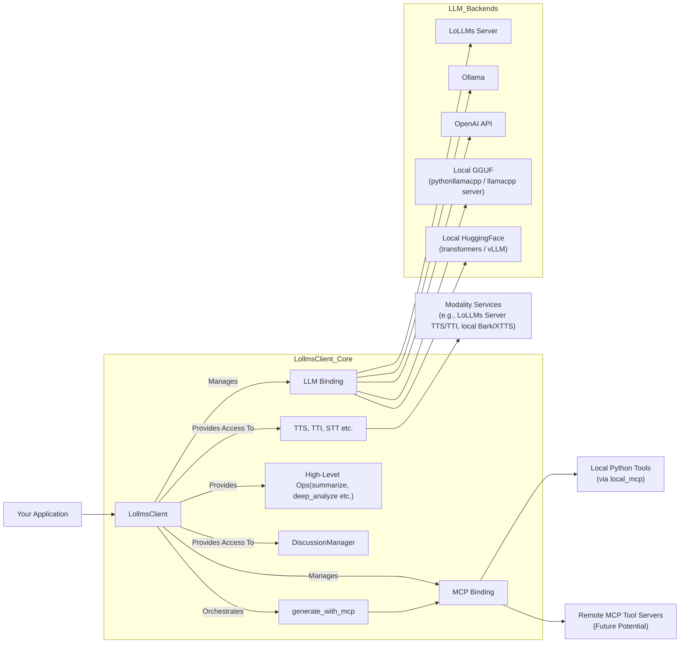

# LoLLMs Client Library

[](https://opensource.org/licenses/Apache-2.0)
[](https://badge.fury.io/py/lollms_client)
[](https://pypi.org/project/lollms_client/)
[](https://pepy.tech/project/lollms-client)
[](DOC_USE.md)
[](DOC_DEV.md)
[](https://github.com/ParisNeo/lollms_client/stargazers/)
[](https://github.com/ParisNeo/lollms_client/issues)

**`lollms_client`** is a powerful and flexible Python library designed to simplify interactions with the **LoLLMs (Lord of Large Language Models)** ecosystem and various other Large Language Model (LLM) backends. It provides a unified API for text generation, multimodal operations (text-to-image, text-to-speech, etc.), and robust function calling through the Model Context Protocol (MCP).

Whether you're connecting to a remote LoLLMs server, an Ollama instance, the OpenAI API, or running models locally using GGUF (via `llama-cpp-python` or a managed `llama.cpp` server), Hugging Face Transformers, or vLLM, `lollms-client` offers a consistent and developer-friendly experience.

## Key Features

*   🔌 **Versatile Binding System:** Seamlessly switch between different LLM backends (LoLLMs, Ollama, OpenAI, Llama.cpp, Transformers, vLLM, OpenLLM) without major code changes.
*   🗣️ **Multimodal Support:** Interact with models capable of processing images and generate various outputs like speech (TTS) and images (TTI).
*   🤖 **Function Calling with MCP:** Empowers LLMs to use external tools and functions through the Model Context Protocol (MCP), with built-in support for local Python tool execution via `local_mcp` binding and its default tools (file I/O, internet search, Python interpreter, image generation).
*   🎭 **Personalities as Agents:** Personalities can now define their own set of required tools (MCPs), turning them into self-contained, ready-to-use agents.
*   🚀 **Streaming & Callbacks:** Efficiently handle real-time text generation with customizable callback functions, including during MCP interactions.
*   💬 **Discussion Management:** Utilities to easily manage and format conversation histories, including a persistent `data_zone` for context that is always present in the system prompt.
*   ⚙️ **Configuration Management:** Flexible ways to configure bindings and generation parameters.
*   🧩 **Extensible:** Designed to easily incorporate new LLM backends and modality services, including custom MCP toolsets.
*   📝 **High-Level Operations:** Includes convenience methods for complex tasks like sequential summarization and deep text analysis directly within `LollmsClient`.

## Installation

You can install `lollms_client` directly from PyPI:

```bash
pip install lollms-client
```

This will install the core library. Some bindings may require additional dependencies (e.g., `llama-cpp-python`, `torch`, `transformers`, `ollama`, `vllm`). The library attempts to manage these using `pipmaster`, but for complex dependencies (especially those requiring compilation like `llama-cpp-python` with GPU support), manual installation might be preferred.

## Quick Start

Here's a very basic example of how to use `LollmsClient` to generate text with a LoLLMs server (ensure one is running at `http://localhost:9600`):

```python
from lollms_client import LollmsClient, MSG_TYPE
from ascii_colors import ASCIIColors

# Callback for streaming output
def simple_streaming_callback(chunk: str, msg_type: MSG_TYPE, params=None, metadata=None) -> bool:
    if msg_type == MSG_TYPE.MSG_TYPE_CHUNK:
        print(chunk, end="", flush=True)
    elif msg_type == MSG_TYPE.MSG_TYPE_EXCEPTION:
        ASCIIColors.error(f"\nStreaming Error: {chunk}")
    return True # True to continue streaming

try:
    # Initialize client to connect to a LoLLMs server
    # For other backends, change 'binding_name' and provide necessary parameters.
    # See DOC_USE.md for detailed initialization examples.
    lc = LollmsClient(
        binding_name="lollms",
        host_address="http://localhost:9600"
    )

    prompt = "Tell me a fun fact about space."
    ASCIIColors.yellow(f"Prompt: {prompt}")

    # Generate text with streaming
    ASCIIColors.green("Streaming Response:")
    response_text = lc.generate_text(
        prompt,
        n_predict=100,
        stream=True,
        streaming_callback=simple_streaming_callback
    )
    print("\n--- End of Stream ---")

    # The 'response_text' variable will contain the full concatenated text
    # if streaming_callback returns True throughout.
    if isinstance(response_text, str):
        ASCIIColors.cyan(f"\nFull streamed text collected: {response_text[:100]}...")
    elif isinstance(response_text, dict) and "error" in response_text:
        ASCIIColors.error(f"Error during generation: {response_text['error']}")

except ValueError as ve:
    ASCIIColors.error(f"Initialization Error: {ve}")
    ASCIIColors.info("Ensure a LoLLMs server is running or configure another binding.")
except ConnectionRefusedError:
    ASCIIColors.error("Connection refused. Is the LoLLMs server running at http://localhost:9600?")
except Exception as e:
    ASCIIColors.error(f"An unexpected error occurred: {e}")

```

### Function Calling with MCP

`lollms-client` supports robust function calling via the Model Context Protocol (MCP), allowing LLMs to interact with your custom Python tools or pre-defined utilities.

```python
from lollms_client import LollmsClient, MSG_TYPE
from ascii_colors import ASCIIColors
import json # For pretty printing results

# Example callback for MCP streaming
def mcp_stream_callback(chunk: str, msg_type: MSG_TYPE, metadata: dict = None, turn_history: list = None) -> bool:
    if msg_type == MSG_TYPE.MSG_TYPE_CHUNK:  ASCIIColors.success(chunk, end="", flush=True) # LLM's final answer or thought process
    elif msg_type == MSG_TYPE.MSG_TYPE_STEP_START: ASCIIColors.info(f"\n>> MCP Step Start: {metadata.get('tool_name', chunk)}", flush=True)
    elif msg_type == MSG_TYPE.MSG_TYPE_STEP_END: ASCIIColors.success(f"\n<< MCP Step End: {metadata.get('tool_name', chunk)} -> Result: {json.dumps(metadata.get('result', ''))}", flush=True)
    elif msg_type == MSG_TYPE.MSG_TYPE_INFO and metadata and metadata.get("type") == "tool_call_request": ASCIIColors.info(f"\nAI requests: {metadata.get('name')}({metadata.get('params')})", flush=True)
    return True

try:
    # Initialize LollmsClient with an LLM binding and the local_mcp binding
    lc = LollmsClient(
        binding_name="ollama", model_name="mistral", # Example LLM
        mcp_binding_name="local_mcp" # Enables default tools (file_writer, internet_search, etc.)
                                     # or custom tools if mcp_binding_config.tools_folder_path is set.
    )

    user_query = "What were the main AI headlines last week and write a summary to 'ai_news.txt'?"
    ASCIIColors.blue(f"User Query: {user_query}")
    ASCIIColors.yellow("AI Processing with MCP (streaming):")

    mcp_result = lc.generate_with_mcp(
        prompt=user_query,
        streaming_callback=mcp_stream_callback
    )
    print("\n--- End of MCP Interaction ---")

    if mcp_result.get("error"):
        ASCIIColors.error(f"MCP Error: {mcp_result['error']}")
    else:
        ASCIIColors.cyan(f"\nFinal Answer from AI: {mcp_result.get('final_answer', 'N/A')}")
        ASCIIColors.magenta("\nTool Calls Made:")
        for tc in mcp_result.get("tool_calls", []):
            print(f"  - Tool: {tc.get('name')}, Params: {tc.get('params')}, Result (first 50 chars): {str(tc.get('result'))[:50]}...")

except Exception as e:
    ASCIIColors.error(f"An error occurred in MCP example: {e}")
    trace_exception(e) # Assuming you have trace_exception utility
```
For a comprehensive guide on function calling and setting up tools, please refer to the [Usage Guide (DOC_USE.md)](DOC_USE.md).

### 🎭 Personalities as Self-Contained Agents

A powerful feature of `lollms-client` is the ability to define personalities that are not just conversational styles, but fully-fledged agents with their own tools. By including an `active_mcps` list in a personality's definition, you specify which tools should be enabled by default whenever that personality is used.

**Example Personality Definition (conceptual):**

```python
# In your application logic where you might define personalities
from lollms_client import LollmsPersonality

# This personality is designed to be a research assistant
researcher_personality = LollmsPersonality(
    name="Researcher_Bot",
    author="My_App",
    category="Research",
    description="An AI assistant that can search the web and write files.",
    system_prompt="You are a helpful research assistant. Use your tools to find information and save it.",
    # This is the new part: specify the tools this personality needs.
    active_mcps=["internet_search", "file_writer"] 
)

# How it works in LollmsDiscussion.chat()
# discussion.chat(
#     "Find the latest news on AI and save it to news.txt", 
#     personality=researcher_personality
# )
# This call will automatically enable 'internet_search' and 'file_writer'
# for the agentic turn, without needing to specify `use_mcps` in the chat call itself.
```

This simplifies agentic calls and makes personalities much more portable and powerful. The tools specified in `use_mcps` during a `chat()` call will be *added* to the personality's default tools for that specific turn.

### 🤖 Advanced Agentic Generation with RAG: `generate_with_mcp_rag`

For more complex tasks, `generate_with_mcp_rag` provides a powerful, built-in agent that uses a ReAct-style (Reason, Act) loop. This agent can reason about a user's request, use tools (MCP), retrieve information from knowledge bases (RAG), and adapt its plan based on the results of its actions.

**Key Agent Capabilities:**

*   **Observe-Think-Act Loop:** The agent iteratively reviews its progress, thinks about the next logical step, and takes an action (like calling a tool).
*   **Tool Integration (MCP):** Can use any available MCP tools, such as searching the web or executing code.
*   **Retrieval-Augmented Generation (RAG):** You can provide one or more "data stores" (knowledge bases). The agent gains a `research::{store_name}` tool to query these stores for relevant information.
*   **In-Memory Code Generation:** The agent has a special `generate_code` tool. This allows it to first write a piece of code (e.g., a complex Python script) and then pass that code to another tool (e.g., `python_code_interpreter`) in a subsequent step.
*   **Stateful Progress Tracking:** Designed for rich UI experiences, it emits `step_start` and `step_end` events with unique IDs via the streaming callback. This allows an application to track the agent's individual thoughts and long-running tool calls in real-time.
*   **Self-Correction:** Includes a `refactor_scratchpad` tool for the agent to clean up its own thought process if it becomes cluttered.

Here is an example of using the agent to answer a question by first performing RAG on a custom knowledge base and then using the retrieved information to generate and execute code.

```python
import json
from lollms_client import LollmsClient, MSG_TYPE
from ascii_colors import ASCIIColors

# 1. Define a mock RAG data store and retrieval function
project_notes = {
    "project_phoenix_details": "Project Phoenix has a current budget of $500,000 and an expected quarterly growth rate of 15%."
}

def retrieve_from_notes(query: str, top_k: int = 1, min_similarity: float = 0.5):
    """A simple keyword-based retriever for our mock data store."""
    results = []
    for key, text in project_notes.items():
        if query.lower() in text.lower():
            results.append({"source": key, "content": text})
    return results[:top_k]

# 2. Define a detailed streaming callback to visualize the agent's process
def agent_streaming_callback(chunk: str, msg_type: MSG_TYPE, params: dict = None, metadata: list = None) -> bool:
    if not params: params = {}
    msg_id = params.get("id", "")
    
    if msg_type == MSG_TYPE.MSG_TYPE_STEP_START:
        ASCIIColors.yellow(f"\n>> Agent Step Start [ID: {msg_id}]: {chunk}")
    elif msg_type == MSG_TYPE.MSG_TYPE_STEP_END:
        ASCIIColors.green(f"<< Agent Step End [ID: {msg_id}]: {chunk}")
        if params.get('result'):
            ASCIIColors.cyan(f"   Result: {json.dumps(params['result'], indent=2)}")
    elif msg_type == MSG_TYPE.MSG_TYPE_THOUGHT_CONTENT:
        ASCIIColors.magenta(f"\n🤔 Agent Thought: {chunk}")
    elif msg_type == MSG_TYPE.MSG_TYPE_TOOL_CALL:
        ASCIIColors.blue(f"\n🛠️  Agent Action: {chunk}")
    elif msg_type == MSG_TYPE.MSG_TYPE_OBSERVATION:
        ASCIIColors.cyan(f"\n👀 Agent Observation: {chunk}")
    elif msg_type == MSG_TYPE.MSG_TYPE_CHUNK:
        print(chunk, end="", flush=True) # Final answer stream
    return True

try:
    # 3. Initialize LollmsClient with an LLM and local tools enabled
    lc = LollmsClient(
        binding_name="ollama",          # Use Ollama
        model_name="llama3",            # Or any capable model like mistral, gemma, etc.
        mcp_binding_name="local_mcp"    # Enable local tools like python_code_interpreter
    )

    # 4. Define the user prompt and the RAG data store
    prompt = "Based on my notes about Project Phoenix, write and run a Python script to calculate its projected budget after two quarters."
    
    rag_data_store = {
        "project_notes": {"callable": retrieve_from_notes}
    }

    ASCIIColors.yellow(f"User Prompt: {prompt}")
    print("\n" + "="*50 + "\nAgent is now running...\n" + "="*50)

    # 5. Run the agent
    agent_output = lc.generate_with_mcp_rag(
        prompt=prompt,
        use_data_store=rag_data_store,
        use_mcps=["python_code_interpreter"], # Make specific tools available
        streaming_callback=agent_streaming_callback,
        max_reasoning_steps=5
    )

    print("\n" + "="*50 + "\nAgent finished.\n" + "="*50)

    # 6. Print the final results
    if agent_output.get("error"):
        ASCIIColors.error(f"\nAgent Error: {agent_output['error']}")
    else:
        ASCIIColors.green("\n--- Final Answer ---")
        print(agent_output.get("final_answer"))
        
        ASCIIColors.magenta("\n--- Tool Calls ---")
        print(json.dumps(agent_output.get("tool_calls", []), indent=2))

        ASCIIColors.cyan("\n--- RAG Sources ---")
        print(json.dumps(agent_output.get("sources", []), indent=2))

except Exception as e:
    ASCIIColors.red(f"\nAn unexpected error occurred: {e}")

```

## Documentation

For more in-depth information, please refer to:

*   **[Usage Guide (DOC_USE.md)](DOC_USE.md):** Learn how to use `LollmsClient`, different bindings, modality features, function calling with MCP, and high-level operations.
*   **[Developer Guide (DOC_DEV.md)](DOC_DEV.md):** Understand the architecture, how to create new bindings (LLM, modality, MCP), and contribute to the library.

## Core Concepts



*   **`LollmsClient`**: The central class for all interactions. It holds the currently active LLM binding, an optional MCP binding, and provides access to modality bindings and high-level operations.
*   **LLM Bindings**: These are plugins that allow `LollmsClient` to communicate with different LLM backends. You choose a binding (e.g., `"ollama"`, `"lollms"`, `"pythonllamacpp"`) when you initialize `LollmsClient`.
*   **🔧 MCP Bindings**: Enable tool use and function calling. `lollms-client` includes `local_mcp` for executing Python tools. It discovers tools from a specified folder (or uses its default set), each defined by a `.py` script and a `.mcp.json` metadata file.
*   **Modality Bindings**: Similar to LLM bindings, but for services like Text-to-Speech (`tts`), Text-to-Image (`tti`), etc.
*   **High-Level Operations**: Methods directly on `LollmsClient` (e.g., `sequential_summarize`, `deep_analyze`, `generate_code`, `yes_no`) for performing complex, multi-step AI tasks.
*   **`LollmsDiscussion`**: Helps manage and format conversation histories for chat applications.

## Examples

The `examples/` directory in this repository contains a rich set of scripts demonstrating various features:
*   Basic text generation with different bindings.
*   Streaming and non-streaming examples.
*   Multimodal generation (text with images).
*   Using built-in methods for summarization and Q&A.
*   Implementing and using function calls with **`generate_with_mcp`** and the `local_mcp` binding (see `examples/function_calling_with_local_custom_mcp.py` and `examples/local_mcp.py`).
*   Text-to-Speech and Text-to-Image generation.

Explore these examples to see `lollms-client` in action!

## Using LoLLMs Client with Different Bindings

`lollms-client` supports a wide range of LLM backends through its binding system. This section provides practical examples of how to initialize `LollmsClient` for each of the major supported bindings.

### A Note on Configuration

The recommended way to provide credentials and other binding-specific settings is through the `llm_binding_config` dictionary during `LollmsClient` initialization. While many bindings can fall back to reading environment variables (e.g., `OPENAI_API_KEY`), passing them explicitly in the config is clearer and less error-prone.

```python
# General configuration pattern
lc = LollmsClient(
    binding_name="your_binding_name",
    model_name="a_model_name",
    llm_binding_config={
        "specific_api_key_param": "your_api_key_here",
        "another_specific_param": "some_value"
    }
)
```

---

### 1. Local Bindings

These bindings run models directly on your local machine, giving you full control and privacy.

#### **Ollama**

The `ollama` binding connects to a running Ollama server instance on your machine or network.

**Prerequisites:**
*   [Ollama installed and running](https://ollama.com/).
*   Models pulled, e.g., `ollama pull llama3`.

**Usage:**

```python
from lollms_client import LollmsClient

# Configuration for a local Ollama server
lc = LollmsClient(
    binding_name="ollama",
    model_name="llama3",  # Or any other model you have pulled
    host_address="http://localhost:11434" # Default Ollama address
)

# Now you can use lc.generate_text(), lc.chat(), etc.
response = lc.generate_text("Why is the sky blue?")
print(response)
```

#### **PythonLlamaCpp (Local GGUF Models)**

The `pythonllamacpp` binding loads and runs GGUF model files directly using the powerful `llama-cpp-python` library. This is ideal for high-performance, local inference on CPU or GPU.

**Prerequisites:**
*   A GGUF model file downloaded to your machine.
*   `llama-cpp-python` installed. For GPU support, it must be compiled with the correct flags (e.g., `CMAKE_ARGS="-DLLAMA_CUBLAS=on" pip install llama-cpp-python`).

**Usage:**

```python
from lollms_client import LollmsClient

# --- Configuration for Llama.cpp ---
# Path to your GGUF model file
MODEL_PATH = "/path/to/your/model.gguf" 

# Binding-specific configuration
LLAMACPP_CONFIG = {
    "n_gpu_layers": -1,  # -1 for all layers to GPU, 0 for CPU
    "n_ctx": 4096,       # Context size
    "seed": -1,          # -1 for random seed
    "chat_format": "chatml" # Or another format like 'llama-2'
}

try:
    lc = LollmsClient(
        binding_name="pythonllamacpp",
        model_name=MODEL_PATH, # For this binding, model_name is the file path
        llm_binding_config=LLAMACPP_CONFIG
    )

    response = lc.generate_text("Write a recipe for a great day.")
    print(response)

except Exception as e:
    print(f"Error initializing Llama.cpp binding: {e}")
    print("Please ensure llama-cpp-python is installed and the model path is correct.")

```

---

### 2. Cloud Service Bindings

These bindings connect to hosted LLM APIs from major providers.

#### **OpenAI**

Connects to the official OpenAI API to use models like GPT-4o, GPT-4, and GPT-3.5.

**Prerequisites:**
*   An OpenAI API key.

**Usage:**

```python
from lollms_client import LollmsClient

OPENAI_CONFIG = {
    "service_key": "your_openai_api_key_here" # sk-...
}

lc = LollmsClient(
    binding_name="openai",
    model_name="gpt-4o",
    llm_binding_config=OPENAI_CONFIG
)

response = lc.generate_text("What is the difference between AI and machine learning?")
print(response)
```

#### **Google Gemini**

Connects to Google's Gemini family of models via the Google AI Studio API.

**Prerequisites:**
*   A Google AI Studio API key.

**Usage:**

```python
from lollms_client import LollmsClient

GEMINI_CONFIG = {
    "service_key": "your_google_api_key_here"
}

lc = LollmsClient(
    binding_name="gemini",
    model_name="gemini-1.5-pro-latest",
    llm_binding_config=GEMINI_CONFIG
)

response = lc.generate_text("Summarize the plot of 'Dune' in three sentences.")
print(response)
```

#### **Anthropic Claude**

Connects to Anthropic's API to use the Claude family of models, including Claude 3.5 Sonnet, Opus, and Haiku.

**Prerequisites:**
*   An Anthropic API key.

**Usage:**

```python
from lollms_client import LollmsClient

CLAUDE_CONFIG = {
    "service_key": "your_anthropic_api_key_here"
}

lc = LollmsClient(
    binding_name="claude",
    model_name="claude-3-5-sonnet-20240620",
    llm_binding_config=CLAUDE_CONFIG
)

response = lc.generate_text("What are the core principles of constitutional AI?")
print(response)
```

---

### 3. API Aggregator Bindings

These bindings connect to services that provide access to many different models through a single API.

#### **OpenRouter**

OpenRouter provides a unified, OpenAI-compatible interface to access models from dozens of providers (Google, Anthropic, Mistral, Groq, etc.) with one API key.

**Prerequisites:**
*   An OpenRouter API key (starts with `sk-or-...`).

**Usage:**
Model names must be specified in the format `provider/model-name`.

```python
from lollms_client import LollmsClient

OPENROUTER_CONFIG = {
    "open_router_api_key": "your_openrouter_api_key_here"
}

# Example using a Claude model through OpenRouter
lc = LollmsClient(
    binding_name="open_router",
    model_name="anthropic/claude-3-haiku-20240307",
    llm_binding_config=OPENROUTER_CONFIG
)

response = lc.generate_text("Explain what an API aggregator is, as if to a beginner.")
print(response)
```

#### **Groq**

While Groq is a direct provider, it's famous as an aggregator of speed. It runs open-source models on custom LPU hardware for exceptionally fast inference.

**Prerequisites:**
*   A Groq API key.

**Usage:**

```python
from lollms_client import LollmsClient

GROQ_CONFIG = {
    "groq_api_key": "your_groq_api_key_here"
}

lc = LollmsClient(
    binding_name="groq",
    model_name="llama3-8b-8192",
    llm_binding_config=GROQ_CONFIG
)

response = lc.generate_text("Write a 3-line poem about incredible speed.")
print(response)
```

#### **Hugging Face Inference API**

This connects to the serverless Hugging Face Inference API, allowing experimentation with thousands of open-source models without local hardware.

**Note:** This API can have "cold starts," so the first request might be slow.

**Prerequisites:**
*   A Hugging Face User Access Token (starts with `hf_...`).

**Usage:**

```python
from lollms_client import LollmsClient

HF_CONFIG = {
    "hf_api_key": "your_hugging_face_token_here"
}

lc = LollmsClient(
    binding_name="hugging_face_inference_api",
    model_name="google/gemma-1.1-7b-it",
    llm_binding_config=HF_CONFIG
)

response = lc.generate_text("Write a short story about a robot who discovers music.")
print(response)
```

## Contributing

Contributions are welcome! Whether it's bug reports, feature suggestions, documentation improvements, or new bindings, please feel free to open an issue or submit a pull request on our [GitHub repository](https://github.com/ParisNeo/lollms_client).

## License

This project is licensed under the **Apache 2.0 License**. See the [LICENSE](LICENSE) file for details (assuming you have a LICENSE file, if not, state "Apache 2.0 License").

## Changelog

For a list of changes and updates, please refer to the [CHANGELOG.md](CHANGELOG.md) file.
```

---
### Phase 2: Update `lollms_discussion.md`

I will improve the documentation for the `LollmsDiscussion` class, explaining the `chat` method's new behavior regarding personality-based tool activation.

`[UPDATE] docs/md/lollms_discussion.md`
```markdown
# LollmsDiscussion Class

The `LollmsDiscussion` class is a cornerstone of the `lollms-client` library, designed to represent and manage a single conversation. It provides a robust interface for handling message history, conversation branching, context formatting, and persistence.

## Overview

A `LollmsDiscussion` can be either **in-memory** or **database-backed**, offering flexibility for different use cases.

-   **In-Memory:** Ideal for temporary or transient conversations. The discussion exists only for the duration of the application's runtime.
-   **Database-Backed:** Provides persistence by saving the entire conversation, including all branches and metadata, to a database file (e.g., SQLite). This is perfect for applications that need to retain user chat history.

## Key Features

-   **Message Management:** Add user and AI messages, which are automatically linked to form a conversation tree.
-   **Branching:** The conversation is a tree, not a simple list. This allows for exploring different conversational paths from any point. You can regenerate an AI response, and it will create a new branch.
-   **Context Exporting:** The `export()` method formats the conversation history for various LLM backends (`openai_chat`, `ollama_chat`, `lollms_text`, `markdown`), ensuring compatibility.
-   **Automatic Pruning:** To prevent exceeding the model's context window, it can automatically summarize older parts of the conversation without losing the original data.
-   **Persistent Data Zone:** A special field to hold context that is always included in the system prompt, separate from the main conversation flow.

## Creating a Discussion

The recommended way to create a discussion is using the `LollmsDiscussion.create_new()` class method.

```python
from lollms_client import LollmsClient, LollmsDataManager, LollmsDiscussion

# For an in-memory discussion (lost when the app closes)
lc = LollmsClient(binding_name="ollama", model_name="llama3")
discussion = LollmsDiscussion.create_new(lollms_client=lc, id="my-temp-discussion")

# For a persistent, database-backed discussion
# This will create a 'discussions.db' file if it doesn't exist
db_manager = LollmsDataManager('sqlite:///discussions.db')
discussion_db = LollmsDiscussion.create_new(
    lollms_client=lc, 
    db_manager=db_manager,
    discussion_metadata={"title": "My First DB Chat"}
)
```

## Core Properties

### `data_zone`

The `data_zone` is a string property where you can store persistent information that should always be visible to the AI as part of its system instructions. This is incredibly useful for providing context that doesn't change, such as user profiles, complex instructions, or data that the AI should always reference.

The content of `data_zone` is automatically appended to the system prompt during context export.

#### Example: Using the Data Zone

Imagine you are building a Python coding assistant. You can use the `data_zone` to hold the current state of a script the user is working on.

```python
from lollms_client import LollmsClient, LollmsDiscussion

lc = LollmsClient(binding_name="ollama", model_name="codellama")
discussion = LollmsDiscussion.create_new(lollms_client=lc)

# Set the system prompt and initial data_zone
discussion.system_prompt = "You are a Python expert. Help the user with their code."
discussion.data_zone = "# Current script content:\n\nimport os\n\ndef list_files(path):\n    pass"

# The user asks for help
user_prompt = "Flesh out the list_files function to print all files in the given path."

# When you generate a response, the AI will see the system prompt AND the data_zone
# The effective system prompt becomes:
# """
# You are a Python expert. Help the user with their code.
#
# --- data ---
# # Current script content:
#
# import os
#
# def list_files(path):
#     pass
# """
response = discussion.chat(user_prompt)
print(response['ai_message'].content)

# The calling application can then parse the AI's response and update the data_zone
# for the next turn.
updated_code = "# ... updated code from AI ...\nimport os\n\ndef list_files(path):\n    for f in os.listdir(path):\n        print(f)"
discussion.data_zone = updated_code
discussion.commit() # If DB-backed
```

### Other Important Properties

-   `id`: The unique identifier for the discussion.
-   `system_prompt`: The main system prompt defining the AI's persona and core instructions.
-   `metadata`: A dictionary for storing any custom metadata, like a title.
-   `active_branch_id`: The ID of the message at the "tip" of the current conversation branch.
-   `messages`: A list of all `LollmsMessage` objects in the discussion.

## Main Methods

### `chat()`
The `chat()` method is the primary way to interact with the discussion. It handles a full user-to-AI turn, including invoking the advanced agentic capabilities of the `LollmsClient`.

#### Personalities and Tool Usage (`use_mcps`)

The `chat` method intelligently handles tool activation (MCPs) when a `LollmsPersonality` is provided. This allows personalities to be configured as self-contained agents with their own default tools.

Here’s how the `use_mcps` parameter interacts with a personality's `active_mcps` list:

1.  **Personality has tools, `use_mcps` is not set:** The agent will use the tools defined in `personality.active_mcps`.
2.  **Personality has tools, `use_mcps` is also set:** The agent will use a *combination* of tools from both the personality and the `use_mcps` parameter for that specific turn. Duplicates are automatically handled. This allows you to augment a personality's default tools on the fly.
3.  **Personality has no tools, `use_mcps` is set:** The agent will use only the tools specified in the `use_mcps` parameter.
4.  **Neither are set:** The agentic turn is not triggered (unless `use_data_store` is active), and a simple chat generation occurs.

This mechanism makes it easy to create powerful, reusable agents. For example, a "Code Writer" personality could come bundled with `file_reader` and `file_writer` tools, while a "Research Assistant" could have `internet_search` enabled by default.

### Other Methods
-   `add_message(sender, content, ...)`: Adds a new message.
-   `export(format_type, ...)`: Exports the discussion to a specific format.
-   `commit()`: Saves changes to the database (if DB-backed).
-   `summarize_and_prune()`: Automatically handles context window limits.
-   `count_discussion_tokens()`: Counts the tokens for a given format.