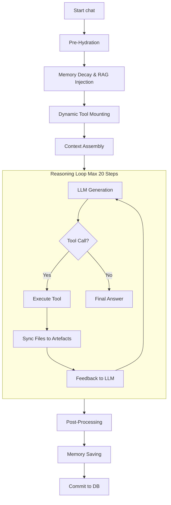
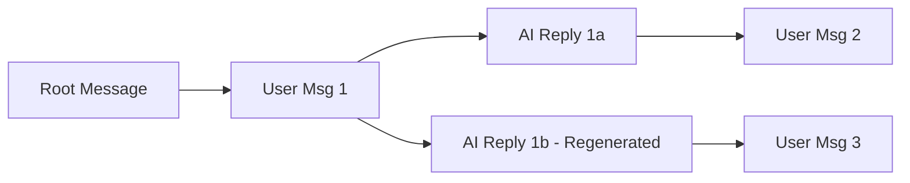

# 🧠 LollmsDiscussion: Cognitive Session & Artefact Architecture

This module implements the **Sovereign Discussion Session**, a stateful, thread-safe conversational engine that bridges the gap between transient LLM tokens and permanent, versioned knowledge storage.

It is composed of five orthogonal mixins:
1.  **`CoreMixin`**: Lifecycle, ORM proxy, message CRUD, and thread-safe DB commits.
2.  **`ChatMixin`**: The agentic reasoning loop, tool execution orchestration, and stream parsing.
3.  **`UtilsMixin`**: Branch management, export normalization, and context token auditing.
4.  **`PromptMixin`**: System prompt construction and XML tag post-processing.
5.  **`FileImportMixin`**: Multi-modal ingestion (PDF, DOCX, Data) and Dual-Stream storage.

---

## 🏛️ 1. The Dual-Stream Artefact System (.lam Protocol)

The core innovation of this architecture is **Dual-Stream Storage**. We solve the "Context vs. Tool" paradox by splitting every artefact into two distinct physical and logical streams.

### The Problem
*   **LLMs** need high-level schemas, stats, and descriptions (Logical) to reason effectively without wasting context window on raw binary data.
*   **Tools** (Python, SQL, Executors) need the exact, raw binary or text file (Physical) on disk to execute against.

### The Solution: `.lam` (Logical Artefact Metadata)
When an artefact is created (especially Data or Binary files), the system writes **two** distinct entities:

1.  **Physical Twin (`versions/{title}_v{N}.{ext}` & `workspace/{title}.{ext}`)**
    *   **Content**: Raw bytes (CSV rows, SQLite binary, PNG pixels, Python source).
    *   **Purpose**: Executable by tools. Accessible via simple relative paths.
    *   **Visibility**: Visible in the workspace tree.

2.  **Logical Twin (`versions/{title}_v{N}.lam`)**
    *   **Content**: Markdown schema, statistics, column types, row counts, descriptions.
    *   **Purpose**: Injected into the LLM context window.
    *   **Visibility**: **Hidden** from the workspace tree (stored only in `versions/`).

### Architecture Diagram
```text
data_workspace/
└── discussions/
    └── {discussion_id}/
        ├── versions/
        │   ├── dataset_v1.csv       <-- Physical Twin (Raw Data)
        │   ├── dataset_v1.lam       <-- Logical Twin (Schema/Stats for LLM)
        │   ├── dataset_v2.csv       <-- Physical Twin (Updated)
        │   └── dataset_v2.lam       <-- Logical Twin (Updated Schema)
        └── dataset.csv              <-- Active Workspace Copy (Symlink/Copy of Physical)
```

---

## 🧬 2. The Chat Loop & Tool Orchestration (`ChatMixin`)

The `chat()` method is not a simple API call; it is an **Agentic State Machine**. It handles pre-hydration, multi-step reasoning, tool execution, and self-healing file restoration.

### Execution Workflow



### Detailed Phase Breakdown

1.  **Pre-Hydration**:
    * Memory Decay & Associative Pull (SQLite).
    * RAG Injection (if personality has data).
    * **Dynamic Tool Mounting**: If data files exist in workspace, `semantic_data_engineer` is auto-mounted.
2.  **Context Assembly**:
    * System Prompt + Rules.
    * **Active Artefacts**: Injects `.lam` content (Logical Twins) for all active files.
    * Memory Handles.
3.  **Reasoning Loop** (Max 20 steps):
    * **LLM Generation**: Streams tokens to `_StreamState`.
    * **Stream Parsing**: Intercepts closed XML tags (`<artifact>`, `<tool>`) instantly.
    * **Tool Execution**:
        * **CWD Switch**: Changes OS Current Working Directory to `data_workspace/discussions/{id}/`.
        * **Sync**: Ensures all active artifacts exist on disk.
        * **Run**: Executes Python function.
        * **Post-Scan**: Detects NEW files created by tool → Auto-registers as Artefacts.
    * **Feedback**: Sanitizes tool output (strips base64 blobs) and feeds back to LLM.
4.  **Termination**: Commits DB, resets cancellation flags.

### Processing Block Status Metadata

When the LLM triggers a tool call or builds an artifact, the system intercepts the action and wraps it in a `<processing>` block in the live chat stream. Upon completion of the action, the system injects an HTML comment metadata tag immediately after the closing `</processing>` tag to indicate the outcome.

This metadata is **not** meant to be read by the LLM, but rather by the **frontend rendering engine**. It allows the UI to definitively know whether an operation succeeded or failed when the block closes, enabling accurate visual styling (e.g., green for success, red for failure).

*   **Tool Calls**:
    *   `<!-- status:success -->`: The tool executed successfully.
    *   `<!-- status:failure -->`: The tool encountered an error, crashed, or was blocked by the loop interceptor.
*   **Artefact Building**:
    *   `<!-- status:finished -->`: The artifact was fully received and registered in the workspace.

**Example Stream Output:**
```xml
<processing type="tool" title="Tool Execution: tool_execute_sql_query">
* Calling local tool system for 'tool_execute_sql_query'...
* Completed execution of 'tool_execute_sql_query' successfully.
Output Logs:
| id | name |
|----|------|
| 1  | Foo  |
</processing>
<!-- status:success -->
```

### The `chat()` Method API

```python
def chat(
    self,
    user_message: str,
    personality=None,
    branch_tip_id=None,
    tools=None,
    add_user_message: bool = True,
    images=None,
    # ... (see full signature in code)
) -> Dict[str, Any]:
```

**Key Parameters:**
*   `user_message` (`str`): The input text from the user.
*   `tools` (`Optional[Dict]`): A dictionary of tool specifications. If `None`, the system relies on LCP auto-discovery.
*   `images` (`Optional[List[str]]`): List of base64 encoded images for vision models.
*   `enable_artefacts` (`bool`): Master switch for the artifact creation system.
*   `allow_dynamic_tools` (`bool`): **Security Gate**. If `True`, allows the LLM to write and execute its own Python tools on the fly.
*   `max_reasoning_steps` (`int`): Limit for the agentic loop to prevent infinite cycles.

**Return Dictionary:**
```python
{
    "user_message": LollmsMessage,
    "ai_message": LollmsMessage,
    "sources": List[Dict],           # RAG sources
    "artefacts": List[Dict],         # Artifacts created/modified this turn
    "memory_report": Dict,           # Memory operations report
    "dream_report": Optional[Dict],  # Auto-dream consolidation report
    "was_cancelled": bool            # Cancellation status
}
```

---

## 🛠️ 3. Dynamic Tool Generation & Execution Protocol

The system allows the LLM to write, compile, and execute its own custom tools on the fly as standard `type="tool"` Artefacts. This bridges the gap between code generation and agentic action.

### The Flow
1.  **Generation**: The LLM writes a Python script containing a `tool_*` function and outputs it inside an `<artifact type="tool" name="my_tool">` XML block.
2.  **Interception**: The `ArtefactManager` intercepts the creation event and checks if the artefact type is `TOOL`.
3.  **Security Gate**: The manager checks the `allow_dynamic_tools` flag on the active discussion session. If `False` (the default), the file is saved as a standard code artefact but is **NOT** executed.
4.  **Registration**: If enabled, `ArtefactManager` passes the raw code to `LCPBinding.register_tool_from_code()`. The binding parses the AST, executes the code in an isolated module namespace, and registers the `tool_*` functions into the active tool registry.
5.  **Execution**: The LLM can immediately call `<tool>{"name": "tool_my_tool", "parameters": {...}}</tool>` in the same or subsequent turns.

### Security & Control
Because allowing an LLM to write and execute arbitrary code is inherently dangerous, this feature is strictly gated:
*   **`allow_dynamic_tools=False`**: By default, the chat loop sets this to `False`. The LLM can write the tool file, but it remains inert text.
*   **Opt-In Execution**: The host application must explicitly pass `allow_dynamic_tools=True` to `discussion.chat()` to enable dynamic execution.
*   **Visibility Rules**: Even when disabled, the tool artefact remains in the workspace, subject to standard `[U]`, `[C]`, `[L]` visibility tiers. The user can inspect the code the LLM wrote.

---

## 🛑 4. Cancellation & Interrupt Protocol

The `ChatMixin` implements a **Thread-Safe Cancellation Protocol** using a simple boolean flag. This ensures that long-running agentic loops, heavy tool executions, or streaming generations can be interrupted instantly without leaving the database or workspace in an inconsistent state.

### How It Works
1.  **Signal**: The user (or UI) calls `discussion.cancel_generation()`.
2.  **Propagation**: This sets a internal `_cancel_flag` boolean and propagates to the LLM binding to stop low-level streaming.
3.  **Observation**: The agentic loop checks this flag at **four critical safe points**:
    *   **Start of Reasoning Round**: Before sending a new prompt to the LLM.
    *   **During Streaming**: Inside the token streaming callback (every chunk).
    *   **Post-Generation**: Immediately after the LLM finishes but before tool execution starts.
    *   **Tool Cleanup**: During the `finally` block of tool execution (restoring CWD, closing DB connections).
4.  **Graceful Exit**:
    *   The loop breaks immediately.
    *   The current message content is appended with `"[Generation cancelled by user]"`.
    *   Metadata is flagged: `{"cancelled": True, "mode": "cancelled"}`.
    *   The session is committed to DB safely.
    *   The cancellation flag is reset, allowing the next turn to proceed normally.

### API Usage

```python
# 1. Start a long-running generation in a background thread
def run_chat():
    response = discussion.chat(user_message="Analyze this 1GB CSV file...")
    print(response["was_cancelled"]) # Will be True if interrupted

thread = threading.Thread(target=run_chat)
thread.start()

# 2. User clicks "Stop" button
discussion.cancel_generation() 
# Returns True if signal was sent, False if no generation was active

# 3. Check status programmatically
if discussion.is_generation_cancelled():
    print("Generation is stopping...")

# 4. Automatic Reset
# After the chat() method returns, the cancel state is automatically cleared.
# You do NOT need to manually reset it for the next turn.
discussion.chat(user_message="New question...") # Works normally
```

### ⚠️ Critical Safety Guarantees
*   **No Orphaned Tools**: If cancelled *during* tool execution, the system waits for the current tool to finish its `finally` block (to restore CWD and close files) before breaking the loop. It does not kill the process abruptly (which could corrupt files).
*   **DB Integrity**: The partial message is saved to the database with a cancellation marker. You do not lose the conversation history up to that point.
*   **Context Cleanliness**: The system ensures no partial XML tags or broken JSON structures are left in the context window for the next turn.

---

## 🌿 5. Branching & Versioning

Messages are not a linear list. They are a **Directed Acyclic Graph (DAG)**.

### Message Branching

*   **`active_branch_id`**: Points to the leaf node of the current conversation path.
*   **`get_branch(leaf_id)`**: Recursively walks parents to root, returning a chronological list.
*   **`regenerate_branch`**: Deletes the current AI leaf and restarts the loop from the user parent.

### Artefact Versioning
Every update to an artefact creates a new version (Git-like).
*   **`artefacts.update(..., bump_version=True)`**: Creates v2, v3, etc.
*   **`artefacts.revert(title, target_version=2)`**: Restores old content as a new highest version.
*   **`artefacts.squash_versions(...)`**: Deletes intermediate versions to save space, preserving history in commit messages.
*   **Tags**: Bind semantic labels (e.g., "stable", "gold") to specific versions.

---

## 📥 6. File Import Modes (`FileImportMixin`)

The `import_file` method supports sophisticated ingestion strategies:

| Mode | Behavior | Use Case |
| :--- | :--- | :--- |
| **`text`** | Extracts raw text only. | Code, Logs, Markdown. |
| **`text_images`** | Extracts text + renders pages/images. Anchors images in text via `<artefact_image id="..." />`. | PDFs, DOCX with diagrams. |
| **`images_only`** | Rasterizes everything to images. No text extraction. | Scanned books, complex layouts. |
| **`ocr`** | Renders pages → Sends to Vision LLM → Transcribes text. | Handwritten notes, non-selectable PDFs. |
| **`data`** | **Dual-Stream**. Parses schema (.lam) + saves raw binary (.csv/.db). | Datasets, Spreadsheets. |
| **`data_bundle`** | **Schema Fusion**. Scans a folder, groups files by column signature, fuses them into a single SQLite DB. | Merging 100s of daily CSV reports into one DB. |

### Data Bundle Fusion Logic
When importing a folder as `data_bundle`:
1.  **Scan**: Reads headers of all CSV/XLSX files.
2.  **Fingerprint**: Normalizes column names (lowercase, underscore) and types.
3.  **Group**: Files with identical schemas are merged.
4.  **LLM Naming**: Sends schema sample to LLM to generate a meaningful table name (e.g., `sales_q1_q2_merged`).
5.  **Consolidate**: Writes a single `.db` file with multiple tables.

---

## 🛡️ 7. Security & Integrity Rules

1.  **Path Sovereignty**: Tools **cannot** access files outside `data_workspace/discussions/{id}/`. The CWD switch enforces this at the OS level.
2.  **No Blind Edits**: The Aider patch engine requires verbatim `SEARCH` blocks. It uses 6-pass fuzzy matching (Exact → Whitespace → Indent → Comments → Blanks → Core Delta) to ensure safe edits.
3.  **Binary Stripping**: Tool results containing base64 blobs (>500 chars) are automatically stripped and replaced with `[base64 blob stripped: 24.3KB]` to prevent context explosion and tool loops.
4.  **Prompt Injection**: Tools can return a `prompt_injection` key. This overrides the standard JSON dump and tells the LLM exactly what to say next (e.g., "Here is your plot: ").

---

## 🚀 Quick Start: Creating a Custom Tool

Place a Python file in `tools_bindings/lcp/default_tools/`:

```python
# my_tool.py
def tool_analyze_my_data(file_name: str, discussion_instance=None) -> dict:
    """Analyzes a file and logs to memory."""
    # File is available at simple relative path due to CWD switch
    path = Path(file_name) 
    if not path.exists():
        return {"error": "File missing"}
    
    # Do work...
    
    # Auto-sync result as artifact
    if discussion_instance:
        discussion_instance.artefacts.add(
            title="result", 
            artefact_type="document", 
            content="Analysis complete..."
        )
        
    return {"success": True, "prompt_injection": "Analysis done. Tell the user the result."}
```

The LCP Binding will automatically:
1.  Parse the function signature via AST.
2.  Register it as a callable tool.
3.  Set CWD to the discussion workspace before execution.
4.  Sync any new files created back to the artefact system.
