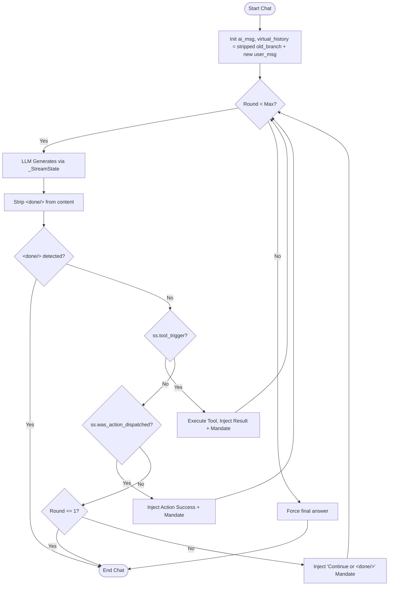
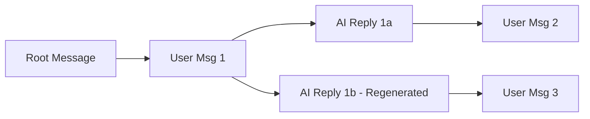

# 🧠 LollmsDiscussion: Cognitive Session & Artefact Architecture

This module implements the **Sovereign Discussion Session**, a stateful, thread-safe conversational engine that bridges the gap between transient LLM tokens and permanent, versioned knowledge storage.

It is composed of five orthogonal mixins:
1.  **`CoreMixin`**: Lifecycle, ORM proxy, message CRUD, and thread-safe DB commits.
2.  **`ChatMixin`**: The agentic reasoning loop, tool execution orchestration, and stream parsing.
3.  **`UtilsMixin`**: Branch management, export normalization, and context token auditing.
4.  **`PromptMixin`**: System prompt construction and XML tag post-processing.
5.  **`FileImportMixin`**: Multi-modal ingestion (PDF, DOCX, Data) and Dual-Stream storage.

---

## 🏛️ 1. The Dual-Stream Artefact System (.lam Protocol)

The core innovation of this architecture is **Dual-Stream Storage**. We solve the "Context vs. Tool" paradox by splitting every artefact into two distinct physical and logical streams.

### The Problem
*   **LLMs** need high-level schemas, stats, and descriptions (Logical) to reason effectively without wasting context window on raw binary data.
*   **Tools** (Python, SQL, Executors) need the exact, raw binary or text file (Physical) on disk to execute against.

### The Solution: `.lam` (Logical Artefact Metadata)
When an artefact is created (especially Data or Binary files), the system writes **two** distinct entities:

1.  **Physical Twin (`versions/{title}_v{N}.{ext}` & `workspace/{title}.{ext}`)**
    *   **Content**: Raw bytes (CSV rows, SQLite binary, PNG pixels, Python source).
    *   **Purpose**: Executable by tools. Accessible via simple relative paths.
    *   **Visibility**: Visible in the workspace tree.

2.  **Logical Twin (`versions/{title}_v{N}.lam`)**
    *   **Content**: Markdown schema, statistics, column types, row counts, descriptions.
    *   **Purpose**: Injected into the LLM context window.
    *   **Visibility**: **Hidden** from the workspace tree (stored only in `versions/`).

### Architecture Diagram
```text
data_workspace/
└── discussions/
    └── {discussion_id}/
        ├── versions/
        │   ├── dataset_v1.csv       <-- Physical Twin (Raw Data)
        │   ├── dataset_v1.lam       <-- Logical Twin (Schema/Stats for LLM)
        │   ├── dataset_v2.csv       <-- Physical Twin (Updated)
        │   └── dataset_v2.lam       <-- Logical Twin (Updated Schema)
        └── dataset.csv              <-- Active Workspace Copy (Symlink/Copy of Physical)
```

---

## 🧬 2. The Chat Loop & Tool Orchestration (`ChatMixin`)

The `chat()` method is not a simple API call; it is an **Agentic State Machine**. It handles pre-hydration, multi-step reasoning, tool execution, and self-healing file restoration.

### Execution Workflow & Virtual History Protocol

The `chat()` method is not a simple API call; it is an **Agentic State Machine** that orchestrates multi-step reasoning, tool execution, and context preservation. 

The core architectural concept is the separation of **Old History** from **Virtual History**:
- **Old History**: All messages up to the current user prompt. To save tokens and prevent mimicry, these are aggressively stripped of execution logs (`<processing>` blocks) and raw XML. Artifact creations are replaced with `[🔒SYSTEM_ARTIFACT_CREATED:title|type]` anchors.
- **Virtual History**: The rounds seen as extra alternations between user and assistant during the current turn. The assistant messages contain the **raw text including `<tool>` tags**, and the user messages contain the structured `<tool_result>`. This raw preservation ensures perfect KV-cache alignment and allows the LLM to understand exactly what it already asked for.



### The `<done/>` Termination Protocol

The agentic loop no longer relies on fragile heuristics (like intent detection) to decide when to terminate. Instead, the LLM is given explicit control via the `<done/>` tag.

1.  **Round 1 Short-Circuit**: If the LLM generates pure conversational text without any functional tags (`<tool>`, `<artifact>`) on the first round, the loop breaks immediately. This is a standard conversational response.
2.  **Action Continuation**: If the LLM emits a functional tag, the action is executed. The result is injected into `virtual_history` along with a mandate: "When you think you finished your task, issue a final conversational text and end it with a `<done/>` tag."
3.  **Explicit Termination**: The loop only breaks if the LLM emits `<done/>` on a new line, or if `max_reasoning_steps` is reached. The `<done/>` tag is stripped from `ai_msg.content` before saving so it never appears in the UI.
4.  **Continuation Mandate**: If the LLM stops generating without `<done/>` and without dispatching an action (and it's not round 1), a system message is injected reminding it to either continue working or emit `<done/>`.

### Detailed Phase Breakdown

1.  **Pre-Hydration**:
    * Memory Decay & Associative Pull (SQLite).
    * RAG Injection (if personality has data).
    * **Dynamic Tool Mounting**: If data files exist in workspace, `semantic_data_engineer` is auto-mounted.
2.  **Context Assembly**:
    * System Prompt + Rules (including `<done/>` protocol instructions).
    * **Active Artefacts**: Injects `.lam` content (Logical Twins) for all active files.
    * Memory Handles.
3.  **Reasoning Loop** (Max 20 steps):
    * **LLM Generation**: Streams tokens to `_StreamState`.
    * **Stream Parsing**: Intercepts closed XML tags (`<artifact>`, `<tool>`, `<done/>`) instantly.
    * **Tool Execution**:
        * **CWD Switch**: Changes OS Current Working Directory to `data_workspace/discussions/{id}/`.
        * **Sync**: Ensures all active artifacts exist on disk.
        * **Run**: Executes Python function.
        * **Post-Scan**: Detects NEW files created by tool → Auto-registers as Artefacts.
    * **Feedback**: Sanitizes tool output (strips base64 blobs) and feeds back to LLM with the `<done/>` mandate.
    4.  **Termination**: Commits DB, resets cancellation flags.

#### 🧠 2.1 Multi-Turn Context Amnesia & Dual-Copy Persistence

A critical challenge in agentic loops is **Multi-Turn Context Amnesia**. When an LLM executes a sequence of actions across multiple turns (e.g., testing 19 tools sequentially), the standard sanitization of historical messages (stripping `<processing>` blocks and raw XML) erases the exact execution path. On the next turn, the LLM loses its place in the sequence, causing it to repeat tools or halt prematurely.

To solve this, the `ChatMixin` implements the **Dual-Copy Virtual History Persistence Protocol**:

1.  **Dual-Copy Storage**: For any assistant message involving multi-step tool calls, the system stores two copies:
    *   **UI Content (`ai_msg.content`)**: The sanitized, user-facing text containing conversational summaries and `<processing>` execution blocks.
    *   **Virtual History (`ai_msg.metadata["virtual_history"]`)**: The raw, unsanitized alternation of assistant text (including `<tool>` tags) and user tool results (`<tool_result>` payloads).

2.  **Context Splicing during `export()`**:
    When building the context for the LLM in the *next* turn, `UtilsMixin.export()` checks the metadata of historical assistant messages. If a message contains persisted `virtual_history` AND no active `virtual_history` is being built for the current turn, the sanitized `ai_msg.content` is **discarded** and replaced with the raw virtual history alternation.
    *   This ensures the LLM sees the exact `<tool>` tags and `<tool_result>` payloads from the previous turn, maintaining perfect KV-cache alignment.
    *   Only the *immediately preceding* turn retains its full virtual history; older turns are aggressively stripped to save tokens.

```mermaid
flowchart TD
    A[Turn N: User asks to test tools] --> B[ChatMixin executes Tool 1, Tool 2]
    B --> C{Turn N ends with tool calls?}
    C -- Yes --> D[Persist virtual_history to ai_msg.metadata]
    C -- No --> E[Standard sanitized save]
    D --> F[Turn N+1: User asks to continue]
    F --> G[export() builds context]
    G --> H{Did previous AI msg have virtual_history?}
    H -- Yes --> I[Splice raw virtual_history into context]
    H -- No --> J[Use standard sanitized content]
    I --> K[LLM sees exact execution path and continues correctly]
```

#### 🚦 2.2 Same-Session Continuation Mandate

To complement the Dual-Copy protocol, the system prompt explicitly enforces a **Same-Session Continuation** mandate. The LLM is instructed that when it states an intent to perform a sequence of actions (e.g., "Now testing tool_X..."), it MUST emit the corresponding functional tag (`<tool>`, `<artifact>`) in its immediate next response.

The system prompt includes the following directive:
> **SAME-SESSION CONTINUATION (MULTI-TURN CHAINS)**: When you are executing a sequence of actions across multiple turns (e.g., testing tools one by one), you MUST emit the next action's tag in your IMMEDIATE NEXT response. Do NOT wait for the user to prompt you again. The system preserves your exact execution path, so you have full visibility of the previous tool results. If you state 'Now testing tool_X...', the VERY NEXT token you generate MUST be `<tool>{"name": "tool_X"...}`.

This combination of architectural persistence (Dual-Copy) and explicit cognitive instruction (Same-Session Mandate) ensures robust multi-turn tool chaining without context loss.

### The `chat()` Method API

The `chat()` method is the primary entry point for interacting with the LollmsDiscussion session. It orchestrates the entire agentic loop, including pre-hydration, multi-step reasoning, tool execution, and self-healing file restoration.

```python
def chat(
    self,
    user_message: str,
    personality=None,
    branch_tip_id=None,
    tools=None,
    add_user_message: bool = True,
    images=None,
    debug: bool = False,
    remove_thinking_blocks: bool = True,
    enable_image_generation: bool = True,
    enable_image_editing:    bool = True,
    auto_activate_artefacts: bool = True,
    enable_inline_widgets:        bool = False,
    enable_notes:                 bool = True,
    enable_skills:                bool = True,
    enable_forms:                 bool = True,
    enable_books:                 bool = False,
    enable_presentations:         bool = False,
    memory_manager=None,
    enable_artefacts:             bool = True,
    enable_memory:                bool = True,
    enable_auto_dream:            bool = True,
    enable_deep_memory_pulling:   bool = True,
    prehydrate_rag:               bool = True,
    max_reasoning_steps:          int = 20,
    enable_in_message_status:     bool = False,
    enable_sub_agents:            bool = False,
    forward_artefact_chunks:      bool = False,
    fast_artefact_replicas:       Optional[List[str]] = None,
    tolerance_level:              Optional[str] = "strict",
    allow_dynamic_tools:          bool = False,
    debug_export:                 bool = False,
    **kwargs
) -> Dict[str, Any]:
```

#### Parameters

**Core Conversation & Context**
*   `user_message` (`str`): The input text from the user for this turn.
*   `personality` (`Optional[Any]`): The personality object containing the system prompt and optional RAG data. If `None`, the discussion's default system prompt is used.
*   `branch_tip_id` (`Optional[str`]): The specific message ID to use as the tip of the conversation branch. If `None`, the discussion's `active_branch_id` is used.
*   `add_user_message` (`bool`): If `True`, the `user_message` is added to the database history. If `False`, the generation regenerates from the existing branch tip (used for regeneration).
*   `images` (`Optional[List[str]]`): A list of base64 encoded images to attach to the user message for vision-capable models. Use `suppress_images=True` to strip these for non-vision models.
*   `suppress_images` (`bool`): If `True`, prevents any images (user-uploaded, discussion-level, or artifact-generated) from being passed to the LLM binding's generation call. This is essential for using non-vision LLMs that crash or error when receiving image data. Defaults to `False`.

**Artifact & Feature Flags**
*   `enable_artefacts` (`bool`): Master switch for the artifact creation system (`<artifact>` tags). If `False`, all artifact-related processing is disabled.
*   `auto_activate_artefacts` (`bool`): If `True`, newly created or updated artifacts are immediately set to `FULL` visibility and injected into the LLM context.
*   `enable_inline_widgets` (`bool`): Enables the `<lollms_inline>` tag for ephemeral, interactive HTML widgets.
*   `enable_notes` (`bool`): Enables the `<note>` tag for persistent user-facing knowledge notes.
*   `enable_skills` (`bool`): Enables the `<skill>` tag for persistent AI behavior capsules.
*   `enable_forms` (`bool`): Enables the `<lollms_form>` tag for pausing generation to request structured user input.
*   `enable_books` (`bool`): Conditionally enables book-specific instructions in the system prompt if the user request matches.
*   `enable_presentations` (`bool`): Conditionally enables HTML presentation slide instructions.
*   `enable_image_generation` (`bool`): Enables the `<generate_image>` tag if a TTI binding is available.
*   `enable_image_editing` (`bool`): Enables the `<edit_image>` tag if a TTI binding is available.

**Agentic Loop & Tool Orchestration**
*   `tools` (`Optional[Dict[str, Dict[str, Any]]]`): A dictionary of external tool specifications that are merged into the active tool registry for this turn. If `None`, the system relies solely on LCP auto-discovery and any dynamically mounted tools (like `semantic_data_engineer`). The dictionary keys are the tool names, and the values are specification dictionaries. A tool spec dict must contain:
    *   `name` (`str`): The exact name of the tool (must match the dictionary key).
    *   `description` (`str`): A human/LLM-readable description of what the tool does.
    *   `parameters` (`List[Dict]`): A list of parameter specifications, where each dict contains `name`, `type`, and `description`.
    *   `callable` (`Callable`): The Python function that the orchestrator will execute when the LLM calls this tool. The orchestrator automatically handles CWD switching and artifact syncing before/after execution.
    
    **Example:**
    ```python
    def my_python_executor(code: str) -> dict:
        # Execution logic here...
        return {"success": True, "output": "Execution finished."}

    external_tools = {
        "tool_my_custom_executor": {
            "name": "tool_my_custom_executor",
            "description": "Executes arbitrary Python code and returns the output.",
            "parameters": [{"name": "code", "type": "str", "description": "The Python code to run."}],
            "callable": my_python_executor
        }
    }

    discussion.chat(user_message="Run this code...", tools=external_tools)
    ```
*   `allow_dynamic_tools` (`bool`): **Security Gate**. If `True`, allows the LLM to write and execute its own Python tools on the fly via `type="tool"` artifacts. Defaults to `False`.
*   `enable_code_execution` (`bool`): **Security Gate**. If `True`, registers the `tool_execute_python_code` LCP tool, allowing the LLM to execute arbitrary Python code strings. Defaults to `False`.
*   `max_reasoning_steps` (`int`): The maximum number of agentic reasoning rounds before the loop forces a final answer. Prevents infinite cycles.

#### 🗂️ Multi-Source Tool Orchestration (LCP)

The system natively supports merging tools from multiple distinct sources (LCP auto-discovery, explicit callable dictionaries, and dynamic mounting). 

**1. LCP Auto-Discovery (Client-Level)**
When constructing the `LollmsClient`, you can configure the LCP binding to scan multiple folders or specific files. All discovered `tool_*` functions are registered and made available to every discussion by default.

```python
from lollms_client import LollmsClient

client = LollmsClient(
    # ... llm_binding_name="ollama" ...
    tools_binding_name="lcp",
    tools_binding_config={
        "tools_folders": [
            "./my_custom_tools_directory",
            "C:/shared_network_tools/lcp_library"
        ],
        "tool_files": [
            "C:/projects/utilities/matter_lock_controller.py"
        ]
    }
)

# All tools found in the folders/files above are automatically active
discussion.chat(user_message="Turn off the living room light")
```

**2. Dynamic Library Mounting (Discussion-Level)**
The `ChatMixin` automatically detects data files in the workspace and mounts specialized libraries (like `semantic_data_engineer`). You can also manually trigger this via the LCP binding if you need to load a specialized library on the fly.

```python
# Mount a specific library folder dynamically
if hasattr(client.tools, "mount_tool_library"):
    client.tools.mount_tool_library("my_specialized_analyzer")

# Now the tools inside `my_specialized_analyzer` are active for the next chat()
discussion.chat(user_message="Run the specialized analysis")
```

**3. Explicit Callable Injection (Turn-Level)**
For maximum control, you can inject Python functions directly into the `tools` parameter of `chat()`. This is useful for temporary tools, testing, or tools that require closure over local state. These are merged with any LCP-discovered tools.

```python
def my_temp_tool(query: str) -> dict:
    """A tool that only exists for this specific turn."""
    return {"success": True, "output": f"Searched for {query}"}

explicit_tools = {
    "tool_my_temp": {
        "name": "tool_my_temp",
        "description": "A temporary tool for this turn.",
        "parameters": [{"name": "query", "type": "str", "description": "The search query."}],
        "callable": my_temp_tool
    }
}

# Merges with LCP tools. If LCP has a tool with the same name, this one overrides it.
discussion.chat(user_message="Search for apples", tools=explicit_tools)
```
*   `enable_sub_agents` (`bool`): If `True`, registers internal spinoff sub-agents (e.g., Surgical Code Specialist, Presentation Designer) as executable tools.
*   `forward_artefact_chunks` (`bool`): If `True`, forwards raw streaming code chunks to the UI callback for live artifact rendering. If `False`, only lightweight structural status events are forwarded.
*   `fast_artefact_replicas` (`Optional[List[str]]`): Custom status messages to display when an artifact is created with an empty body (instant creation).
*   `tolerance_level` (`Optional[str]`): Sets the execution tolerance for downstream tools (e.g., `strict` or `lax` for Python data queries).

**Memory & RAG**
*   `memory_manager` (`Optional[Any]`): The LollmsMemoryManager instance for tiered persistent memory. If `None`, memory features are disabled.
*   `enable_memory` (`bool`): Master switch for SQLite memory ingestion and retrieval.
*   `enable_deep_memory_pulling` (`bool`): If `True`, performs associative deep memory pull based on the `user_message` before generation.
*   `enable_auto_dream` (`bool`): If `True`, triggers a subconscious dream consolidation pass after the turn completes.
*   `prehydrate_rag` (`bool`): If `True` and the personality has data, queries the RAG database before generation to inject context.

**Debugging & UI Feedback**
*   `debug` (`bool`): Enables verbose logging of the agentic loop.
*   `debug_export` (`bool`): Dumps the exact `virtual_history` (LLM context) and `ai_msg.content` (UI context) to a JSON file in the workspace to verify context separation.
*   `enable_in_message_status` (`bool`): If `True`, emits detailed status comments inside `<processing>` blocks for UI rendering.
*   `remove_thinking_blocks` (`bool`): If `True`, strips `<think>` or `</think>` blocks from the final saved message content.
*   `**kwargs`: Additional keyword arguments passed directly to the LLM binding's `generate_from_messages` call (e.g., `temperature`, `streaming_callback`).

#### Return Value

Returns a dictionary containing the complete result of the conversational turn:

```python
{
    "user_message": LollmsMessage,  # The user message object
    "ai_message": LollmsMessage,    # The final AI message object
    "sources": List[Dict],          # RAG sources retrieved
    "artefacts": List[Dict],        # Artifacts created/modified this turn
    "memory_report": Dict,          # Memory operations report
    "dream_report": Optional[Dict], # Auto-dream consolidation report
    "was_cancelled": bool           # Cancellation status
}
```

### Processing Block Status Metadata

When the LLM triggers a tool call, builds an artifact, or requests a context visibility change, the system intercepts the action and wraps it in a `<processing>` block in the live chat stream. Upon completion of the action, the system injects an HTML comment metadata tag immediately after the closing `</processing>` tag to indicate the outcome.

This metadata is **not** meant to be read by the LLM, but rather by the **frontend rendering engine**. It allows the UI to definitively know whether an operation succeeded or failed when the block closes, enabling accurate visual styling (e.g., green for success, red for failure).

*   **Tool Calls**:
    *   `<!-- status:success -->`: The tool executed successfully.
    *   `<!-- status:failure -->`: The tool encountered an error, crashed, or was blocked by the loop interceptor.
*   **Artefact Building**:
    *   `<!-- status:finished -->`: The artifact was fully received and registered in the workspace.
*   **Context Visibility Management**:
    *   `<!-- status:success -->`: The files were successfully locked, unlocked, or hidden.
    *   `<!-- status:failure -->`: None of the requested files were found in the workspace.

**Example Stream Output (Tool Call):**
```xml
<processing type="tool" title="Tool Execution: tool_execute_sql_query">
* Calling local tool system for 'tool_execute_sql_query'...
* Completed execution of 'tool_execute_sql_query' successfully.
Output Logs:
| id | name |
|----|------|
| 1  | Foo  |
</processing>
<!-- status:success -->
```

**Example Stream Output (Context Unlock):**
```xml
<processing type="context_update" title="Context Visibility Manager">
* Unlocking context files...
Context Update:
✅ Unlocking: data.csv, utils.py
</processing>
<!-- status:success -->
```

### Multi-Tier Context Visibility Management

To optimize the LLM's context window budget, the system uses a tiered visibility protocol for workspace files. **By default, all newly registered or synced files are assigned `TREE_UNLOCKABLE` (`[U]`) visibility to prevent automatic context pollution.** The LLM can dynamically promote or demote files into different visibility states using dedicated XML tags.

| Visibility Tier | Symbol | Context Behavior |
| :--- | :--- | :--- |
| **`FULL`** | `[C]` | Fully loaded in context (verbatim text/code/schema). |
| **`METADATA`** | `[M]` | Only signatures, schemas, and metadata are loaded. |
| **`TREE_UNLOCKABLE`**| `[U]` | Listed in the directory tree, but excluded from context. **This is the default state for all newly registered artifacts.** |
| **`TREE_LOCKED`** | `[L]` | Excluded from context and cannot be unlocked by the LLM. |
| **`HIDDEN`** | — | Completely excluded from both the context and the directory tree. |

#### State Transition Matrix

The system enforces a strict state machine for artifact visibility. The LLM can trigger transitions using XML tags, while the host application or system orchestrator can trigger transitions via API calls or background processes (like memory consolidation).

| Current State | Target State | Trigger / Mechanism | Description |
| :--- | :--- | :--- | :--- |
| **`[U]` TREE_UNLOCKABLE** | **`[C]` FULL** | `<unlock_file>` tag | LLM requests to load the file content into its active context window. |
| **`[U]` TREE_UNLOCKABLE** | **`[L]` TREE_LOCKED** | `<lock_file>` tag | LLM requests to lock the file to free up context space. |
| **`[U]` TREE_UNLOCKABLE** | **`HIDDEN`** | `<hide_file>` tag | LLM requests to completely remove the file from its awareness. |
| **`[C]` FULL** | **`[L]` TREE_LOCKED** | `<lock_file>` tag | LLM requests to lock the file to free up context space. |
| **`[C]` FULL** | **`HIDDEN`** | `<hide_file>` tag | LLM requests to completely remove the file from its awareness. |
| **`[L]` TREE_LOCKED** | **`HIDDEN`** | `<hide_file>` tag | LLM requests to completely remove the file from its awareness. |
| **`[M]` METADATA** | **`[C]` FULL** | `<unlock_file>` tag | LLM requests to promote the file from metadata-only to full content. |
| **`[M]` METADATA** | **`[L]` TREE_LOCKED** | `<lock_file>` tag | LLM requests to lock the file. |
| **`[M]` METADATA** | **`HIDDEN`** | `<hide_file>` tag | LLM requests to completely remove the file from its awareness. |
| **`HIDDEN`** | **`[C]` FULL** | Host Application API | The user or host application explicitly activates the artifact. |
| **`HIDDEN`** | **`[U]` TREE_UNLOCKABLE** | System Auto-Sync | A new file is detected on disk, or an external tool modifies a hidden file. |
| **`[L]` TREE_LOCKED** | **`[C]` FULL** | Host Application API | The user or host application explicitly unlocks the file for the LLM. |
| **`[C]` FULL** | **`[U]` TREE_UNLOCKABLE** | System Auto-Prune | The context management system demotes the file to save tokens. |
| **`[C]` FULL** | **`[M]` METADATA** | System Auto-Prune | The context management system demotes the file to metadata-only to save tokens. |

> **Note on `[L]` (Locked)**: The LLM **cannot** unlock a `[L]` (Locked) file. Once a file is locked, it remains locked for the duration of the session unless the host application intervenes. This prevents the LLM from repeatedly locking and unlocking large files, which would waste context tokens.

#### LLM Control Tags

The LLM can request visibility changes by outputting the following tags. The `ChatMixin` intercepts these tags, applies the visibility changes via `ArtefactManager.set_visibility()`, commits the discussion, and forces a continuation round so the LLM immediately utilizes the newly available context.

1.  **Unlock (Load to `[C]`)**:
    Used to load the full content of a file into the active context window.
    ```xml
    <unlock_file>
    filename.ext
    </unlock_file>
    ```

2.  **Lock (Demote to `[L]`)**:
    Used to free up context space by locking a file. It remains visible in the directory tree but cannot be loaded by the LLM.
    ```xml
    <lock_file>
    filename.ext
    </lock_file>
    ```

3.  **Hide (Remove from Tree)**:
    Used to completely remove a file from the LLM's awareness (both context and directory tree).
    ```xml
    <hide_file>
    filename.ext
    </hide_file>
    ```

Upon execution, the system replaces the raw XML tag in the LLM's message with a `<processing type="context_update">` block detailing the outcome (which files were processed, already in state, or not found) and a status meta tag.


---

## 🛠️ 3. Dynamic Tool Generation & Execution Protocol

The system allows the LLM to write, compile, and execute its own custom tools on the fly as standard `type="tool"` Artefacts. This bridges the gap between code generation and agentic action.

### The Flow
1.  **Generation**: The LLM writes a Python script containing a `tool_*` function and outputs it inside an `<artifact type="tool" name="my_tool">` XML block.
2.  **Interception**: The `ArtefactManager` intercepts the creation event and checks if the artefact type is `TOOL`.
3.  **Security Gate**: The manager checks the `allow_dynamic_tools` flag on the active discussion session. If `False` (the default), the file is saved as a standard code artefact but is **NOT** executed.
4.  **Registration**: If enabled, `ArtefactManager` passes the raw code to `LCPBinding.register_tool_from_code()`. The binding parses the AST, executes the code in an isolated module namespace, and registers the `tool_*` functions into the active tool registry.
5.  **Execution**: The LLM can immediately call `<tool>{"name": "tool_my_tool", "parameters": {...}}</tool>` in the same or subsequent turns.

### Security & Control
Because allowing an LLM to write and execute arbitrary code is inherently dangerous, this feature is strictly gated:
*   **`allow_dynamic_tools=False`**: By default, the chat loop sets this to `False`. The LLM can write the tool file, but it remains inert text.
*   **Opt-In Execution**: The host application must explicitly pass `allow_dynamic_tools=True` to `discussion.chat()` to enable dynamic execution.
*   **Visibility Rules**: Even when disabled, the tool artefact remains in the workspace, subject to standard `[U]`, `[C]`, `[L]` visibility tiers. The user can inspect the code the LLM wrote.

---
### 🛡️ 4.1 Security Gates & Strict Tool Registry Isolation

The `ChatMixin` enforces a **Strict Tool Registry Isolation** doctrine. The LLM is only ever aware of tools that are explicitly registered in the active `tools` dictionary for the current turn. If a tool is filtered out, the LLM has zero knowledge of its existence, preventing hallucination loops.

This is controlled by two critical security gates passed to `discussion.chat()`:

| Security Gate | Default | Filtered Tool | Description |
| :--- | :--- | :--- | :--- |
| `allow_dynamic_tools` | `False` | `tool_execute_python_data_query` | If `False`, filters out the dynamic LLM-authored Python tool execution environment. The LLM can still write `.py` files as artifacts, but cannot execute them. |
| `enable_code_execution` | `False` | `tool_execute_python_code` | If `False`, filters out the arbitrary Python code string execution tool. The LLM cannot run raw Python code strings unless explicitly enabled. |

If the LLM attempts to call a tool that was filtered out (or hallucinates one entirely), the `ChatMixin` intercepts the call *before* execution, injects a targeted correction into `virtual_history` listing the exact names of available tools, and forces a continuation round. This gracefully steers the LLM back to reality without polluting the context with raw stack traces.

---

### 🧠 5.1 Cognitive Checkpoint System

To prevent context window bloat and preserve the LLM's cognitive state across turns, the `ChatMixin` implements the **Cognitive Checkpoint System**. This system consists of three core components:

1.  **Smart Tool Output Offloading**:
    When a tool returns a result exceeding 1500 tokens, the system intercepts the output *before* it is appended to `virtual_history`.
    *   **Structured Data**: If the output is identified as structured data (e.g., from `tool_query*` or contains markdown tables/JSON), it is replaced with a compact system marker: `[SYSTEM: Tool returned X tokens of structured data...]`. The LLM is instructed to use aggregation tools next.
    *   **Unstructured Text**: The output is saved to a `.log` file in the workspace, registered as a `TREE_UNLOCKABLE` artifact, and replaced with: `[SYSTEM: Tool returned X tokens of text. It has been saved to 'filename.log'...]`.

2.  **The Unfinished Intent Interceptor**:
    If the LLM stops generating before emitting a functional tag but its text matches an intent pattern (e.g., "Let me query...", "Next I will build..."), the system intercepts the termination. It sanitizes the partial output, appends it to `virtual_history`, and injects a critical system correction: `[SYSTEM: CRITICAL. You stopped generation before executing your stated intent. Output the <tool> or <artifact> tag NOW...]`, forcing another reasoning round.

3.  **Cognitive Scratchpad Protocol**:
    The LLM is instructed to maintain a `scratchpad.md` artifact (of type `SCRATCHPAD`) during multi-step analysis. It uses this to save intermediate findings and hypotheses. If a hypothesis is proven wrong, the LLM is mandated to use a `SEARCH/REPLACE` block to invalidate the old assumption, preventing contradictory context accumulation.

### 🛑 5.2 Cancellation & Interrupt Protocol

The `ChatMixin` implements a **Thread-Safe Cancellation Protocol** using a simple boolean flag. This ensures that long-running agentic loops, heavy tool executions, or streaming generations can be interrupted instantly without leaving the database or workspace in an inconsistent state.

### How It Works
1.  **Signal**: The user (or UI) calls `discussion.cancel_generation()`.
2.  **Propagation**: This sets a internal `_cancel_flag` boolean and propagates to the LLM binding to stop low-level streaming.
3.  **Observation**: The agentic loop checks this flag at **four critical safe points**:
    *   **Start of Reasoning Round**: Before sending a new prompt to the LLM.
    *   **During Streaming**: Inside the token streaming callback (every chunk).
    *   **Post-Generation**: Immediately after the LLM finishes but before tool execution starts.
    *   **Tool Cleanup**: During the `finally` block of tool execution (restoring CWD, closing DB connections).
4.  **Graceful Exit**:
    *   The loop breaks immediately.
    *   The current message content is appended with `"[Generation cancelled by user]"`.
    *   Metadata is flagged: `{"cancelled": True, "mode": "cancelled"}`.
    *   The session is committed to DB safely.
    *   The cancellation flag is reset, allowing the next turn to proceed normally.

### API Usage

```python
# 1. Start a long-running generation in a background thread
def run_chat():
    response = discussion.chat(user_message="Analyze this 1GB CSV file...")
    print(response["was_cancelled"]) # Will be True if interrupted

thread = threading.Thread(target=run_chat)
thread.start()

# 2. User clicks "Stop" button
discussion.cancel_generation() 
# Returns True if signal was sent, False if no generation was active

# 3. Check status programmatically
if discussion.is_generation_cancelled():
    print("Generation is stopping...")

# 4. Automatic Reset
# After the chat() method returns, the cancel state is automatically cleared.
# You do NOT need to manually reset it for the next turn.
discussion.chat(user_message="New question...") # Works normally
```

### ⚠️ Critical Safety Guarantees
*   **No Orphaned Tools**: If cancelled *during* tool execution, the system waits for the current tool to finish its `finally` block (to restore CWD and close files) before breaking the loop. It does not kill the process abruptly (which could corrupt files).
*   **DB Integrity**: The partial message is saved to the database with a cancellation marker. You do not lose the conversation history up to that point.
*   **Context Cleanliness**: The system ensures no partial XML tags or broken JSON structures are left in the context window for the next turn.

---

## 🌿 6. Branching & Versioning

Messages are not a linear list. They are a **Directed Acyclic Graph (DAG)**.

### Message Branching

*   **`active_branch_id`**: Points to the leaf node of the current conversation path.
*   **`get_branch(leaf_id)`**: Recursively walks parents to root, returning a chronological list.
*   **`regenerate_branch`**: Deletes the current AI leaf and restarts the loop from the user parent.

### Artefact Versioning
Every update to an artefact creates a new version (Git-like).
*   **`artefacts.update(..., bump_version=True)`**: Creates v2, v3, etc.
*   **`artefacts.revert(title, target_version=2)`**: Restores old content as a new highest version.
*   **`artefacts.squash_versions(...)`**: Deletes intermediate versions to save space, preserving history in commit messages.
*   **Tags**: Bind semantic labels (e.g., "stable", "gold") to specific versions.

---

## 📥 7. File Import Modes (`FileImportMixin`)

The `import_file` method supports sophisticated ingestion strategies:

| Mode | Behavior | Use Case |
| :--- | :--- | :--- |
| **`text`** | Extracts raw text only. | Code, Logs, Markdown. |
| **`text_images`** | Extracts text + renders pages/images. Anchors images in text via `<artefact_image id="..." />`. | PDFs, DOCX with diagrams. |
| **`images_only`** | Rasterizes everything to images. No text extraction. | Scanned books, complex layouts. |
| **`ocr`** | Renders pages → Sends to Vision LLM → Transcribes text. | Handwritten notes, non-selectable PDFs. |
| **`data`** | **Dual-Stream**. Parses schema (.lam) + saves raw binary (.csv/.db). | Datasets, Spreadsheets. |
| **`data_bundle`** | **Schema Fusion**. Scans a folder, groups files by column signature, fuses them into a single SQLite DB. | Merging 100s of daily CSV reports into one DB. |

### Data Bundle Fusion Logic
When importing a folder as `data_bundle`:
1.  **Scan**: Reads headers of all CSV/XLSX files.
2.  **Fingerprint**: Normalizes column names (lowercase, underscore) and types.
3.  **Group**: Files with identical schemas are merged.
4.  **LLM Naming**: Sends schema sample to LLM to generate a meaningful table name (e.g., `sales_q1_q2_merged`).
5.  **Consolidate**: Writes a single `.db` file with multiple tables.

---

## 📦 8. Decoupled Artefact Protocol (.laa & .lab)

Artefacts are fully decoupled from discussions via two standalone archive formats. This allows artefacts to be moved between discussions, stored in Git, or shared externally without losing version history or physical data.

### A. Standalone Artefact Archive (`.laa`)
Used for exporting a **single artefact** with its **entire version history** (metadata + physical/logical twins). The `.laa` file is a ZIP archive containing a `manifest.json` and individual files for each version's content and physical bytes.

*   **Export**: `discussion.artefacts.export_artefact_to_archive(title, output_path)`
*   **Import**: `discussion.artefacts.import_artefact_from_archive(laa_path, activate=True)`
    *   Reconstructs all versions in the target discussion and generates new IDs to prevent collisions.

### B. Linked Artefact Bundle (`.lab`)
Used for exporting **multiple artefacts** (e.g., a full-stack application: backend, frontend, assets). It preserves the **relative folder structure** of the workspace. By default, it exports the active version of the artefacts, but can include all historical versions if requested.

*   **Single File Flattening**: If only one file is exported, it is placed at the root of the archive. If multiple files are exported, their relative paths from `workspace_data` are preserved.
*   **Export**: `discussion.artefacts.export_artefact_bundle(paths, output_path, include_versions=False)`
*   **Import**: `discussion.artefacts.import_artefact_bundle(lab_path, activate=True)`
    *   Unzips the archive into the target discussion's `workspace_data` and auto-registers all new files as artefacts.

### C. Global Artefact Library
The system provides a global archive directory (`data_workspace/standalone_artefacts/`) outside any specific discussion to store and manage `.laa` and `.lab` files.

```python
# Save an artefact to the global library
discussion.save_artefact_to_global_archive("my_data.csv")

# Load an artefact from the global library into the current discussion
discussion.load_artefact_from_global_archive("my_data.csv")

# Save a bundle of files to the global library
discussion.save_artefact_bundle_to_global_archive(
    paths=["workspace_data/main.py", "workspace_data/index.html"],
    bundle_name="my_fullstack_app"
)

# List all available artefacts and bundles in the global library
discussion.list_global_archive_artefacts()
discussion.list_global_archive_bundles()
```

---

### 📂 Accessing the Workspace & Executing Artifacts Externally

If your host application needs to execute or read an artifact (e.g., a Python script) directly **without** invoking the LLM agentic loop (`discussion.chat()`), you must resolve the file's absolute path safely.

**CRITICAL**: Never assume the workspace path exists. Always use the built-in getters to handle path resolution and directory creation automatically.

#### API Reference

*   `discussion.get_workspace_path() -> str | None`
    Returns the root workspace directory path for this discussion. Returns `None` if the discussion was created without a `workspace_path`.

*   `discussion.get_active_file_path(file_name: str, create_if_missing: bool = True) -> str | None`
    Safely resolves the absolute path of a file inside the discussion's `workspace_data` subfolder. If `create_if_missing` is True, it ensures the directory exists before returning the path (preventing `NoneType.mkdir` errors).

*   `discussion.sync_workspace_to_artefacts() -> Dict[str, int]`
    Synchronizes the physical `workspace_data` folder with the Artefact database. It scans the folder for new/modified files and registers them, and restores any missing files from the DB. **Always call this after executing scripts externally via `subprocess.run`.**

#### Example: Executing a Python Artifact Directly

🚨 **CRITICAL ARCHITECTURAL RULE**: When executing scripts externally via `subprocess`, you **MUST** set the `cwd` (Current Working Directory) to `discussion.get_workspace_data_path()`. 
If you omit this, the subprocess will inherit the host application's working directory, and the script will crash with `FileNotFoundError` when trying to open relative paths like `"sample_sales_data.csv"`.

```python
from pathlib import Path
import subprocess

# 1. Get the absolute paths safely
script_path = discussion.get_active_file_path("my_script.py")
ws_data_path = discussion.get_workspace_data_path()

if script_path and Path(script_path).exists():
    # 2. Execute it using the host environment
    print(f"Executing {script_path}...")
    result = subprocess.run(
        ["python", script_path], 
        capture_output=True, 
        text=True,
        cwd=ws_data_path  # 🛡️ MANDATORY: Set CWD to workspace_data so relative paths resolve correctly!
    )
    print("Output:", result.stdout)
    print("Errors:", result.stderr)
    
    # 3. 🔄 SYNC THE WORKSPACE BACK TO THE ARTEFACT SYSTEM
    # This detects any new files (e.g., output.csv, plot.png) created by the script
    # and registers them as artifacts so the UI and LLM can see them.
    sync_report = discussion.sync_workspace_to_artefacts()
    print(f"Sync complete: {sync_report}")
else:
    print("Artifact not found or workspace not configured.")
```

### 🔄 Post-Execution Sync: How It Works

When you execute a script manually (or via an external tool), it may generate new files (e.g., `plot.png`, `results.db`, `output.csv`) or modify existing ones in the `workspace_data/` directory. The LLM and the UI are unaware of these changes until you synchronize the workspace.

The `sync_workspace_to_artefacts()` method performs a **bidirectional synchronization**:

1. **Workspace → Database (Upsert)**: It scans the `workspace_data/` directory. If it finds a file that isn't registered as an artefact, it creates it. If a file has been modified, it updates the artefact content and bumps its version.
2. **Database → Workspace (Heal)**: It ensures all active text-based artefacts in the database exist on disk. If a file was accidentally deleted, it restores it from the database.

This ensures the LLM's context window (the `.lam` schemas and code contents) perfectly matches the physical state of the workspace. **Always call this method after any external execution.**

#### API Reference

*   `discussion.get_workspace_data_path() -> str | None`
    Returns the absolute path to the `workspace_data/` subfolder for this discussion. Returns `None` if the discussion was created without a workspace.

*   `discussion.get_active_file_path(file_name: str, create_if_missing: bool = True) -> str | None`
    Safely resolves the absolute path of a file inside the discussion's `workspace_data/` subfolder. If `create_if_missing` is True, it ensures the directory exists before returning the path (preventing `NoneType.mkdir` errors).

*   `discussion.sync_workspace_to_artefacts() -> Dict[str, int]`
    Synchronizes the physical `workspace_data/` folder with the Artefact database. 
    Returns a report dictionary: `{"new_artefacts": int, "updated_artefacts": int, "restored_files": int}`.


### Import Conflict Resolution

When importing files into the artefact system, there is a possibility of title collisions (e.g., importing `README.md` from two different sources). The `import_file` method provides an `on_conflict` parameter to define the resolution strategy.

### Strategies

1. **`suffix` (Default)**
   - **Behavior**: If an artifact with the target title already exists, the new file is renamed with an incrementing suffix (e.g., `README_1.md`, `README_2.md`).
   - **Use Case**: Preserving all imported files without losing any data or altering the original artifact.
   - **Result**: Creates a new artifact with the suffixed title. The original artifact remains untouched.

2. **`version`**
   - **Behavior**: The existing artifact is updated, and its version number is incremented. The physical file is overwritten with the new content, but the previous version is preserved in the database history.
   - **Use Case**: Importing an updated version of a file where you want to maintain a clear audit trail of changes.
   - **Result**: Updates the existing artifact and bumps the version (e.g., v1 → v2).

3. **`overwrite`**
   - **Behavior**: The existing artifact's content is replaced with the new content, but the version number is **not** incremented. Previous version history is preserved, but the active version is silently replaced.
   - **Use Case**: Correcting or silently updating a file without polluting the version history.
   - **Result**: Updates the existing artifact. The version number remains the same.

4. **`replace`**
   - **Behavior**: Completely purges all existing versions and history of the artifact, then creates a fresh `v1` baseline with the new content.
   - **Use Case**: Starting over cleanly when the previous iterations are no longer relevant or were imported in error.
   - **Result**: Deletes all previous database records and physical metadata, then creates a new `v1` artifact.

### Example

```python
# Import a file, replacing any existing artifact with the same name completely
discussion.import_file(
    path="path/to/new/README.md",
    mode="text",
    title="README.md",
    on_conflict="replace"
)
```

## 🎛️ 8. Interactive Widgets (`<lollms_inline>`)

Widgets are **ephemeral, in-context, interactive educational demonstrations** rendered directly inside the chat bubble. They are designed for teaching concepts, visualizing data, or providing micro-interactions (similar to platforms like Brilliant.org).

### 🚧 The Boundary Doctrine: Widgets vs. Artifacts

The architecture strictly separates transient educational tools from persistent applications.

| Feature | `<lollms_inline>` (Widget) | `<artifact>` (Artifact) |
| :--- | :--- | :--- |
| **Purpose** | Teaching, explaining, visualizing concepts. | Real coding, games, persistent tools, scripts. |
| **Persistence** | Ephemeral. Disappears when the chat scrolls. | Persistent, versioned, saved to disk. |
| **Size Limit** | Strictly constrained to **600x400px**. | Unconstrained (full screen apps). |
| **Rendering** | Rendered inline in the chat flow by the **host app**. | Rendered in a dedicated workspace panel/viewer. |
| **Syntax** | Starts directly with a `<div>` (no `<html>` wrapper). | Contains full file content. |

The LLM is instructed to use widgets **only** for brief, educational animations or interactive diagrams. If a user asks to "build a game" or "create an app", the LLM is strictly forbidden from using `<lollms_inline>` and must use `<artifact>`.

### 🛠️ Host Application Integration (How to Use It)

Unlike artifacts (which are persisted to disk and managed by the backend), `<lollms_inline>` widgets are **strictly handled by the calling application's frontend**. The backend parser does not wrap them in `<processing>` blocks or dispatch them internally. It passes the raw HTML/CSS/JS content directly to the UI via streaming events.

To integrate interactive widgets into your application, you must intercept these events and render the payload inside a secure sandbox.

#### 1. Event Lifecycle
When the LLM generates a widget, the backend stream parser (`_StreamState` in `_mixin_chat.py`) detects the `<lollms_inline>` tag and emits specific events on the streaming callback:
1. **`MSG_TYPE_CHUNK` (Open)**: Fired when `<lollms_inline ...>` is detected. The metadata contains `{"type": "inline_widget_start"}`.
2. **`MSG_TYPE_WIDGET_CHUNK` (Streaming)**: Fired for every text chunk inside the widget tag. 
   - Meta: `{"title": str, "chunk": str, "widget_type": str}`
3. **`MSG_TYPE_WIDGET_DONE` (Complete)**: Fired when the closing `</lollms_inline>` tag is detected. It contains the complete, validated raw source.
   - Meta: `{"title": str, "content": str, "widget_type": str}`

#### 2. Intercepting the Event (Python Backend / FastAPI)
If your backend acts as a proxy to the frontend, ensure you forward these message types to your WebSocket or SSE stream.

```python
# Example backend callback handling
def stream_callback(chunk: str, msg_type: MSG_TYPE, meta: dict):
    if msg_type == MSG_TYPE.MSG_TYPE_WIDGET_DONE:
        # Forward the complete widget payload to the frontend
        websocket.send_json({
            "type": "widget_complete",
            "title": meta.get("title"),
            "html_content": meta.get("content")
        })
```

#### 3. Rendering in the Frontend (JavaScript / React / Vue)
Because widgets contain raw HTML, CSS, and JavaScript, they **MUST** be rendered inside a secure, sandboxed `<iframe>` to prevent CSS leakage and DOM manipulation of the host application.

**Widget Content Structure:**
The LLM outputs **simplified tag contents**. It does NOT write a complete HTML document (`<!DOCTYPE html>`, `<head>`, `<body>`). It starts directly with a container `<div>` (max-width 600px, max-height 400px) and uses `<script>` tags for logic. Your frontend must wrap this content.

**Secure Rendering Protocol:**
1. Create an `<iframe>` with strict sandbox attributes.
2. Wrap the LLM's raw output in a basic HTML document.
3. Inject predefined CSS to match the dark-mode aesthetic.
4. Use the **Blob URL Protocol** to bypass `file://` cross-origin restrictions.

```javascript
function renderWidgetInChat(title, rawWidgetHtml) {
    const wrapper = document.createElement('div');
    wrapper.className = 'chat-widget-wrapper';
    wrapper.style.width = '600px';
    wrapper.style.height = '400px';
    
    const iframe = document.createElement('iframe');
    iframe.sandbox = "allow-scripts allow-same-origin"; // Strict sandbox
    iframe.style.width = '100%';
    iframe.style.height = '100%';
    iframe.style.border = 'none';
    
    wrapper.appendChild(iframe);
    document.getElementById('chat-container').appendChild(wrapper);

    // Pre-defined CSS (matches _build_inline_widget_instructions defaults)
    const widgetCss = `
        body {
            font-family: -apple-system, BlinkMacSystemFont, "Segoe UI", Roboto, sans-serif;
            background-color: #0f172a;
            color: #f8fafc;
            margin: 0; padding: 16px;
            box-sizing: border-box;
            display: flex; flex-direction: column;
            align-items: center; justify-content: center;
            min-height: 100vh; overflow: hidden;
        }
        button {
            background-color: #4f46e5; color: #ffffff;
            border: none; padding: 8px 16px; border-radius: 6px;
            font-weight: 600; cursor: pointer;
        }
    `;

    // Build the complete HTML document
    const fullHtml = `
        <!DOCTYPE html>
        <html>
        <head>
            <style>${widgetCss}</style>
        </head>
        <body>
            ${rawWidgetHtml}
        </body>
        </html>
    `;

    // Create a Blob from the HTML string (Bypasses file:// cross-origin blocks)
    const blob = new Blob([fullHtml], { type: 'text/html' });
    const blobUrl = URL.createObjectURL(blob);

    // Assign the Blob URL to the iframe src
    iframe.src = blobUrl;

    // Clean up the Blob URL when the iframe finishes loading
    iframe.onload = () => {
        URL.revokeObjectURL(blobUrl);
    };
}
```

### 🔒 Security Rules for Widget Rendering

1. **Strict Sandboxing**: Always use `sandbox="allow-scripts allow-same-origin"`. Do **NOT** add `allow-top-navigation` or `allow-popups`.
2. **No Parent Access**: The LLM is instructed never to access `window.parent` or `window.top`. Your iframe sandbox enforces this.
3. **No External Storage**: Widgets should not read/write cookies, `localStorage`, or `sessionStorage`. They are ephemeral.
4. **Relative Fetches Only**: If a widget needs to load a dataset, it should perform relative fetches to `/api/workspace_files/filename.csv`. The host application must ensure this endpoint is accessible from the iframe's origin.

### 💡 PixiJS Integration
The LLM is mandated to use **PixiJS** for any animations or physics simulations. The host application does not need to pre-install PixiJS, as the LLM's code dynamically loads it via CDN:
```javascript
var s = document.createElement('script');
s.src = 'https://cdn.jsdelivr.net/npm/pixi.js@7/dist/pixi.min.js';
document.head.appendChild(s);
```
Ensure your Content Security Policy (CSP) allows scripts from `cdn.jsdelivr.net` if you are using one.

---

## 📋 9. Interactive Forms (`<lollms_form>`)

Forms allow the LLM to request structured data from the user mid-generation. When the LLM emits a `<lollms_form>` tag, the system parses it into a JSON descriptor, pauses the generation loop, and waits for the frontend to submit the user's answers. This is ideal for surveys, configuration steps, or gathering multiple parameters at once.

### 🚧 The Boundary Doctrine: Forms vs. Artifacts

Forms are strictly for **synchronous user data acquisition**. They do not create persistent files. If the LLM needs to save a document or script, it must use `<artifact>`.

| Feature | `<lollms_form>` (Form) | `<artifact>` (Artifact) |
| :--- | :--- | :--- |
| **Purpose** | Asking the user for structured input. | Creating files, code, and persistent tools. |
| **Persistence** | Ephemeral. Disappears once submitted. | Persistent, versioned, saved to disk. |
| **Action** | Pauses LLM generation and awaits UI response. | Triggers a file write and context update. |
| **Syntax** | Contains nested `<field>` and `<option>` tags. | Contains raw file content. |

The LLM is instructed to use forms when it needs multiple specific details from the user before proceeding with a task. It is forbidden from using forms to delay work that could be done with sensible defaults.

### 📡 Streaming Protocol & Events

The form lifecycle is synchronous. The backend parses the XML and emits a specific event, then halts the reasoning loop until the API is called.

#### Event Lifecycle
1. **`MSG_TYPE_FORM_READY`**: Fired when the closing `</lollms_form>` tag is detected. The metadata contains the complete parsed form descriptor. The LLM generation loop is now paused.
   - Meta: `{"form_id": str, "form": dict}`
2. **`MSG_TYPE_FORM_SUBMITTED`**: Fired when the host application calls `discussion.submit_form_response()`. The generation loop resumes, injecting the user's answers as a tool result.
   - Meta: `{"form_id": str, "answers": dict, "form": dict}`

#### Form Descriptor Structure
The LLM outputs raw XML containing the form schema. The backend parses this into a JSON descriptor.

**Example LLM Output:**
```xml
<lollms_form title="User Survey" description="Please fill this out" submit_label="Submit">
  <field name="user_name" label="Full Name" type="text" placeholder="John Doe" />
  <field name="color" label="Favorite Color" type="select" options="Red, Blue, Green" />
  <field name="pref" label="Contact Method" type="radio">
    <option>Email</option>
    <option>Phone</option>
  </field>
  <field name="age" label="Your Age" type="number" min="18" max="99" default="25" />
  <field name="rating" label="Satisfaction" type="rating" max="5" default="4" />
</lollms_form>
```

**Parsed JSON Descriptor (Sent to UI):**
```json
{
  "id": "unique-uuid-here",
  "title": "User Survey",
  "description": "Please fill this out",
  "submit_label": "Submit",
  "fields": [
    {"name": "user_name", "label": "Full Name", "type": "text", "placeholder": "John Doe", "required": true},
    {"name": "color", "label": "Favorite Color", "type": "select", "options": ["Red", "Blue", "Green"], "required": true},
    {"name": "pref", "label": "Contact Method", "type": "radio", "options": ["Email", "Phone"], "required": true},
    {"name": "age", "label": "Your Age", "type": "number", "min": 18.0, "max": 99.0, "default": 25.0, "required": true},
    {"name": "rating", "label": "Satisfaction", "type": "rating", "max": 5.0, "default": 4.0, "required": true}
  ]
}
```

### 🖥️ Host Application Integration Guide

Because forms require pausing the LLM and waiting for human input, the host application must intercept the `MSG_TYPE_FORM_READY` event, render a UI component, and call a backend method to resume the conversation.

#### Step-by-Step Rendering Protocol

**1. Intercept the `MSG_TYPE_FORM_READY` Event**
In your streaming callback handler, listen for the form descriptor. You must map the field types to your UI framework's input components.

```javascript
// Frontend Streaming Callback Example
function handleStreamChunk(chunk, msgType, meta) {
    if (msgType === MSG_TYPE_FORM_READY) {
        const formDescriptor = meta.form;
        const formId = meta.form_id;
        renderFormInChat(formId, formDescriptor);
    }
}
```

**2. Render the Form**
Dynamically build a form based on the `fields` array. Common field types include:
- `text`, `textarea`: Standard string inputs.
- `number`, `range`: Numeric inputs with optional `min`, `max`, `step`.
- `select`: Dropdown menu. Options are provided as a comma-separated string in the `options` attribute OR as nested `<option>` tags.
- `radio`: Radio button group. MUST use child `<option>` tags.
- `checkbox`: Boolean toggle. Supports a `default="true"` attribute.
- `rating`: Star rating (integer). Supports `max` and `default`.
- `section`: A non-interactive header used to divide forms into sections.

**3. Submit the Response**
Once the user clicks "Submit", collect the form values into a dictionary where the keys are the field `name` attributes. Send this dictionary back to the backend.

The backend Python method to resume the conversation is `discussion.submit_form_response(form_id, answers)`.

```python
# Backend API Endpoint Example (e.g., FastAPI)
@app.post("/api/discussions/{disc_id}/forms/{form_id}/submit")
async def submit_form(disc_id: str, form_id: str, answers: dict):
    discussion = discussion_manager.get_discussion(disc_id)
    
    # This method injects the answers into the conversation history
    # and fires the MSG_TYPE_FORM_SUBMITTED event.
    success = discussion.submit_form_response(form_id, answers)
    
    if not success:
        raise HTTPException(status_code=404, detail="Form not found or already submitted.")
        
    return {"status": "success"}
```

### 🔒 Security & Integrity Rules for Forms

1. **Idempotency**: A form ID can only be submitted once. Calling `submit_form_response` a second time with the same ID will return `False` and log a warning.
2. **Blocking Behavior**: The `chat()` method blocks the current thread while waiting for form submission. Ensure the host application runs `discussion.chat()` in a background worker thread so the API server can still receive the form submission POST request.
3. **No Code Execution**: Forms are strictly data descriptors. The LLM cannot inject scripts or executable code into form fields or labels. The backend parser sanitizes the input.
4. **Required Fields**: The backend parser automatically marks fields as `required: true` unless explicitly marked `required="false"`. The UI should enforce this validation before allowing the submit button to be clicked.

---

### 🔄 10.1 Tool Failure Visibility & Anti-Loop Protocol

A critical architectural requirement is that the LLM **must always see the error details** when a tool fails, and the system **must never mask a failure as a success**. If the LLM cannot see why a tool failed, it will blindly retry the same call indefinitely, causing an infinite agentic loop.

#### The Three-Pronged Fix

The agentic loop in `ChatMixin` implements a three-pronged defense against infinite tool-retry loops:

1.  **Raw Dict Failure Detection (`is_failure`)**:
    The system checks the raw `tool_res` dictionary for `success: False` or a non-200 `status_code` **before** looking at the sanitized string. This prevents `prompt_injection` text (which may not contain the word "Error") from masking a failure.
    ```python
    is_failure = (
        (isinstance(tool_res, dict) and tool_res.get("success") is False) or
        (isinstance(tool_res, dict) and tool_res.get("status_code", 200) != 200) or
        "crashed" in status_done_line.lower() or
        (isinstance(tool_res, dict) and tool_res.get("error") and not tool_res.get("success", True))
    )
    ```

2.  **Error-Aware Sanitization (`_sanitize_tool_result`)**:
    When a tool returns a `prompt_injection` key alongside `success: False`, the sanitizer now includes the actual `error` message in the text fed back to the LLM. Previously, only the injection text was returned, hiding the root cause.
    ```python
    if not success and isinstance(tool_res, dict):
        error_msg = tool_res.get("error", "")
        # ...
        return f"{success_status}\nError: {error_msg}\n{pinj}"
    ```

3.  **Virtual History Feedback**:
    When a tool fails, the result injected into `virtual_history` is explicitly labeled as a failure with actionable guidance:
    ```python
    user_part = (
        f'<tool_result name="{tool_name}">\n'
        f"{clean_result_str}\n"
        f"</tool_result>\n\n"
        f"⚠️ **Tool Execution Failed.**\n"
        f"The tool '{tool_name}' encountered an error. Please politely inform the user..."
    )
    ```

#### FailureMemory Loop Guard

In addition to visibility, the system maintains a `FailureMemory` instance per `chat()` turn. This is a **signature-based loop interceptor**.

*   **Signature**: `f"{tool_name}::{json.dumps(tool_params, sort_keys=True)}"`
*   **First Failure**: The signature is recorded in `FailureMemory._signatures`. The error result is fed back to the LLM, and the loop **continues** to allow the LLM to correct itself.
*   **Second Identical Call**: Before executing a tool, the system checks if the signature already exists in `_signatures`. If it does, execution is **blocked**, a "Loop Intercepted" error is returned, and the agentic loop **breaks**.

This ensures the LLM gets exactly one chance to retry a failed tool with modified parameters before the system forcefully terminates the loop to prevent token waste.

### 🛡️ 11. Security & Integrity Rules

1.  **Path Sovereignty**: Tools **cannot** access files outside `data_workspace/discussions/{id}/`. The CWD switch enforces this at the OS level.
2.  **No Blind Edits**: The Aider patch engine requires verbatim `SEARCH` blocks. It uses 6-pass fuzzy matching (Exact → Whitespace → Indent → Comments → Blanks → Core Delta) to ensure safe edits.
3.  **Binary Stripping**: Tool results containing base64 blobs (>500 chars) are automatically stripped and replaced with `[base64 blob stripped: 24.3KB]` to prevent context explosion and tool loops.
4.  **Prompt Injection**: Tools can return a `prompt_injection` key. This overrides the standard JSON dump and tells the LLM exactly what to say next (e.g., "Here is your plot: ").

---

## 🚀 Quick Start: Executing Arbitrary Python Code

To allow the LLM to run arbitrary Python code strings (e.g., for quick calculations or ad-hoc scripting), pass `enable_code_execution=True` to `chat()`. This registers the built-in `tool_execute_python_code` LCP tool.

```python
# Enable the arbitrary code execution security gate
response = discussion.chat(
    user_message="Calculate the factorial of 10 using Python and tell me the result.",
    enable_code_execution=True
)

# The LLM will output:
# <tool>{"name": "tool_execute_python_code", "parameters": {"code": "import math; print(math.factorial(10))"}}</tool>
# The system will execute it, capture stdout, and feed it back to the LLM to formulate the final answer.
```

---

## 🚀 Quick Start: Creating a Custom Tool

Place a Python file in `tools_bindings/lcp/default_tools/`:

```python
# my_tool.py
def tool_analyze_my_data(file_name: str) -> dict:
    """
    Analyzes a file and logs to memory.
    
    Args:
        file_name (str): The name of the file to analyze.
    """
    # File is available at a simple relative path due to the CWD switch
    # performed by the LCP Binding/ChatMixin before execution.
    from pathlib import Path
    path = Path(file_name)
    
    if not path.exists():
        return {"success": False, "error": f"File '{file_name}' not found."}
    
    # Do work...
    
    # Tools MUST NOT accept discussion_instance or lollms_client_instance.
    # They must NOT directly manipulate the database or commit artifacts.
    # Simply return the result. The orchestrator will detect any new files
    # created in the CWD and automatically register them as artifacts.
        
    return {
        "success": True, 
        "output": "Analysis complete.",
        "prompt_injection": "Analysis done. Tell the user the result."
    }
```

### 🛑 CRITICAL: LCP Tool Agnosticism Doctrine (Relaxed)

**LCP tools are strictly agnostic to Lollms by default.** They must **NEVER** accept `discussion_instance`, `lollms_client_instance`, or any internal Lollms state object as input parameters unless explicitly required for advanced agentic patterns.

1.  **Agnostic Signatures**: Tools must operate purely on parameters that an LLM can naturally generate (strings, numbers, lists). The LCP AST parser filters out internal parameters (`discussion_instance`, `lollms_client_instance`) when building the JSON schema for the LLM, so the LLM never sees them.
2.  **Optional Context Injection**: If a tool explicitly declares `discussion_instance` or `lollms_client_instance` in its function signature, the ChatMixin orchestrator will inject them. This enables advanced patterns like recursive child agent spawning. The LCP AST parser filters these out when building the JSON schema for the LLM, maintaining the agnostic contract at the API level.
3.  **CWD Reliance**: The ChatMixin orchestrator is responsible for setting the CWD to the isolated workspace before execution. Tools should resolve files using simple relative paths (e.g., `Path(file_name)`).
4.  **Output-Only Communication**: Tools communicate results back by returning a dictionary. They must never attempt to directly manipulate the discussion database, commit artifacts, or access the client. The orchestrator detects new/modified files after execution and syncs them.

The LCP Binding will automatically:
1.  Parse the function signature via AST.
2.  Register it as a callable tool.
3.  Set CWD to the discussion workspace before execution.
4.  Sync any new files created back to the artefact system.
5.  **Track Errors**: Capture full tracebacks for both explicit tool failures and unexpected crashes, returning them in the result dictionary.
