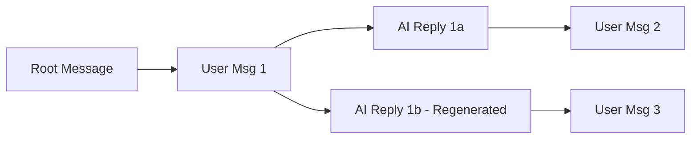

# 🧠 LollmsDiscussion: Cognitive Session & Artefact Architecture

This module implements the **Sovereign Discussion Session**, a stateful, thread-safe conversational engine that bridges the gap between transient LLM tokens and permanent, versioned knowledge storage.

It is composed of ten orthogonal mixins:
1.  **`CoreMixin`**: Lifecycle, ORM proxy, message CRUD, and thread-safe DB commits.
2.  **`ChatMixin`**: The persona-aware agentic reasoning loop (Orchestrator/Worker modes), tool execution orchestration, stream parsing, and the scientific debug-dump instrumentation layer.
3.  **`DelegationMixin`**: Orchestrator→Worker delegation — `<task>`/`<context_files>` parsing, sandboxed context-file resolution, bounded Worker spawning, and the `[WORKER REPORT]` envelope protocol.
4.  **`UtilsMixin`**: Branch management, export normalization, and context token auditing.
5.  **`PromptMixin`**: Single source of truth for all prompt doctrine — worker-tier builders (artifact/note/skill/form/image/widget), plus the Orchestrator-tier delegation protocol and the Worker task wrapper.
6.  **`MemoryMixin`**: Integration with `LollmsMemoryManager` for tiered persistent memory, episodic memory saving, and graph relationship traversal.
7.  **`FileImportMixin`**: Multi-modal ingestion (PDF, DOCX, Data) and Dual-Stream storage.
8.  **`InternetImportMixin`**: Web content extraction and quality scoring for internet-based RAG.
9.  **`ExportMixin`**: Standalone Artefact Archive (`.laa`) and Linked Artefact Bundle (`.lab`) export/import protocols.
10. **`BranchMixin`**: Directed Acyclic Graph (DAG) branch discovery, navigation, forking, and merging.

---

## 📊 14. Context Auditing & Token Telemetry (`get_context_status`)

`LollmsDiscussion` provides a built-in context auditing engine via `UtilsMixin.get_context_status()` and `UtilsMixin.count_discussion_tokens()`. This enables host applications and UI dashboards to inspect token consumption per context zone, calculate fill percentages against the active LLM context size (`get_ctx_size()`), and monitor image/VLM token costs in real time.

### 🏛️ Context Zone Token Breakdown

Calling `discussion.get_context_status(branch_tip_id=None)` evaluates all active context zones and returns a structured breakdown:

```python
status = discussion.get_context_status()
```

#### JSON Output Schema
```json
{
  "max_tokens": 8192,
  "current_tokens": 2450,
  "percent": 29.91,
  "zones": {
    "system_context": {
      "tokens": 1200,
      "breakdown": {
        "system_prompt": { "tokens": 350 },
        "user_data_zone": { "tokens": 50 },
        "discussion_data_zone": { "tokens": 100 },
        "personality_data_zone": { "tokens": 80 },
        "scratchpad": { "tokens": 120 },
        "pruning_summary": { "tokens": 150 },
        "working_memory": { "tokens": 180 },
        "deep_memory": { "tokens": 60 },
        "artefacts": {
          "tokens": 450,
          "types": {
            "code": { "tokens": 300, "count": 1 },
            "document": { "tokens": 150, "count": 1 }
          }
        }
      }
    },
    "message_history": {
      "tokens": 1050,
      "breakdown": {
        "text_tokens": 850,
        "image_tokens": 200,
        "message_count": 6
      }
    },
    "discussion_images": {
      "tokens": 200,
      "count": 1
    }
  }
}
```

---

### 📋 Detailed Zone Reference

| Zone | Sub-Category | Description | Source / Computation |
| :--- | :--- | :--- | :--- |
| **`system_context`** | `system_prompt` | Base system prompt instructions and persona definitions. | `self._system_prompt` |
| | `user_data_zone` | Persistent user data block injected into the system prompt. | `self.user_data_zone` |
| | `discussion_data_zone` | Session-level data documents loaded into context. | `self.discussion_data_zone` |
| | `personality_data_zone` | Persona-specific data zone. | `self.personality_data_zone` |
| | `scratchpad` | Volatile technical notes and intermediate thoughts. | `self.scratchpad` |
| | `pruning_summary` | Dense synopsis generated by `summarize_and_prune()`. | `self.pruning_summary` |
| | `working_memory` | Level 1 active working memory tokens from `LollmsMemoryManager`. | `memory_manager.build_working_zone()` |
| | `deep_memory` | Deep memory handle index / catalog tokens. | `memory_manager.build_handles_zone()` |
| | `artefacts` | Active workspace files (`.lam` schemas or code) categorized by `ArtefactType` with counts. | `self.artefacts.list(active_only=True)` |
| **`message_history`** | `text_tokens` | Text content of all messages along the active branch. | `msg.content` via tokenizer |
| | `image_tokens` | Multimodal tokens for active images attached to branch messages. | `lollmsClient.count_image_tokens()` |
| | `message_count` | Number of messages in the active branch context. | `len(msgs_to_render)` |
| **`discussion_images`** | `tokens` | Global discussion-level attached images. | `lollmsClient.count_image_tokens()` |

---

### 📏 Model Context Size Resolution (`get_ctx_size`)

`get_context_status()` automatically computes the fill percentage against the active model's maximum context size:

```python
# 1. Retrieve the model's maximum context size directly from the binding
model_ctx_size = discussion.lollmsClient.get_ctx_size()

# 2. Assign to discussion (or let it fall back to default)
discussion.max_context_size = model_ctx_size or 8192

# 3. Retrieve status
status = discussion.get_context_status()
print(f"Used {status['current_tokens']} of {status['max_tokens']} tokens ({status['percent']}%)")
```

---

### 👁️ Image & VLM Token Estimation

Multimodal inputs are accounted for in both message history and discussion-level image pools:
* `lollmsClient.count_image_tokens(image_data)`:
  * **Native Vision Models**: Calculates the vision-token footprint (fixed grid or patch-based computation depending on model resolution).
  * **VLM Combo / Descriptors**: Calculates the token cost of generated image captions or OCR text payloads.
* Reported under `message_history.breakdown.image_tokens` and `discussion_images.tokens`.

---

### ⚡ Quick Helpers & Performance Caching

#### Fast Token Query
If only the total active token count is needed:
```python
total_tokens = discussion.count_discussion_tokens()
```

#### Change-Invalidated Token Caching
To eliminate network latency when using remote tokenizers, `get_context_status()` implements an MD5 hash-backed cache stored in `discussion.metadata["_token_cache"]`. Only altered blocks (modified artifacts, new messages, updated memories) re-trigger tokenizer calls; untouched zones resolve instantly in-memory.

---

## 🔍 13. Multi-Source RAG (Retrieval-Augmented Generation) in LollmsDiscussion

`LollmsDiscussion` supports **Multi-Source Retrieval-Augmented Generation (RAG)** through the `LollmsPersonality` layer. It combines automatic turn-level pre-hydration with on-demand agentic tool execution (`tool_query_rag`), allowing the LLM to inspect cataloged knowledge bases and retrieve domain facts on demand.

### 🏛️ Architecture: The Dual RAG Execution Model

```
                          User Prompt
                              │
                              ▼
┌───────────────────────────────────────────────────────────┐
│ 1. Turn Pre-Hydration (Automatic on Turn Start)           │
│    • Queries all data sources with `auto_query=True`      │
│    • Injects all retrieved chunks into system prompt      │
│    • 50k character safety ceiling (no 3-chunk crop)       │
└─────────────────────────────┬─────────────────────────────┘
                              │
                              ▼
┌───────────────────────────────────────────────────────────┐
│ 2. Agentic Reasoning Loop & On-Demand Tools               │
│    • System prompt lists all available RAG databases      │
│    • LLM can call `tool_query_rag(query, datasource_name)`│
│    • Retries / drills down into specific domain indices   │
└─────────────────────────────┬─────────────────────────────┘
                              │
                              ▼
                         Final Answer
```

---

### 🚀 Complete Quick Start Examples

#### Example 1: Basic RAG with a Custom Query Function

```python
from lollms_client import LollmsClient, LollmsDiscussion, LollmsDataManager
from lollms_client.lollms_personality import LollmsPersonality

# 1. Initialize Client and Database Manager
client = LollmsClient(llm_binding_name="ollama", llm_binding_config={"model_name": "llama3"})
db_manager = LollmsDataManager("sqlite:///discussion.db")

# 2. Define your RAG retrieval engine
def my_search_engine(query: str) -> list:
    # Your search / vector database logic here
    return [
        {
            "title": "architecture_overview.md",
            "content": "The backend microservice uses FastAPI with async SQLAlchemy sessions.",
            "score": 0.94
        },
        {
            "title": "deployment_guide.md",
            "content": "Deployments are managed via Kubernetes pods with horizontal auto-scaling.",
            "score": 0.88
        }
    ]

# 3. Create a Personality with the RAG data source
personality = LollmsPersonality(
    name="SystemArchitect",
    system_prompt="You are a senior system architect assistant.",
    data_source=my_search_engine
)

# 4. Create Discussion and Chat
discussion = LollmsDiscussion.create_new(lollms_client=client, db_manager=db_manager)

response = discussion.chat(
    user_message="What framework does our backend microservice use?",
    personality=personality,
    prehydrate_rag=True  # Automatically queries my_search_engine and injects results
)

print("AI Response:", response["ai_message"].content)
```

---

#### Example 2: Multi-Source RAG with `RAGDataSource` & Advanced Callbacks

Use `RAGDataSource` when you have multiple distinct knowledge bases (e.g., Codebase Docs, Legal/Compliance, Customer FAQs) or when using advanced retrieval engines with custom arguments (`ss`, `rag_top_k`, `mode`, etc.).

```python
from pathlib import Path
from lollms_client import LollmsClient, LollmsDiscussion, LollmsDataManager
from lollms_client.lollms_personality import LollmsPersonality, RAGDataSource

client = LollmsClient(llm_binding_name="ollama", llm_binding_config={"model_name": "qwen2.5-coder:7b"})
db_manager = LollmsDataManager("sqlite:///multi_rag_discussion.db")

# Advanced RAG callback supporting store instances and custom retrieval kwargs
def advanced_rag_query_engine(query: str, ss, rag_top_k=None, rag_min_similarity_percent=None, mode="hybrid") -> list:
    if not ss:
        return []
    # Queries the underlying store (e.g., SafeStore, GraphStore, Chroma, etc.)
    results = ss.query(query, top_k=rag_top_k or 5, min_similarity_percent=rag_min_similarity_percent or 50.0)
    return [
        {
            "title": Path(entry.get("file_path", "doc")).name,
            "content": entry.get("chunk_text", ""),
            "score": float(entry.get("score", 1.0))
        }
        for entry in results
    ]

# Define individual named knowledge bases
knowledge_bases = [
    RAGDataSource(
        name="api_specs",
        description="REST and GraphQL endpoint definitions, request/response schemas, and auth headers",
        query_fn=advanced_rag_query_engine,
        store=api_vector_store_instance,
        auto_query=True  # Pre-hydrated automatically on turn start
    ),
    RAGDataSource(
        name="database_schemas",
        description="PostgreSQL table definitions, foreign key relationships, and migration history",
        query_fn=advanced_rag_query_engine,
        store=db_vector_store_instance,
        auto_query=False  # Queried on-demand by the LLM via tool_query_rag
    )
]

personality = LollmsPersonality(
    name="LeadEngineer",
    system_prompt="You are a lead software engineer with access to API and database documentation.",
    data_sources=knowledge_bases
)

discussion = LollmsDiscussion.create_new(lollms_client=client, db_manager=db_manager)

# The LLM receives the 'api_specs' pre-hydrated and can invoke `tool_query_rag` to inspect 'database_schemas'
response = discussion.chat(
    user_message="How do we authenticate requests to the /orders endpoint, and what table does it insert into?",
    personality=personality,
    prehydrate_rag=True,
    max_nb_rounds=5
)

print("AI Response:", response["ai_message"].content)
```

---

#### Example 3: On-Demand Agentic Querying via `tool_query_rag`

When `personality.has_data` is `True`, `LollmsDiscussion` automatically mounts the `tool_query_rag` tool. The LLM can call this tool multiple times across reasoning rounds:

```xml
<!-- LLM output during reasoning turn -->
I need to check the database schema for the orders table.
<tool>{"name": "tool_query_rag", "parameters": {"query": "orders table columns and foreign keys", "datasource_name": "database_schemas"}}</tool>
```

---

### 📊 RAG Parameters & Configuration Options

| Parameter | Type | Default | Description |
| :--- | :--- | :--- | :--- |
| `prehydrate_rag` | `bool` | `True` | If `True`, automatically queries data sources with `auto_query=True` using the `user_message` and injects chunks under `=== RETRIEVED RAG CONTEXT ===`. |
| `data_source` | `Callable` \| `str` \| `RAGDataSource` | `None` | Legacy / single data source passed during `LollmsPersonality` initialization. |
| `data_sources` | `List[RAGDataSource]` \| `Dict[str, dict]` | `None` | Multi-source registry of knowledge bases with names and descriptions. |
| `auto_query` | `bool` | `True` | Flag on `RAGDataSource`. Set `False` for large or specialized indices that should only be queried when the LLM explicitly calls `tool_query_rag`. |

---

## 🧠 12. Persistent Memory & Graph Traversal API

The `MemoryMixin` integrates the `LollmsMemoryManager` directly into the discussion session, exposing high-level APIs for persistent memory management and cognitive graph traversal. This enables the host application to build advanced UI dashboards for memory inspection and relationship mapping.

### High-Level Memory Management

These methods provide direct access to the persistent memory layer attached to the discussion.

*   `add_memory(content, importance, tags, subject_group, level)`: Manually inject a memory.
*   `get_memory(memory_id)`: Retrieve a specific memory by ID.
*   `update_memory(memory_id, new_content)`: Overwrite the content of an existing memory.
*   `edit_memory(memory_id, content, importance, level, tags, subject_group)`: Granular editing of any memory attribute.
*   `delete_memory(memory_id)`: Permanently forget a memory.
*   `clear_memories_of_level(level)`: Bulk delete all memories in a specific tier.
*   `load_memory_to_working(memory_id)`: Promote a Deep Memory handle back to Level 1 Working Memory.
*   `list_all_memories(level, search_query, page, page_size)`: Paginated, searchable list of all memories.
*   `query_memories(text, top_k, level)`: Keyword search across the memory database.
*   `dream_memories(lollms_client)`: Trigger an on-demand subconscious dream consolidation pass.

### Cognitive Graph Traversal

Memories can be explicitly linked using graph relationships, allowing the system to map how concepts connect across sessions.

*   `add_memory_relationship(source_id, target_id, relationship_type, weight, metadata)`: Create an explicit graph edge between two memories.
*   `remove_memory_relationship(source_id, target_id)`: Remove a graph edge.
*   `get_memory_relationships(memory_id, relationship_type)`: Get all direct relationships for a specific node.
*   `traverse_memory_graph(start_id, max_depth, relationship_types)`: Perform a Breadth-First Search (BFS) traversal from a starting node to discover distant connections.
*   `get_high_centrality_memories(top_k, level)`: Retrieve the most connected/important memories based on graph centrality.
*   `recalculate_memory_centrality()`: Force a recalculation of centrality scores (computationally expensive).

## 🏛️ 1. The Dual-Stream Artefact System (.lam Protocol)

The core innovation of this architecture is **Dual-Stream Storage**. We solve the "Context vs. Tool" paradox by splitting every artefact into two distinct physical and logical streams.

### The Problem
*   **LLMs** need high-level schemas, stats, and descriptions (Logical) to reason effectively without wasting context window on raw binary data.
*   **Tools** (Python, SQL, Executors) need the exact, raw binary or text file (Physical) on disk to execute against.

### The Solution: `.lam` (Logical Artefact Metadata)
When an artefact is created (especially Data or Binary files), the system writes **two** distinct entities:

1.  **Physical Twin (`versions/{title}_v{N}.{ext}` & `workspace/{title}.{ext}`)**
    *   **Content**: Raw bytes (CSV rows, SQLite binary, PNG pixels, Python source).
    *   **Purpose**: Executable by tools. Accessible via simple relative paths.
    *   **Visibility**: Visible in the workspace tree.

2.  **Logical Twin (`versions/{title}_v{N}.lam`)**
    *   **Content**: Markdown schema, statistics, column types, row counts, descriptions.
    *   **Purpose**: Injected into the LLM context window.
    *   **Visibility**: **Hidden** from the workspace tree (stored only in `versions/`).

### Architecture Diagram
```text
data_workspace/
└── discussions/
    └── {discussion_id}/
        ├── versions/
        │   ├── dataset_v1.csv       <-- Physical Twin (Raw Data)
        │   ├── dataset_v1.lam       <-- Logical Twin (Schema/Stats for LLM)
        │   ├── dataset_v2.csv       <-- Physical Twin (Updated)
        │   └── dataset_v2.lam       <-- Logical Twin (Updated Schema)
        └── dataset.csv              <-- Active Workspace Copy (Symlink/Copy of Physical)
```

---

## 🧠 2.0 Orchestrator–Worker Delegation Protocol

`chat()` is **dual-persona**. The `orchestrator_mode` parameter selects which persona a given invocation runs:

| | **Orchestrator persona** (`orchestrator_mode=True`) | **Worker persona** (default) |
| :--- | :--- | :--- |
| **System prompt** | Reflection + delegation protocol ONLY | Full tool/artifact XML doctrine |
| **Tool grammar** | **None** — `tools_prompt` is empty; tool syntax never enters its context | Complete `<tool>`/`<artifact>`/`<skill>`/... grammar |
| **Mimicry risk** | **Structurally impossible** — it cannot imitate tool calls it has never seen | Guarded by the standard interception gates |
| **Allowed moves per round** | ANSWER (→ `<done/>`) or DELEGATE (never both) | Any tool/artifact action, or finish |
| **Guards active** | Minimal: one-action-per-turn, empty-response, round budget | Full set: phantom-tool, malformed-JSON, epoch loop gates, duplicate-artifact |
| **Context size** | The real conversation + artifact tree + loaded files (persistent) | Fresh and small: task + named files only (disposable) |

### Delegation Grammar

When the Orchestrator decides the user's request requires building, editing, querying, computing, or verifying workspace state, it emits:

```xml
<delegate>
<task>
Precise, self-contained instructions for the specialist.
The task must be executable by someone who sees ONLY the named files.
</task>
<context_files>
data.csv
analysis.py
</context_files>
</delegate>
```

The stream parser intercepts the block (`_StreamState` routes it through the secondary-tag accumulator), and `ChatMixin._process_delegation` validates it:
- **Malformed block** (missing/empty `<task>`) → a correction round is injected.
- **Depth limit reached** (`max_delegation_depth`, default 1) → the delegation is converted into a directive to answer the user directly.
- **Valid block** → a Worker is spawned via `DelegationMixin._run_worker`.

### Worker Lifecycle

1. **Context assembly**: The task doctrine (`PromptMixin._build_worker_doctrine`) + the contents of the named `context_files` (resolved through the artifact registry, then the sandboxed workspace with `relative_to(ws_root)` path-traversal confinement — `..` and absolute escapes raise `PermissionError` and the file is reported missing) are built into ONE user message. The Worker sees nothing else — no conversation history, no prior tool results.
2. **Bounded loop**: The Worker runs its own `chat()` with `orchestrator_mode=False`, a round budget derived from the parent's remaining rounds, and all execution guards active. Failure isolation is total: a Worker crash becomes a structured failure report, never an exception into the Orchestrator turn.
3. **Report capture**: The Worker's final output is extracted from `<report>...</report>` (falling back to the scrubbed full text), size-capped by the dynamic tool-result limit (25% of context window, clamped), and sanitized of host paths.
4. **Single-message feedback**: The report is wrapped into ONE compact plain-data envelope and appended to the Orchestrator's `virtual_history` as a user-role message:

```
[WORKER REPORT 1 — SUCCESS]
Files created/modified: `report.md`
---
<the worker's report text>
---
Choose your next move: ANSWER the user (then `<done/>`), or DELEGATE a follow-up task if this report is insufficient.
```

The envelope deliberately contains **no executable grammar** — the Orchestrator can never learn tool syntax from a report, closing the report-injection mimicry vector.

### Worker Spawn Events

The Worker lifecycle is visible to host apps through a **dedicated event pair** (not `MSG_TYPE_TOOL_START/END` — a Worker is a sub-agent lifecycle, not a tool call):

*   **`MSG_TYPE_WORKER_SPAWN_START`** — fired immediately before the Worker's loop begins.
    *   Meta: `{"round_id": int, "worker_index": int, "task": str, "context_files": list[str], "max_rounds": int}`
    *   `task` is capped at 500 chars; no file contents, no host paths.
*   **`MSG_TYPE_WORKER_SPAWN_END`** — fired exactly once when the Worker completes, including on crash (failure is data, not an exception).
    *   Meta: `{"round_id": int, "worker_index": int, "success": bool, "report_digest": str, "files": list[str], "error": str|None}`
    *   `report_digest` is capped at 2000 chars.

Both events are callback-only (never written to `ai_msg.content` or `virtual_history`) and suppressed in `EventMode.SILENT_MODE`, letting UIs render a dedicated "specialist agent" panel.

### Enabling Orchestrator Mode

```python
response = discussion.chat(
    user_message="Analyze data.csv and build the quarterly report",
    orchestrator_mode=True,   # the conversation runs as pure coordination
    enable_code_execution=True,  # the tools are inherited by spawned workers
)
```

## 🧬 2. The Chat Loop & Tool Orchestration (`ChatMixin`)

The `chat()` method is not a simple API call; it is an **Agentic State Machine**. It handles pre-hydration, multi-step reasoning, tool execution, and self-healing file restoration.

### Execution Workflow & Virtual History Protocol

The `chat()` method is not a simple API call; it is an **Agentic State Machine** that orchestrates multi-step reasoning, tool execution, and context preservation. 

The core architectural concept is the separation of **Old History** from **Virtual History**:
- **Old History**: All messages up to the current user prompt. To save tokens and prevent mimicry, these are aggressively stripped of execution logs (`<processing>` blocks) and raw XML. Artifact creations are replaced with `[🔒SYSTEM_ARTIFACT_CREATED:title|type]` anchors.
- **Virtual History**: The rounds seen as extra alternations between user and assistant during the current turn. The assistant messages contain the **raw text including `<tool>` tags**, and the user messages contain the structured `<tool_result>`. This raw preservation ensures perfect KV-cache alignment and allows the LLM to understand exactly what it already asked for.

```mermaid
flowchart TD
    Start([chat&#40;&#41; called]) --> Persona{orchestrator_mode?}
    Persona -- Yes --> OrchPrompt[ORCHESTRATOR persona:<br/>delegation protocol only,<br/>tools_prompt = &#40;&#41;]
    Persona -- No --> WorkerPrompt[WORKER persona:<br/>full tool/artifact doctrine]
    OrchPrompt --> VHInit[virtual_history = &#91;&#93;<br/>&#40;user prompt stays in the real branch&#41;]
    WorkerPrompt --> VHInit
    VHInit --> Loop{round_count &lt; max_rounds?}
    Loop -- No --> ForceFinal[Round budget exhausted<br/>status: max_rounds]
    Loop -- Yes --> ExportCtx[export&#40;&#41; each round:<br/>system prompt + sanitised branch<br/>+ virtual_history spliced in]
    ExportCtx --> Gen[LLM streams via _StreamState<br/>&#40;one-action-per-turn halting&#41;]
    Gen --> FlushBuf[flush_remaining_buffer:<br/>synthesise unclosed tags,<br/>sweep missed &lt;done/&gt;]
    FlushBuf --> DoneGate{&lt;done/&gt; detected?}
    DoneGate -- Yes --> PersistVH{Turn had tool calls /<br/>raw tags in VH?}
    PersistVH -- Yes --> StoreMeta[Store VH into<br/>ai_msg.metadata&#91;'virtual_history'&#93;]
    PersistVH -- No --> StoreMsg[Standard save: ai_msg.content only]
    StoreMeta --> Final([Commit, episodic save, auto-dream, reset cancel])
    StoreMsg --> Final

    DoneGate -- No --> Delegation{delegation_payload captured<br/>AND orchestrator_mode?}
    Delegation -- Yes --> SpawnWorker[DelegationMixin._run_worker:<br/>fresh small context,<br/>bounded rounds, full doctrine]
    SpawnWorker --> ReportEnv[Feed ONE &#91;WORKER REPORT&#93; envelope<br/>into virtual_history,<br/>bump environment epoch]
    ReportEnv --> Loop
    Delegation -- No --> PendingSearch{Pending &lt;mem_search&gt;?}
    PendingSearch -- Yes --> ExecSearch[Run query vs memory tiers,<br/>dedupe identical queries,<br/>inject results + decision point]
    ExecSearch --> Loop
    PendingSearch -- No --> DupCheck{Action dispatched,<br/>no tool, no affected artefacts?}
    DupCheck -- Yes --> FailedPatch{Dispatch marked failed?}
    FailedPatch -- Yes --> PatchCorrection[Inject correction:<br/>retry with exact SEARCH match]
    PatchCorrection --> Loop
    FailedPatch -- No --> TrueDup[Set force-final flag,<br/>inject CRITICAL anti-loop directive]
    TrueDup --> BreakDup([status: loop_break → Final])
    DupCheck -- No --> ActionNoTool{Action dispatched,<br/>not a tool?}
    ActionNoTool -- Yes --> HydrateVH[Append verbatim tag to VH,<br/>bump environment epoch,<br/>inject action_result SUCCESS envelope]
    HydrateVH --> Loop
    ActionNoTool -- No --> ToolTrigger{tool_trigger set?}
    ToolTrigger -- No --> TextAnswer[PLAIN TEXT = THE ANSWER<br/>status: conversational → Final]
    ToolTrigger -- Yes --> GateCascade[Interception gates:<br/>malformed JSON → memory-tag misuse →<br/>phantom tool → failure/success loop guards]
    GateCascade --> ExecTool[Execute tool &#40;CWD switch, before/after<br/>file snapshots, auto-register new files&#41;]
    ExecTool --> Offload{Result &gt; 1500 tokens?}
    Offload -- structured --> StructMarker&#91;Replace with SYSTEM marker:<br/>'use aggregation tools next'&#93;
    Offload -- unstructured --> LogOffload&#91;Save to .log artifact &#91;U&#93;,<br/>replace with pointer marker&#93;
    Offload -- No --> Sanitize[_sanitize_tool_result:<br/>strip base64 blobs, truncate]
    StructMarker --> VHAppend[Append assistant text + &lt;tool&gt; to VH<br/>&#40;skip append if empty prose,<br/>never fabricate placeholders&#41;,]
    LogOffload --> VHAppend
    Sanitize --> VHAppend
    VHAppend --> Compress[Action-window recollection:<br/>drop expired action rounds,<br/>digest to system zone,<br/>no placeholders]
    Compress --> Loop
```

### The `<done/>` Termination Protocol

The agentic loop gives the LLM explicit, sovereign control over termination via the `<done/>` tag. Termination is never second-guessed by runtime guards:

1.  **Sovereign Termination**: Any round ending in `<done/>` (or `<end/>`) terminates the loop immediately with `status: "done"`. The tag is stripped from `ai_msg.content` before saving so it never appears in the UI. There is **no analysis gate** and **no phantom-`<done/>` rejection**: the Orchestrator tier never executes tools, and the Worker tier's self-verification is enforced by its task doctrine, not by rejecting its termination signal.
2.  **Action Continuation**: If the LLM emits a functional tag, the action is executed and the result is injected into `virtual_history` with a completion mandate. The loop continues.
3.  **Plain Text = The Answer**: A text-only round without `<done/>` is the model's final conversational answer. The loop ends with `status: "conversational"`. There is **no stall-counter and no forced-continuation directive** — announcing intent in prose and stopping is treated as the model choosing to answer, and re-prompting it was removed as a pathology (the old 3-strike `text_stall` path no longer exists).
4.  **Empty Response Guard**: A round producing zero tokens breaks immediately (a hard infrastructural failure, not an answer).
5.  **Context Unlock Continuation**: A `<unlock_file>` dispatch is a state change, not an answer — the model receives exactly one continuation round to actually use the newly loaded content.

### 📉 The History & Context Compression Pipeline

Long agentic sessions cannot naively replay their full transcript: execution logs, repeated tool payloads, and repeated artifact bodies would exhaust the context window within a handful of rounds. The discussion manages this through a **placeholder-free recollection architecture** built on one doctrine:

> **The LLM sees either the exact raw execution path, or a plain-language system-zone narrative of what happened — never a synthetic stub token.** Any invented token visible in history (a `status="superseded"` anchor, a `status="saved"` stub, a `[🔒...]` marker) is a template the model can learn to mimic. Placeholder generation is therefore forbidden everywhere.

The pipeline is composed of four cooperating mechanisms:

| # | Mechanism | Implementation | Compression primitive |
| :-- | :-- | :-- | :-- |
| 1 | Dual-Stream separation | `ChatMixin.chat()` | `ai_msg.content` (UI/DB) vs `virtual_history` (LLM) |
| 2 | Age-independent log scrubbing | `HistoryManager._sanitize_for_context()` + `_context_sanitizer.py` | `<processing>` blocks & status comments removed from *every* assistant message — no stubs ever generated |
| 3 | Dual-Copy persistence & splicing | `ChatMixin.chat()` post-loop + next-turn `export()` | `ai_msg.metadata["virtual_history"]` rehydrated for one turn |
| 4 | Action-Window Recollection | `ChatMixin` action-window closures + `discussion.history_compression_window` | Expired action rounds dropped from VH; narrative digest injected in the system zone |
| 5 | Tool-output offloading | Tool-result path in `ChatMixin.chat()` | `[SYSTEM: ...]` pointers / `.log` artefacts (content-bearing, re-accessable) |

#### Mechanism 1 — Dual-Stream Separation (per message)

*   **UI/DB stream (`ai_msg.content`)**: conversational text plus system-generated `<processing type="...">` execution blocks and `<!-- status:... -->` outcome metadata. Rendered to the user, persisted verbatim.
*   **LLM stream (`virtual_history`)**: the raw alternation of assistant text — **including the verbatim `<tool>`/`<artifact>` tags it emitted** — and user-side `<tool_result>` envelopes. This is the only representation that preserves exact KV-cache alignment.

#### Mechanism 2 — Age-Independent Log Scrubbing (at export)

`HistoryManager._sanitize_for_context()` applies one scrub to assistant messages of **every age**: it removes system telemetry (`<processing>` blocks — preserving any `<tool_result>` payload embedded inside — status comments, `<lollms_artifact/>`/`<artefact_image/>` rendering anchors) and keeps all functional tags and conversational text verbatim. The former Three-View Protocol's "reduced view" (which replaced old tags with stub tokens) is **deleted by doctrine**: it taught the model to emit stubs. User messages are never sanitized.

#### Mechanism 3 — Dual-Copy Persistence (cross-turn amnesia prevention)

A turn that involved tool calls or raw tag emission stores its full `virtual_history` into `ai_msg.metadata["virtual_history"]`. On the **next** turn, `export()` splices this stored raw alternation back into the context (in place of the sanitized `ai_msg.content`), but **only while no fresh virtual history is being built** — the LLM sees the exact previous execution path exactly once, then the copy is allowed to age into the normal sanitized branch.


```mermaid
flowchart TD
    subgraph TurnN ["Turn N (agentic)"]
        A1[LLM emits raw &lt;tool&gt; tags + text] --> A2[virtual_history accumulates:<br/>assistant raw text / user tool_result envelopes]
        A2 --> A3[Tool runs; result sanitised,<br/>offloaded if &gt; 1500 tokens]
        A3 --> A4[End of turn]
        A4 --> A5{VH contains tool calls<br/>or raw tags?}
        A5 -- No --> A6[Save ai_msg.content only<br/>&#40;direct mode&#41;]
        A5 -- Yes --> A7[DUAL-COPY SAVE:<br/>metadata&#91;'virtual_history'&#93; = raw VH]
    end

    A6 --> B1[Turn N+1 export]
    A7 --> B1
    B1 --> B2{Previous assistant msg<br/>has stored virtual_history<br/>AND no fresh VH building?}
    B2 -- Yes --> B3[Splice raw VH into context<br/>in place of sanitised ai_msg.content<br/>→ exact KV-cache alignment,<br/>no multi-turn amnesia]
    B2 -- No --> B4[Export sanitised ai_msg.content<br/>&#40;Three-View Protocol&#41;]
    B3 --> B5[Turn N+1 builds its own fresh VH;<br/>the Turn-N copy now ages into<br/>the normal sanitised branch]
    B4 --> B5
```

#### Mechanism 4 — Action-Window Recollection Protocol (intra-turn, placeholder-free)

Because a single agentic turn can run 20 rounds, `virtual_history` is bounded by an **action window** instead of being stubbed. The window size is `discussion.history_compression_window` (**default 4**), and it counts **completed actions** — tool calls (successful or instructive failures) and artifact dispatches — not raw message counts. Text-only stalls, corrections, and re-requests do not consume the window.

The protocol is a deterministic cycle, driven after every completed action:

1.  **Register**: each completed action is recorded with its round number, kind, parameters/recipe, and verdict.
2.  **Overflow & digest**: when a new action arrives and the window already holds `N` actions, the oldest action's **round is removed from `virtual_history` entirely** — the assistant wrapper, the raw tag body, and the result envelope all go. In its place, a one-line **narrative digest entry** is appended to the turn's digest log. A tool digest carries the re-execution recipe (`Executed tool 'X' with parameters {...} — the call succeeded`); an artifact digest points at the live workspace (`Updated artifact 'report.md' (now v3); its current content is loaded in the Active Artifacts zone`).
3.  **System-zone recall**: the digest log is injected into the **per-round system prompt** under `[COMPLETED ACTIONS DIGEST]` — never into `virtual_history`, never into `ai_msg.content`. Because it lives in the system zone, the model is never shown it as history and cannot learn to reproduce it as conversational output.
4.  **Re-arm**: after digesting, the window simply waits again until 4 more actions accumulate. The cycle is purely mechanical — no LLM calls, no token cost beyond the digest lines themselves.
5.  **No-loss guarantee**: artifact content is never lost — the workspace (and the `=== ACTIVE ARTIFACTS ===` zone) always holds the current file state. A digested tool call is fully re-derivable from its recorded recipe. What is released is only the *transcript*, never the *state*.

The Turn Progress Tracker (`[TURN PROGRESS TRACKER]`) continues to list all actions of the turn (in-window and digested) for anti-repetition awareness.

```mermaid
flowchart TD
    Start([Action completes:<br/>tool result received / artifact dispatched]) --> Register[Register action in window:<br/>kind, round, params recipe, verdict]
    Register --> Full{Window holds &lt; N actions?<br/>N = history_compression_window, default 4}
    Full -- Yes --> Keep[Keep the action round<br/>VERBATIM in virtual_history<br/>raw tags + result envelope intact]
    Full -- No --> Overflow[Action window overflow]
    Overflow --> Remove[REMOVE the oldest action round from VH:<br/>assistant text + raw tag body + result envelope]
    Remove --> Digest[Append deterministic digest line to<br/>turn_digest_log system zone:<br/>tool → name + params + verdict recipe<br/>artifact → title + version + pointer to Active Artifacts zone]
    Digest --> ReArm[Window re-arms: waits for<br/>N more actions. Cycle repeats]
    Keep --> NextSysPrompt
    ReArm --> NextSysPrompt[Next round system prompt build]
    NextSysPrompt --> Inject[Inject into SYSTEM zone only:<br/>[TURN PROGRESS TRACKER] — all actions this turn<br/>[COMPLETED ACTIONS DIGEST] — narrative of expired rounds]
    Inject --> Export[export&#40;&#41;:<br/>system prompt + sanitized branch +<br/>VH with only in-window rounds verbatim]
    Export --> Guarantee[NO-LOSS GUARANTEE:<br/>artifact state → Active Artifacts zone<br/>tool results → re-executable from digest recipe<br/>UI/DB ai_msg.content → untouched, placeholder-free]
```

#### Mechanism 5 — Tool-Output Offloading (content-bearing pointers)

Tool results are the single largest source of context bloat. Three defenses apply before a result ever enters `virtual_history`:

*   **`_sanitize_tool_result()`**: strips base64 blobs (`[base64 blob stripped: 24.3KB]`), truncates oversized strings, and unwraps nested `output`/`content` payloads. The character cap is dynamic — 25% of the model context size, clamped between 8,000 and 50,000 chars.
*   **Structured data (>1500 tokens)**: the payload is dropped and replaced with a compact pointer — `[SYSTEM: Tool returned X tokens of structured data… DO NOT attempt to read the raw rows. Use aggregation/plotting tools next.]` — steering the model toward aggregation rather than raw-row re-reads. This is **not** a placeholder: it names real workspace state and carries a concrete re-access strategy.
*   **Unstructured text (>1500 tokens)**: the payload is persisted as a `TREE_UNLOCKABLE` `.log` artefact in the workspace and replaced with a pointer — `[SYSTEM: Tool returned X tokens of text. It has been saved to 'tool_output_x.log'. Unlock it to read a portion…]` — a pointer to a real file the model can unlock and read.

Under the placeholder-free doctrine, these `[SYSTEM: ...]` markers are permitted because they are **content-bearing pointers to real, re-accessable state** (unlike stub tokens that merely claim an action happened). The anti-mimicry contract forbids the model from emitting them itself.

Additionally, tool results are wrapped in an explicit envelope (`<tool_result name="..." status="SUCCESS">`) with an anti-loop header warning that the JSON is a **RESULT, not a new tool call**, plus per-tool next-step guidance.

#### Cross-Session Compression: Pruning Synopsis

`summarize_and_prune()` is the persistent-memory tier of the pipeline. When the branch exceeds a token budget, it generates a dense **Project State Synopsis** (technical decisions, current goal, constraints — explicitly excluding conversational filler), stores it in `self.pruning_summary`, and sets `self.pruning_point_id`. On every subsequent export, only messages **from the pruning point onward** are rendered; everything earlier is represented by the synopsis block injected into the system prompt. The synopsis is fingerprint-hashed, so it is only regenerated when the branch content actually changes.

#### The Anti-Mimicry Contract

Because the pipeline injects system text (`[SYSTEM: ...]` pointers, `<action_result>` envelopes, `[COMPLETED ACTIONS DIGEST]` narratives), the model could be tempted to reproduce them. Four defenses enforce the contract:

1.  The system prompt's *Action Integrity Protocol* explicitly forbids emitting system markers, stub tags, and digest narratives.
2.  `_StreamState` halts generation the moment the model emits a `<processing` tag itself (system-generated only).
3.  `ChatMixin` performs a final display scrub of mimicked `[🔒...]` markers from `ai_msg.content` before persistence (pure UI hygiene; no runtime gate).
4.  **Structural immunity**: digests live only in the system zone — they are never presented as history, so there is no in-context example of a digest the model could copy as an assistant turn.
5.  **Persona isolation**: the Orchestrator tier's prompt contains zero tool syntax, and Worker report envelopes contain no executable grammar — neither tier ever sees an example of a tool call it could mimic outside its own verbatim history.

### Detailed Phase Breakdown

1.  **Pre-Hydration**:
    * **Memory Scoping**: If the `personality` has its own `memory_manager` (Independent Life), it is used. Otherwise, the Discussion's `memory_manager` (System-Managed Life) is used. Memory decay and associative pull are applied to the resolved manager.
    * RAG Injection (if personality has data).
    * **Dynamic Tool Mounting**: If data files exist in workspace AND `enable_data_tools=True`, `semantic_data_engineer` is auto-mounted.
2.  **Context Assembly**:
    * System Prompt + Rules (including `<done/>` protocol instructions).
    * **Multi-Source RAG Knowledge Bases**: Injects overview of available RAG data sources (`=== RAG KNOWLEDGE BASES ===`) and pre-hydrates all retrieved chunks under `=== RETRIEVED RAG CONTEXT ===` (guarded by a generous 50,000-character safety wall to prevent context bloat without arbitrary 3-chunk slicing).
    * **On-Demand RAG Tool Mounting**: Auto-mounts `tool_query_rag(query, datasource_name)` when `personality.has_data` is True.
    * **Progressive Skill Enhancement**: If the `personality` has a `skills_manager`, its context (visible/loadable/searchable tiers) is injected into the system prompt.
    * **Active Artefacts**: Injects `.lam` content (Logical Twins) for all active files.
    * Memory Handles.
    * **Context Size Resolution**: The system queries `lc.get_ctx_size()` to determine the token budget. This uses the 4-layer protocol (Forced > Binding > Hardcoded > Default) to accurately identify the maximum context window before assembling the prompt.
3.  **Reasoning Loop** (Max 20 steps):
    * **LLM Generation**: Streams tokens to `_StreamState`.
    * **Stream Parsing**: Intercepts closed XML tags (`<artifact>`, `<tool>`, `<done/>`) instantly.
    * **Tool Execution**:
        * **CWD Switch**: Changes OS Current Working Directory to `data_workspace/discussions/{id}/`.
        * **Sync**: Ensures all active artifacts exist on disk.
        * **Run**: Executes Python function.
        * **Post-Scan**: Detects NEW files created by tool → Auto-registers as Artefacts.
    * **Feedback**: Sanitizes tool output (strips base64 blobs) and feeds back to LLM with the `<done/>` mandate.
    4.  **Termination**: Commits DB, resets cancellation flags.

#### 🧠 2.1 Multi-Turn Context Amnesia & Dual-Copy Persistence

A critical challenge in agentic loops is **Multi-Turn Context Amnesia**. When an LLM executes a sequence of actions across multiple turns (e.g., testing 19 tools sequentially), the standard sanitization of historical messages (stripping `<processing>` blocks and raw XML) erases the exact execution path. On the next turn, the LLM loses its place in the sequence, causing it to repeat tools or halt prematurely.

To solve this, the `ChatMixin` implements the **Dual-Copy Virtual History Persistence Protocol**:

1.  **Dual-Copy Storage**: For any assistant message involving multi-step tool calls, the system stores two copies:
    *   **UI Content (`ai_msg.content`)**: The sanitized, user-facing text containing conversational summaries and `<processing>` execution blocks.
    *   **Virtual History (`ai_msg.metadata["virtual_history"]`)**: The raw, unsanitized alternation of assistant text (including `<tool>` tags) and user tool results (`<tool_result>` payloads).

2.  **Context Splicing during `export()`**:
    When building the context for the LLM in the *next* turn, `UtilsMixin.export()` checks the metadata of historical assistant messages. If a message contains persisted `virtual_history` AND no active `virtual_history` is being built for the current turn, the sanitized `ai_msg.content` is **discarded** and replaced with the raw virtual history alternation.
    *   This ensures the LLM sees the exact `<tool>` tags and `<tool_result>` payloads from the previous turn, maintaining perfect KV-cache alignment.
    *   Only the *immediately preceding* turn retains its full virtual history; older turns are aggressively stripped to save tokens.

```mermaid
flowchart TD
    A[Turn N: User asks to test tools] --> B[ChatMixin executes Tool 1, Tool 2]
    B --> C{Turn N ends with tool calls?}
    C -- Yes --> D[Persist virtual_history to ai_msg.metadata]
    C -- No --> E[Standard sanitized save]
    D --> F[Turn N+1: User asks to continue]
    F --> G[export() builds context]
    G --> H{Did previous AI msg have virtual_history?}
    H -- Yes --> I[Splice raw virtual_history into context]
    H -- No --> J[Use standard sanitized content]
    I --> K[LLM sees exact execution path and continues correctly]
```

#### 🚦 2.2 Same-Session Continuation Mandate

To complement the Dual-Copy protocol, the system prompt explicitly enforces a **Same-Session Continuation** mandate. The LLM is instructed that when it states an intent to perform a sequence of actions (e.g., "Now testing tool_X..."), it MUST emit the corresponding functional tag (`<tool>`, `<artifact>`) in its immediate next response.

The system prompt includes the following directive:
> **SAME-SESSION CONTINUATION (MULTI-TURN CHAINS)**: When you are executing a sequence of actions across multiple turns (e.g., testing tools one by one), you MUST emit the next action's tag in your IMMEDIATE NEXT response. Do NOT wait for the user to prompt you again. The system preserves your exact execution path, so you have full visibility of the previous tool results. If you state 'Now testing tool_X...', the VERY NEXT token you generate MUST be `<tool>{"name": "tool_X"...}`.

This combination of architectural persistence (Dual-Copy) and explicit cognitive instruction (Same-Session Mandate) ensures robust multi-turn tool chaining without context loss.

### The `chat()` Method API

The `chat()` method is the primary entry point for interacting with the LollmsDiscussion session. It orchestrates the entire agentic loop, including pre-hydration, multi-step reasoning, tool execution, and self-healing file restoration.

```python
def chat(
    self,
    user_message: str,
    personality=None,
    branch_tip_id=None,
    tools=None,
    add_user_message: bool = True,
    images=None,
    remove_thinking_blocks: bool = True,
    enable_image_generation: bool = True,
    enable_image_editing:    bool = True,
    auto_activate_artefacts: bool = True,
    enable_inline_widgets:        bool = False,
    enable_forms:                 bool = True,
    enable_notes:                 bool = True,
    enable_skills:                bool = True,
    enable_books:                 bool = False,
    enable_presentations:         bool = False,
    memory_manager=None,
    enable_artefacts:             bool = True,
    enable_memory:                bool = True,
    enable_episodic_memory:       bool = True,
    enable_auto_dream:            bool = True,
    enable_deep_memory_pulling:   bool = True,
    prehydrate_rag:               bool = True,
    max_nb_rounds:                Optional[int] = None,
    max_reasoning_steps:          Optional[int] = None,
    nudge_threshold:              int = 3,
    enable_in_message_status:     bool = False,
    forward_artefact_chunks:      bool = False,
    fast_artefact_replicas:       Optional[List[str]] = None,
    tolerance_level:              Optional[str] = "strict",
    allow_dynamic_tools:          bool = False,
    enable_data_tools:            bool = True,
    enable_code_execution:        bool = False,
    suppress_images:              bool = False,  # 🛡️ Set to True for non-vision LLMs to prevent passing image data
    orchestrator_mode:            bool = False,  # 🧠 Run as pure Orchestrator (delegation-only; workers inherit the tools)
    debug_export:                 bool = False,
    debug:                        bool = False,
    enable_vlm_query:             bool = False,
    enable_computer_use:          bool = False,
    event_mode:                   EventMode = EventMode.PROCESSING_TAG_MODE,
    think:                        Optional[bool] = None,
    reasoning_effort:             Optional[str] = None,
    reasoning_summary:            Optional[str] = None,
    **kwargs
) -> Dict[str, Any]:
```

#### Parameters

**Core Conversation & Context**
*   `user_message` (`str`): The input text from the user for this turn.
*   `personality` (`Optional[Any]`): The personality object containing the system prompt, optional RAG data, and **Personality Handbag tools**.
*   `branch_tip_id` (`Optional[str`]): The specific message ID to use as the tip of the conversation branch. If `None`, the discussion's `active_branch_id` is used.
*   `add_user_message` (`bool`): If `True`, the `user_message` is added to the database history. If `False`, the generation regenerates from the existing branch tip (used for regeneration).
*   `images` (`Optional[List[str]]`): A list of base64 encoded images to attach to the user message for vision-capable models. Use `suppress_images=True` to strip these for non-vision models.
*   `suppress_images` (`bool`): If `True`, prevents any images (user-uploaded, discussion-level, or artifact-generated) from being passed to the LLM binding's generation call. This is essential for using non-vision LLMs that crash or error when receiving image data. Defaults to `False`.

**Artifact & Feature Flags**
*   `enable_artefacts` (`bool`): Master switch for the artifact creation system (`<artifact>` tags). If `False`, all artifact-related processing is disabled.
*   `auto_activate_artefacts` (`bool`): If `True`, newly created or updated artifacts are immediately set to `FULL` visibility and injected into the LLM context.
*   `enable_inline_widgets` (`bool`): Enables the `<lollms_inline>` tag for ephemeral, interactive HTML widgets.
*   `enable_notes` (`bool`): Enables the `<note>` tag for persistent user-facing knowledge notes.
*   `enable_skills` (`bool`): Enables the `<skill>` tag for persistent AI behavior capsules.
*   `enable_forms` (`bool`): Enables the `<lollms_form>` tag for pausing generation to request structured user input.
*   `enable_books` (`bool`): Conditionally enables book-specific instructions in the system prompt if the user request matches.
*   `enable_presentations` (`bool`): Conditionally enables HTML presentation slide instructions.
*   `enable_image_generation` (`bool`): Enables the `<generate_image>` tag if a TTI binding is available.
*   `enable_image_editing` (`bool`): Enables the `<edit_image>` tag if a TTI binding is available.

**Agentic Loop & Tool Orchestration**

The tool registry follows a **Strict Sovereign Opt-In Doctrine**. The system will NEVER automatically expose all default LCP tools to the LLM. Tools are only activated if they are explicitly requested via one of the following mechanisms:

1.  **Personality Handbag Tools**: If the unified `personality` object was loaded via `from_handbag()` and contains an `LCPBinding` in its `tools` attribute, those tool specifications are automatically discovered and registered for the turn.
2.  **Explicit `tools` parameter**: The `tools` argument to `chat()` accepts two types of values:
    *   **Dictionary of Callables**: A mapping of tool names to their specification dictionaries (containing `name`, `description`, `parameters`, `callable`). This is used for injecting custom, session-specific functions.
    *   **List of Default Tool Names**: A list of strings matching the names of tools available in the `LCPBinding`'s discovered registry (e.g., `["tool_execute_python_code", "tool_query_database_sql"]`). The orchestrator will resolve these names to their specs and register them. If a requested name is not found in the LCP registry, it is ignored.
3.  **Auto-Mounted Data Tools**: If `enable_data_tools=True` (Default: `True`) AND data files (`.csv`, `.db`, `.xlsx`) exist in the discussion workspace, the system will automatically mount and register the `semantic_data_engineer` LCP library.
4.  **Spinoff Sub-Agents (Worker-Tier Only)**: The in-process spinoff sub-agents (`tool_spinoff_code_specialist`, `tool_spinoff_presentation_designer`) are registered ONLY in the Worker persona's tool registry (`orchestrator_mode=False`). The Orchestrator persona NEVER receives them — it never sees tool syntax at all. When the Orchestrator delegates a task, the spawned Worker inherits the spinoff tools through the tools registry resolved once at turn start. This closes the contradictory double-mandate where the Orchestrator was told "you do not execute" while being handed executable tools.

*   `tools` (`Union[Dict[str, Dict[str, Any]], List[str], None]`): A dictionary of external tool specifications OR a list of default LCP tool names to activate.
    
    **Example: Using Default Tool Names**
    ```python
    # Explicitly activate the internet search and Python execution tools
    discussion.chat(
        user_message="Search for the latest news on AI and summarize it.",
        tools=["tool_internet_search", "tool_execute_python_code"],
        enable_code_execution=True
    )
    ```

    **Example: Using Custom Callables**
    ```python
    def my_python_executor(code: str) -> dict:
        # Execution logic here...
        return {"success": True, "output": "Execution finished."}

    explicit_tools = {
        "tool_my_custom_executor": {
            "name": "tool_my_custom_executor",
            "description": "Executes arbitrary Python code and returns the output.",
            "parameters": [{"name": "code", "type": "str", "description": "The Python code to run."}],
            "callable": my_python_executor
        }
    }
    discussion.chat(user_message="Run this code...", tools=explicit_tools)
    ```
*   `enable_data_tools` (`bool`): If `True` (Default), allows the system to auto-mount the `semantic_data_engineer` library if data files are detected in the workspace.
*   `allow_dynamic_tools` (`bool`): **Security Gate**. If `True`, allows the LLM to write and execute its own Python tools on the fly via `type="tool"` artifacts. Defaults to `False`.
*   `enable_code_execution` (`bool`): **Security Gate**. If `True`, registers the `tool_execute_python_code` LCP tool, allowing the LLM to execute arbitrary Python code strings. Defaults to `False`.
*   `orchestrator_mode` (`bool`): If `True`, this `chat()` invocation runs as the **Orchestrator persona**: its system prompt contains only reflection + delegation grammar (no tool syntax, `tools_prompt` empty), and intercepted `<delegate>` blocks spawn bounded Worker sub-agents whose reports return as single `[WORKER REPORT]` envelopes. The tools enabled for the turn are inherited by the spawned Workers. Defaults to `False` (the full worker-tier doctrine with all execution guards).
*   `max_nb_rounds` (`Optional[int]`): The maximum number agentic reasoning rounds before the loop forces a final answer. Prevents infinite cycles. Defaults to `20` if `None`.
*   `max_reasoning_steps` (`Optional[int]`): **Deprecated**. Backward-compatible alias for `max_nb_rounds`. If `max_nb_rounds` is provided, this parameter is ignored.
*   `nudge_threshold` (`int`): Round-budget early warning. When the number of remaining reasoning rounds falls to this value or below, a `[ROUND BUDGET NOTICE]` block is injected into that round's system prompt, telling the LLM exactly how many rounds remain and directing it to prioritize and wrap up (finish remaining work and emit `<done/>`) instead of being hard-stopped by round-budget exhaustion. The notice is recomputed every round and appears only in the per-round system prompt (it never mutates the base system prompt or `tools_prompt`, so KV-cache alignment across turns is preserved). On the final round the notice is an approximate advance warning, since the loop may still terminate by exhaustion immediately after. Suppressed only by setting `0` (or any value `<= 0`); not affected by `EventMode.SILENT_MODE`. Defaults to `3`.

#### 🗂️ Multi-Source Tool Orchestration (LCP)

The system natively supports merging tools from multiple distinct sources (LCP auto-discovery, explicit callable dictionaries, and dynamic mounting). 

**1. LCP Auto-Discovery (Client-Level)**
When constructing the `LollmsClient`, you can configure the LCP binding to scan multiple folders or specific files. All discovered `tool_*` functions are registered and made available to every discussion by default.

```python
from lollms_client import LollmsClient

client = LollmsClient(
    # ... llm_binding_name="ollama" ...
    tools_binding_name="lcp",
    tools_binding_config={
        "tools_folders": [
            "./my_custom_tools_directory",
            "C:/shared_network_tools/lcp_library"
        ],
        "tool_files": [
            "C:/projects/utilities/matter_lock_controller.py"
        ]
    }
)

# All tools found in the folders/files above are automatically active
discussion.chat(user_message="Turn off the living room light")
```

**2. Dynamic Library Mounting (Discussion-Level)**
The `ChatMixin` automatically detects data files in the workspace and mounts specialized libraries (like `semantic_data_engineer`). You can also manually trigger this via the LCP binding if you need to load a specialized library on the fly.

```python
# Mount a specific library folder dynamically
if hasattr(client.tools, "mount_tool_library"):
    client.tools.mount_tool_library("my_specialized_analyzer")

# Now the tools inside `my_specialized_analyzer` are active for the next chat()
discussion.chat(user_message="Run the specialized analysis")
```

**3. Explicit Callable Injection (Turn-Level)**
For maximum control, you can inject Python functions directly into the `tools` parameter of `chat()`. This is useful for temporary tools, testing, or tools that require closure over local state. These are merged with any LCP-discovered tools.

```python
def my_temp_tool(query: str) -> dict:
    """A tool that only exists for this specific turn."""
    return {"success": True, "output": f"Searched for {query}"}

explicit_tools = {
    "tool_my_temp": {
        "name": "tool_my_temp",
        "description": "A temporary tool for this turn.",
        "parameters": [{"name": "query", "type": "str", "description": "The search query."}],
        "callable": my_temp_tool
    }
}

# Merges with LCP tools. If LCP has a tool with the same name, this one overrides it.
discussion.chat(user_message="Search for apples", tools=explicit_tools)
```
*   `enable_sub_agents` (`bool`): If `True`, registers internal spinoff sub-agents (e.g., Surgical Code Specialist, Presentation Designer) as executable tools.
*   `forward_artefact_chunks` (`bool`): If `True`, forwards raw streaming code chunks to the UI callback for live artifact rendering. If `False`, only lightweight structural status events are forwarded.
*   `fast_artefact_replicas` (`Optional[List[str]]`): Custom status messages to display when an artifact is created with an empty body (instant creation).
*   `tolerance_level` (`Optional[str]`): Sets the execution tolerance for downstream tools (e.g., `strict` or `lax` for Python data queries).

**Memory & RAG**
*   `memory_manager` (`Optional[Any]`): The fallback LollmsMemoryManager instance for tiered persistent memory (System-Managed Life). If the active `personality` provides its own `memory_manager` (Independent Life), that takes precedence and this parameter is ignored.
*   `enable_memory` (`bool`): Master switch for SQLite memory ingestion and retrieval.
*   `enable_deep_memory_pulling` (`bool`): If `True`, performs associative deep memory pull based on the `user_message` before generation.
*   `enable_auto_dream` (`bool`): If `True`, triggers a subconscious dream consolidation pass after the turn completes.
*   `prehydrate_rag` (`bool`): If `True` and the personality has data, queries the RAG database before generation to inject context.

**Debugging & UI Feedback**
*   `debug` (`bool`): Enables verbose agentic-loop logging and mounts the `debug_toolset` LCP library (exposes the `tool_dump_context` tool to the LLM). Does **not** enable file dumps by itself.
*   `debug_export` (`bool`): Activates the **Scientific Debug-Dump Protocol** for this single turn (see [🔬 Scientific Debugging & Context Dump Protocol](#-scientific-debugging--context-dump-protocol)). Writes per-round prompt dumps, raw LLM stream dumps, and the final turn context dump to the discussion's `_debug_dumps` directory.
*   `enable_episodic_memory` (`bool`): If `True` (default), saves substantial conversation turns as episodic memories. Set to `False` for privacy-sensitive sessions or manual memory control.
*   `enable_vlm_query` (`bool`): If `True` and the active LLM lacks vision, auto-mounts the `tool_vlm_query` tool that routes image questions to a vision-capable fallback binding.
*   `enable_computer_use` (`bool`): If `True`, mounts the `computer_use` LCP toolset (screenshots, click, type, key, scroll) for desktop automation — **only if the active model supports vision**. A blind model cannot close the observe→act→verify loop, so the toolset is silently skipped (with a console warning) when no vision capability is detected on the active binding or its SmartRouter children. Default `False`.
*   `enable_in_message_status` (`bool`): If `True`, emits detailed status comments inside `<processing>` blocks for UI rendering.
*   `remove_thinking_blocks` (`bool`): If `True`, strips `_EDEFAULT` or `INSTRUCTION` blocks from the final saved message content.
*   `event_mode` (`EventMode`): Controls how execution telemetry (tool calls, artifact builds, context updates) is reported to the `streaming_callback`. Defaults to `EventMode.PROCESSING_TAG_MODE`.
*   `think` (`Optional[bool]`): Legacy flag controlling reasoning/thinking output. If True, maps to `reasoning_effort="high"`. If False, disables thinking output.
*   `reasoning_effort` (`Optional[str]`): Sets the level of reasoning effort for reasoning/thinking models (e.g., OpenAI o-series, DeepSeek-R1, QwQ, etc.). Canonical values: `'low'`, `'medium'`, `'high'`, `'max'`. Overrides `think` when provided. Defaults to `None`.
*   `reasoning_summary` (`Optional[str]`): Optional reasoning summary preference ('auto', 'concise', 'detailed'). Defaults to `None`.
*   `**kwargs`: Additional keyword arguments passed directly to the LLM binding's `generate_from_messages` call (e.g., `temperature`, `streaming_callback`).

### 📡 Event Modes & Streaming Protocol

The `ChatMixin` supports multiple event reporting strategies via the `event_mode` parameter (using the `EventMode` enum from `lollms_client.lollms_types`). This allows host applications to choose between parsing raw text tags or consuming structured callback events.

| Mode | Behavior | Use Case |
| :--- | :--- | :--- |
| **`EventMode.PROCESSING_TAG_MODE`** (Default) | Injects `<processing type="...">` tags and `<!-- status:... -->` comments directly into the `MSG_TYPE_CHUNK` stream. | Simple text-based UIs, CLIs, or applications that parse the chat stream as raw text. |
| **`EventMode.FULL_CALLBACK_MODE`** | Emits specific `MSG_TYPE_*` events (e.g., `MSG_TYPE_TOOL_START`) via the callback with structured metadata. **No `<processing>` tags are injected into the text stream.** | Rich UI applications (like web frontends or `lollms_code`) that render dedicated panels for tool execution and artifact building based on structured event types. |
| **`EventMode.MIXED_MODE`** | Emits both `<processing>` tags in the text stream AND specific `MSG_TYPE_*` events. | Transitioning applications or debugging environments where both raw text and structured panels are needed. |
| **`EventMode.SILENT_MODE`** | Suppresses all event reporting. Only the final conversational text is streamed. | Background tasks or silent processing where telemetry is irrelevant. |

#### Structured Events in `FULL_CALLBACK_MODE`

When `EventMode.FULL_CALLBACK_MODE` (or `MIXED_MODE`, which emits them alongside the text tags) is active, the `streaming_callback` receives the following structured events instead of `<processing>` tags:

*   **`MSG_TYPE_TOOL_START`**: Fired when a tool execution begins.
    *   Meta: `{"tool_name": str, "parameters": dict}`
*   **`MSG_TYPE_TOOL_END`**: Fired when a tool execution completes.
    *   Meta: `{"tool_name": str, "success": bool, "output": str, "error": str|None}`
*   **`MSG_TYPE_ARTEFACT_BUILD_START`**: Fired when an artifact is being created or patched.
    *   Meta: `{"title": str, "art_type": str, "language": str|None, "is_patch": bool}`
*   **`MSG_TYPE_ARTEFACT_BUILD_END`**: Fired when an artifact has been successfully built or patched.
    *   Meta: `{"title": str, "art_type": str, "version": int, "success": bool, "error": str|None}`
*   **`MSG_TYPE_CONTEXT_UPDATE`**: Fired when context visibility is updated (unlock/lock/hide).
    *   Meta: `{"action": str ("unlock"|"lock"|"hide"), "files": list[str], "status": str}`

#### Agentic Round Lifecycle Events

`MSG_TYPE_ROUND_START` and `MSG_TYPE_ROUND_END` bracket every reasoning round of the agentic loop, letting apps render per-round progress chips (e.g., "Round 2/20 ⚙️") and final-state markers ("Round 7/20 ✅ done").

*   **`MSG_TYPE_ROUND_START`**: Fires immediately after the round counter increments, before generation begins.
    *   Meta: `{"round_id": int, "max_rounds": int}`
*   **`MSG_TYPE_ROUND_END`**: Fires exactly once per round, at its terminal outcome.
    *   Meta: `{"round_id": int, "status": str}`
    *   The `status` string is a closed set:
        *   `"done"` — the LLM emitted the `<done/>` termination tag.
        *   `"cancelled"` — user cancellation was observed.
        *   `"action"` — the round dispatched an action (tool, artefact, note, skill, worker delegation); the loop continues.
        *   `"loop_break"` — a duplicate/phantom/malformed-call guard broke the loop.
        *   `"max_rounds"` — the round budget was exhausted.
        *   `"conversational"` — a plain-text round completed the turn (the answer IS the answer).

These events are **callback-only**: they are never written into `ai_msg.content` or `virtual_history`, and they are suppressed entirely in `EventMode.SILENT_MODE`. Exactly one `MSG_TYPE_ROUND_END` fires per `MSG_TYPE_ROUND_START` under all exit paths — including cancellation, loop guards, and natural exhaustion of the round budget.

**Example: Using `FULL_CALLBACK_MODE`**
```python
from lollms_client.lollms_types import MSG_TYPE, EventMode

def my_callback(chunk: str, msg_type: MSG_TYPE, meta: dict) -> bool:
    if msg_type == MSG_TYPE.MSG_TYPE_TOOL_START:
        print(f"\n[Tool Started] {meta['tool_name']} with params: {meta['parameters']}")
    elif msg_type == MSG_TYPE.MSG_TYPE_TOOL_END:
        print(f"\n[Tool Finished] {meta['tool_name']} - Success: {meta['success']}")
    elif msg_type == MSG_TYPE.MSG_TYPE_CHUNK:
        # In FULL_CALLBACK_MODE, this will ONLY contain conversational text, no <processing> tags.
        print(chunk, end="", flush=True)
    return True

discussion.chat(
    user_message="Analyze the data in data.csv",
    streaming_callback=my_callback,
    event_mode=EventMode.FULL_CALLBACK_MODE
)
```

#### Return Value

Returns a dictionary containing the complete result of the conversational turn:

```python
{
    "user_message": LollmsMessage,  # The user message object
    "ai_message": LollmsMessage,    # The final AI message object
    "sources": List[Dict],          # RAG sources retrieved
    "artefacts": List[Dict],        # Artifacts created/modified this turn
    "memory_report": Dict,          # Memory operations report
    "dream_report": Optional[Dict], # Auto-dream consolidation report
    "was_cancelled": bool           # Cancellation status
}
```

### Processing Block Status Metadata

When the LLM triggers a tool call, builds an artifact, or requests a context visibility change, the system intercepts the action and wraps it in a `<processing>` block in the live chat stream. Upon completion of the action, the system injects an HTML comment metadata tag immediately after the closing `</processing>` tag to indicate the outcome.

This metadata is **not** meant to be read by the LLM, but rather by the **frontend rendering engine**. It allows the UI to definitively know whether an operation succeeded or failed when the block closes, enabling accurate visual styling (e.g., green for success, red for failure).

*   **Tool Calls**:
    *   `<!-- status:success -->`: The tool executed successfully.
    *   `<!-- status:failure -->`: The tool encountered an error, crashed, or was blocked by the loop interceptor.
*   **Artefact Building**:
    *   `<!-- status:finished -->`: The artifact was fully received and registered in the workspace.
*   **Context Visibility Management**:
    *   `<!-- status:success -->`: The files were successfully locked, unlocked, or hidden.
    *   `<!-- status:failure -->`: None of the requested files were found in the workspace.

**Example Stream Output (Tool Call):**
```xml
<processing type="tool" title="Tool Execution: tool_execute_sql_query">
* Calling local tool system for 'tool_execute_sql_query'...
* Completed execution of 'tool_execute_sql_query' successfully.
Output Logs:
| id | name |
|----|------|
| 1  | Foo  |
</processing>
<!-- status:success -->
```

**Example Stream Output (Context Unlock):**
```xml
<processing type="context_update" title="Context Visibility Manager">
* Unlocking context files...
Context Update:
✅ Unlocking: data.csv, utils.py
</processing>
<!-- status:success -->
```

### Multi-Tier Context Visibility Management

To optimize the LLM's context window budget, the system uses a tiered visibility protocol for workspace files. **By default, all newly registered or synced files are assigned `TREE_UNLOCKABLE` (`[U]`) visibility to prevent automatic context pollution.** The LLM can dynamically promote or demote files into different visibility states using dedicated XML tags.

| Visibility Tier | Symbol | Context Behavior |
| :--- | :--- | :--- |
| **`FULL`** | `[C]` | Fully loaded in context (verbatim text/code/schema). |
| **`METADATA`** | `[M]` | Only signatures, schemas, and metadata are loaded. |
| **`TREE_UNLOCKABLE`**| `[U]` | Listed in the directory tree, but excluded from context. **This is the default state for all newly registered artifacts.** |
| **`TREE_LOCKED`** | `[L]` | Excluded from context and cannot be unlocked by the LLM. |
| **`HIDDEN`** | — | Completely excluded from both the context and the directory tree. |

#### State Transition Matrix

The system enforces a strict state machine for artifact visibility. The LLM can trigger transitions using XML tags, while the host application or system orchestrator can trigger transitions via API calls or background processes (like memory consolidation).

| Current State | Target State | Trigger / Mechanism | Description |
| :--- | :--- | :--- | :--- |
| **`[U]` TREE_UNLOCKABLE** | **`[C]` FULL** | `<unlock_file>` tag | LLM requests to load the file content into its active context window. |
| **`[U]` TREE_UNLOCKABLE** | **`[L]` TREE_LOCKED** | `<lock_file>` tag | LLM requests to lock the file to free up context space. |
| **`[U]` TREE_UNLOCKABLE** | **`HIDDEN`** | `<hide_file>` tag | LLM requests to completely remove the file from its awareness. |
| **`[C]` FULL** | **`[L]` TREE_LOCKED** | `<lock_file>` tag | LLM requests to lock the file to free up context space. |
| **`[C]` FULL** | **`HIDDEN`** | `<hide_file>` tag | LLM requests to completely remove the file from its awareness. |
| **`[L]` TREE_LOCKED** | **`HIDDEN`** | `<hide_file>` tag | LLM requests to completely remove the file from its awareness. |
| **`[M]` METADATA** | **`[C]` FULL** | `<unlock_file>` tag | LLM requests to promote the file from metadata-only to full content. |
| **`[M]` METADATA** | **`[L]` TREE_LOCKED** | `<lock_file>` tag | LLM requests to lock the file. |
| **`[M]` METADATA** | **`HIDDEN`** | `<hide_file>` tag | LLM requests to completely remove the file from its awareness. |
| **`HIDDEN`** | **`[C]` FULL** | Host Application API | The user or host application explicitly activates the artifact. |
| **`HIDDEN`** | **`[U]` TREE_UNLOCKABLE** | System Auto-Sync | A new file is detected on disk, or an external tool modifies a hidden file. |
| **`[L]` TREE_LOCKED** | **`[C]` FULL** | Host Application API | The user or host application explicitly unlocks the file for the LLM. |
| **`[C]` FULL** | **`[U]` TREE_UNLOCKABLE** | System Auto-Prune | The context management system demotes the file to save tokens. |
| **`[C]` FULL** | **`[M]` METADATA** | System Auto-Prune | The context management system demotes the file to metadata-only to save tokens. |

> **Note on `[L]` (Locked)**: The LLM **cannot** unlock a `[L]` (Locked) file. Once a file is locked, it remains locked for the duration of the session unless the host application intervenes. This prevents the LLM from repeatedly locking and unlocking large files, which would waste context tokens.

#### LLM Control Tags

The LLM can request visibility changes by outputting the following tags. The `ChatMixin` intercepts these tags, applies the visibility changes via `ArtefactManager.set_visibility()`, commits the discussion, and forces a continuation round so the LLM immediately utilizes the newly available context.

1.  **Unlock (Load to `[C]`)**:
    Used to load the full content of a file into the active context window.
    ```xml
    <unlock_file>
    filename.ext
    </unlock_file>
    ```

2.  **Lock (Demote to `[L]`)**:
    Used to free up context space by locking a file. It remains visible in the directory tree but cannot be loaded by the LLM.
    ```xml
    <lock_file>
    filename.ext
    </lock_file>
    ```

3.  **Hide (Remove from Tree)**:
    Used to completely remove a file from the LLM's awareness (both context and directory tree).
    ```xml
    <hide_file>
    filename.ext
    </hide_file>
    ```

Upon execution, the system replaces the raw XML tag in the LLM's message with a `<processing type="context_update">` block detailing the outcome (which files were processed, already in state, or not found) and a status meta tag.


---

## 🛠️ 3. Dynamic Tool Generation & Execution Protocol

The system allows the LLM to write, compile, and execute its own custom tools on the fly as standard `type="tool"` Artefacts. This bridges the gap between code generation and agentic action.

### The Flow
1.  **Generation**: The LLM writes a Python script containing a `tool_*` function and outputs it inside an `<artifact type="tool" name="my_tool">` XML block.
2.  **Interception**: The `ArtefactManager` intercepts the creation event and checks if the artefact type is `TOOL`.
3.  **Security Gate**: The manager checks the `allow_dynamic_tools` flag on the active discussion session. If `False` (the default), the file is saved as a standard code artefact but is **NOT** executed.
4.  **Registration**: If enabled, `ArtefactManager` passes the raw code to `LCPBinding.register_tool_from_code()`. The binding parses the AST, executes the code in an isolated module namespace, and registers the `tool_*` functions into the active tool registry.
5.  **Execution**: The LLM can immediately call `<tool>{"name": "tool_my_tool", "parameters": {...}}</tool>` in the same or subsequent turns.

### Security & Control
Because allowing an LLM to write and execute arbitrary code is inherently dangerous, this feature is strictly gated:
*   **`allow_dynamic_tools=False`**: By default, the chat loop sets this to `False`. The LLM can write the tool file, but it remains inert text.
*   **Opt-In Execution**: The host application must explicitly pass `allow_dynamic_tools=True` to `discussion.chat()` to enable dynamic execution.
*   **Visibility Rules**: Even when disabled, the tool artefact remains in the workspace, subject to standard `[U]`, `[C]`, `[L]` visibility tiers. The user can inspect the code the LLM wrote.

---
### 🛡️ 4.1 Security Gates & Strict Tool Registry Isolation

The `ChatMixin` enforces a **Strict Tool Registry Isolation** doctrine. The LLM is only ever aware of tools that are explicitly registered in the active `tools` dictionary for the current turn. If a tool is filtered out, the LLM has zero knowledge of its existence, preventing hallucination loops.

This is controlled by two critical security gates passed to `discussion.chat()`:

| Security Gate | Default | Filtered Tool | Description |
| :--- | :--- | :--- | :--- |
| `allow_dynamic_tools` | `False` | `tool_execute_python_data_query` | If `False`, filters out the dynamic LLM-authored Python tool execution environment. The LLM can still write `.py` files as artifacts, but cannot execute them. |
| `enable_code_execution` | `False` | `tool_execute_python_code` | If `False`, filters out the arbitrary Python code string execution tool. The LLM cannot run raw Python code strings unless explicitly enabled. |

If the LLM attempts to call a tool that was filtered out (or hallucinates one entirely), the `ChatMixin` intercepts the call *before* execution, injects a targeted correction into `virtual_history` listing the exact names of available tools, and forces a continuation round. This gracefully steers the LLM back to reality without polluting the context with raw stack traces.

---

### 🧠 5.1 Cognitive Checkpoint System

To prevent context window bloat and preserve the LLM's cognitive state across turns, the `ChatMixin` implements the **Cognitive Checkpoint System**. This system consists of three core components:

1.  **Smart Tool Output Offloading**:
    When a tool returns a result exceeding 1500 tokens, the system intercepts the output *before* it is appended to `virtual_history`.
    *   **Structured Data**: If the output is identified as structured data (e.g., from `tool_query*` or contains markdown tables/JSON), it is replaced with a compact system marker: `[SYSTEM: Tool returned X tokens of structured data...]`. The LLM is instructed to use aggregation tools next.
    *   **Unstructured Text**: The output is saved to a `.log` file in the workspace, registered as a `TREE_UNLOCKABLE` artifact, and replaced with: `[SYSTEM: Tool returned X tokens of text. It has been saved to 'filename.log'...]`.

2.  **The Unfinished Intent Interceptor**:
    If the LLM stops generating before emitting a functional tag but its text matches an intent pattern (e.g., "Let me query...", "Next I will build..."), the system intercepts the termination. It sanitizes the partial output, appends it to `virtual_history`, and injects a critical system correction: `[SYSTEM: CRITICAL. You stopped generation before executing your stated intent. Output the <tool> or <artifact> tag NOW...]`, forcing another reasoning round.

3.  **Cognitive Scratchpad Protocol**:
    The LLM is instructed to maintain a `scratchpad.md` artifact (of type `SCRATCHPAD`) during multi-step analysis. It uses this to save intermediate findings and hypotheses. If a hypothesis is proven wrong, the LLM is mandated to use a `SEARCH/REPLACE` block to invalidate the old assumption, preventing contradictory context accumulation.

### 🛑 5.2 Cancellation & Interrupt Protocol

The `ChatMixin` implements a **Thread-Safe Cancellation Protocol** using a simple boolean flag. This ensures that long-running agentic loops, heavy tool executions, or streaming generations can be interrupted instantly without leaving the database or workspace in an inconsistent state.

### How It Works
1.  **Signal**: The user (or UI) calls `discussion.cancel_generation()`.
2.  **Propagation**: This sets a internal `_cancel_flag` boolean and propagates to the LLM binding to stop low-level streaming.
3.  **Observation**: The agentic loop checks this flag at **four critical safe points**:
    *   **Start of Reasoning Round**: Before sending a new prompt to the LLM.
    *   **During Streaming**: Inside the token streaming callback (every chunk).
    *   **Post-Generation**: Immediately after the LLM finishes but before tool execution starts.
    *   **Tool Cleanup**: During the `finally` block of tool execution (restoring CWD, closing DB connections).
4.  **Graceful Exit**:
    *   The loop breaks immediately.
    *   The current message content is appended with `"[Generation cancelled by user]"`.
    *   Metadata is flagged: `{"cancelled": True, "mode": "cancelled"}`.
    *   The session is committed to DB safely.
    *   The cancellation flag is reset, allowing the next turn to proceed normally.

### API Usage

```python
# 1. Start a long-running generation in a background thread
def run_chat():
    response = discussion.chat(user_message="Analyze this 1GB CSV file...")
    print(response["was_cancelled"]) # Will be True if interrupted

thread = threading.Thread(target=run_chat)
thread.start()

# 2. User clicks "Stop" button
discussion.cancel_generation() 
# Returns True if signal was sent, False if no generation was active

# 3. Check status programmatically
if discussion.is_generation_cancelled():
    print("Generation is stopping...")

# 4. Automatic Reset
# After the chat() method returns, the cancel state is automatically cleared.
# You do NOT need to manually reset it for the next turn.
discussion.chat(user_message="New question...") # Works normally
```

### ⚠️ Critical Safety Guarantees
*   **No Orphaned Tools**: If cancelled *during* tool execution, the system waits for the current tool to finish its `finally` block (to restore CWD and close files) before breaking the loop. It does not kill the process abruptly (which could corrupt files).
*   **DB Integrity**: The partial message is saved to the database with a cancellation marker. You do not lose the conversation history up to that point.
*   **Context Cleanliness**: The system ensures no partial XML tags or broken JSON structures are left in the context window for the next turn.

---

### 🐛 5.3 Scientific Debugging & Context Dump Protocol

When an agentic loop misbehaves (phantom tool calls, KV-cache poisoning, context bloat, malformed XML), guessing is not enough. `ChatMixin` ships with a **dump-everything instrumentation layer**, feature-parity with `LollmsPersonality.debug_mode`, that writes the *exact bytes* sent to and received from the LLM to disk for post-mortem analysis.

#### Activation

| Method | Scope | Mechanism |
| :--- | :--- | :--- |
| `discussion.chat(..., debug_export=True)` | Single turn | Per-call parameter; enables all dump types below. |
| `discussion._debug_mode = True` | Persistent (all future turns) | Instance flag, mirroring `personality.debug_mode`. Can be toggled at any time by the host application. |

Internally the two are OR-ed: `debug_enabled = debug_export or discussion._debug_mode`. The separate `debug=True` parameter is **orthogonal** — it only mounts the `debug_toolset` LCP library (giving the LLM a `tool_dump_context` self-inspection tool) and does not write dump files.

#### Dump File Inventory

All artifacts are written to `data_workspace/discussions/{discussion_id}/workspace_data/_debug_dumps/`:

| File | Written When | Contents |
| :--- | :--- | :--- |
| `full_prompt_round_N.log` | After `export()` each reasoning round | The **complete, verbatim prompt** (every message, role, and full text) exactly as sent to the LLM binding. Images are represented as `[IMAGE ATTACHED]` markers. |
| `prompt_dump_round_N_shortened.md` | After `export()` each reasoning round | A human-readable Markdown digest of the same prompt — each message truncated to first/last 500 characters — for quick manual inspection. |
| `raw_llm_output_round_N.log` | After generation completes each round | The **raw, unfiltered token stream** received from the LLM, captured *before* any stream parsing, tag interception, or sanitization. This reveals what the model *actually* emitted, including partial tags and `<think>` blocks. |
| `turn_dump_<timestamp>.json` | Once at end of turn | Structured JSON: the final `virtual_history` (the LLM's view), `ai_message.content` (the UI/DB view), and `ai_message.metadata`. Used to verify **context separation** between the two streams. |
| `export_dump_<timestamp>.json` | When `export(debug=True)` runs | The normalized message list produced by `HistoryManager.export()` at that instant. |
| `error_round_N_<context>.log` | On uncaught exceptions | Structured error report: exception type, message, **full traceback**, and contextual `extra_data` (e.g., failing tool name + parameters, or the last 4000 chars of raw LLM output). |

> **Note**: The `error_round_*.log` dumps are gated on the persistent `discussion._debug_mode` flag only — they fire even if `debug_export` was not passed for the turn, as long as `_debug_mode` is set. This guarantees crash forensics are never lost on a long-running debug session.

#### Crash Forensics Coverage

`_dump_error()` is wired into the two critical failure points of the agentic loop:

1.  **LLM Generation Failure** — dumps the exception plus `raw_llm_output` (last 4000 chars), revealing whether the model streamed garbage before the binding crashed.
2.  **Tool Execution Crash** — dumps the exception plus `tool_name` and the exact `parameters` dict, enabling exact reproduction of the failing call.

#### Directory Layout Example

```text
data_workspace/
└── discussions/
    └── {discussion_id}/
        └── workspace_data/
            └── _debug_dumps/
                ├── full_prompt_round_1.log
                ├── prompt_dump_round_1_shortened.md
                ├── raw_llm_output_round_1.log
                ├── full_prompt_round_2.log
                ├── prompt_dump_round_2_shortened.md
                ├── raw_llm_output_round_2.log
                ├── error_round_2_llm_generation_error.log   ← if a round crashed
                ├── error_round_3_tool_execution_error.log   ← if a tool crashed
                ├── export_dump_20260908_124459_123456.json
                └── turn_dump_20260908_124500_654321.json
```

#### Usage Example

```python
# One-shot forensic capture of a failing turn
response = discussion.chat(
    user_message="Analyze data.csv and build the quarterly report",
    debug_export=True
)

# …or enable persistent instrumentation for an entire debugging session
discussion._debug_mode = True
response = discussion.chat(user_message="Re-run the analysis")
discussion._debug_mode = False  # disable when done (zero overhead when off)
```

#### 🛡️ Security & Privacy Caveats

*   **Full prompt exposure**: `full_prompt_round_*.log` contains the complete system prompt, RAG context, memories, and workspace file contents. Never enable debug dumps in production or when handling sensitive user data.
*   **Retention**: Dumps are never auto-deleted. Purge `_debug_dumps/` manually after a debugging session, or exclude it from backups.
*   **No network egress**: All dumps are strictly local writes inside the discussion workspace — nothing leaves the machine.

---

## 🌊 5. The Complete `chat()` Agentic Loop Workflow

The following diagram describes the **entire control flow** of the `chat()` method, including every exit path, interception gate, and continuation branch. It is the authoritative map of the agentic state machine implemented in `ChatMixin`.

```mermaid
flowchart TD
    Start([chat() called]) --> PreInit[Pre-turn setup:<br/>resolve max_rounds, capture<br/>pre-turn cancellation signal]
    PreInit --> MemOp{Memory enabled?}
    MemOp -- Yes --> MemTasks[Apply decay, pull deep memories,<br/>enforce token budget]
    MemOp -- No --> UserMsg[Add or resolve user message<br/>from branch tip]
    MemTasks --> UserMsg

    UserMsg --> SysPrompt[Build system prompt:<br/>persona + core rules + features +<br/>RAG + artifacts + memories + data zones]
    SysPrompt --> ToolReg[Resolve active tool registry:<br/>personality handbag, explicit tools,<br/>auto-mounted LCP libraries]
    ToolReg --> InitAIm[Initialize DB ai_msg,<br/>reset FailureMemory,<br/>virtual_history = empty]

    InitAIm --> RoundStart{Round loop:<br/>round_count &lt; max_rounds?}
    RoundStart -- No --> MaxRounds[Force final answer<br/>status: max_rounds]
    RoundStart -- Yes --> CancelChk{Cancelled?}
    CancelChk -- Yes --> CancelledExit[Mark was_cancelled,<br/>status: cancelled]
    CancelChk -- No --> ExportCtx[export context,<br/>inject turn progress tracker]
    ExportCtx --> GenCall[Stream LLM generation<br/>via _StreamState parser]

    GenCall --> GenFail{Generation<br/>exception?}
    GenFail -- Yes --> CancelChk2{Cancelled?}
    CancelChk2 -- Yes --> CancelledExit
    GenFail -- Yes --> CancelChk2
    CancelChk2 -- No --> RaiseError[Raise exception<br/>error dump if debug]
    GenFail -- No --> FlushBuf[flush_remaining_buffer:<br/>force-dispatch unclosed tags]
    FlushBuf --> DoneTag{&lt;done/&gt;<br/>detected?}
    DoneTag -- Yes --> DoneExit[Terminate loop<br/>status: done]

    DoneTag -- No --> MemSearch{Pending<br/>&lt;mem_search&gt;?}
    MemSearch -- Yes --> ExecSearch[Execute search against memory tiers,<br/>deduplicate identical queries,<br/>inject results + decision point]
    ExecSearch --> RoundStart
    MemSearch -- No --> ArtifactLoop{Force-final flag set<br/>AND artifact re-dispatch?}
    ArtifactLoop -- Yes --> LoopBreak1[Break loop<br/>status: loop_break]
    ArtifactLoop -- No --> DupCheck{Action dispatched,<br/>no tool, no affected artefacts?}
    DupCheck -- Yes --> FailedPatch{Dispatch<br/>marked failed?}
    FailedPatch -- Yes --> PatchCorrection[Inject correction:<br/>retry SEARCH/REPLACE with<br/>exact match, status: action]
    PatchCorrection --> RoundStart
    FailedPatch -- No --> TrueDup[Force final answer flag,<br/>inject CRITICAL anti-loop directive]
    TrueDup --> LoopBreak2[Break loop<br/>status: loop_break]

    DupCheck -- No --> ActionNoTool{Action dispatched,<br/>not a tool?}
    ActionNoTool -- Yes --> HydrateVH[Hydrate virtual_history with verbatim tag,<br/>bump environment epoch,<br/>inject action_result SUCCESS envelope]
    HydrateVH --> RoundStart
    ActionNoTool -- No --> ToolTrigger{tool_trigger<br/>set?}
    ToolTrigger -- No --> NoTool[Text-only round<br/>path]
    ToolTrigger -- Yes --> ParseCall[Parse tool call JSON]
    ParseCall --> Malformed{Malformed JSON<br/>or missing name?}
    Malformed -- Yes --> MalCount{Same malformed<br/>signature 2+ times?}
    MalCount -- Yes --> LoopBreak3[Break loop<br/>status: loop_break]
    MalCount -- No --> MalCorrect[Inject format-error correction,<br/>record in FailureMemory]
    MalCorrect --> RoundStart
    Malformed -- No --> MemTagCheck{Tool name is a<br/>forbidden memory tag?}
    MemTagCheck -- Yes --> MemCorrect[Block, emit failure UI block,<br/>inject correct &lt;mem_*&gt; syntax correction]
    MemCorrect --> RoundStart
    MemTagCheck -- No --> PhantomChk{Tool NOT in<br/>active registry?}
    PhantomChk -- Yes --> PhantomCount{Same phantom signature<br/>2+ times?}
    PhantomCount -- Yes --> LoopBreak4[Break loop<br/>status: loop_break]
    PhantomCount -- No --> PhantomCorrect[Inject INVALID TOOL CALL correction,<br/>list available tools,<br/>record in FailureMemory]
    PhantomCorrect --> RoundStart
    PhantomChk -- No --> LoopDet{Failure signature match<br/>AND same environment epoch?}
    LoopDet -- Yes --> FailBlock[Inject loop-blocked result,<br/>mandate final explanation<br/>status: action]
    FailBlock --> RoundStart
    LoopDet -- No --> SuccessLoop{Success signature match<br/>AND unchanged workspace hashes?}
    SuccessLoop -- Yes --> SuccessBlock[Inject duplicate-success block,<br/>mandate final answer<br/>status: action]
    SuccessBlock --> RoundStart
    SuccessLoop -- No --> Execute[Execute tool via callable or LCP:<br/>CWD switch to workspace,<br/>sync artifacts before/after,<br/>diff workspace files]
    Execute --> ToolResult{Result is<br/>failure?}
    ToolResult -- Failure --> FailPath[Record failure signature + epoch,<br/>inject SELF-CORRECTION MANDATE:<br/>diagnose → fix → retry → iterate]
    FailPath --> RoundStart
    ToolResult -- Success --> SuccessPath[Record success signature,<br/>inject TOOL RESULT envelope<br/>+ mandatory next steps]
    SuccessPath --> RoundStart

    NoTool --> EmptyGen{Empty response<br/>0 tokens?}
    EmptyGen -- Yes --> EmptyBreak[Break immediately<br/>&#40;no placeholder appended&#41;]
    EmptyGen -- No --> UnlockReq{Context unlock<br/>requested?}
    UnlockReq -- Yes --> UnlockCont[Inject action_result SUCCESS:<br/>files now loaded,<br/>status: action]
    UnlockCont --> RoundStart
    UnlockReq -- No --> ConvExit[Plain text = the answer<br/>status: conversational]

    MaxRounds --> Final
    CancelledExit --> Final
    DoneExit --> Final
    LoopBreak1 --> Final
    LoopBreak2 --> Final
    LoopBreak3 --> Final
    LoopBreak4 --> Final
    FailBlock --> Final
    SuccessBlock --> Final
    FailPath --> Final
    SuccessPath --> Final
    MalCorrect --> Final
    EmptyBreak --> Final
    UnlockCont --> Final
    ConvExit --> Final
    PatchCorrection --> Final
    ExecSearch --> Final
    MemCorrect --> Final
    PhantomCorrect --> Final

    Final([Post-loop: dual-copy virtual_history persistence,<br/>hallucinated filename auto-correction,<br/>memory tag processing, episodic save,<br/>auto-dream, commit, reset cancel state])
```

**Exit Path Summary Table**

| Exit Status | Trigger | Guarantee |
| :--- | :--- | :--- |
| `done` | LLM emitted `<done/>` — sovereign, never rejected | Task explicitly terminated by the model |
| `conversational` | A plain-text round without `<done/>` (any round) | The answer IS the answer; no forced continuation |
| `cancelled` | `cancel_generation()` observed at any safe point | `ai_msg` saved with cancellation marker |
| `action` | Tool ran / artifact built / correction / worker report injected | Loop continues with hydrated `virtual_history` |
| `loop_break` | Duplicate artifact, repeated phantom/malformed call | Hard-stops token waste on pathological loops |
| `max_rounds` | Round budget exhausted | Safety net; forces loop end |

**Key Invariants**

1. **Round-Event Pairing**: Exactly one `MSG_TYPE_ROUND_END` fires per `MSG_TYPE_ROUND_START` under every exit path.
2. **Environment Epoch Gating**: A failing tool may be retried identically only if the workspace changed in between (artifact built, different tool ran, files mutated). Otherwise the second identical failure is hard-blocked.
3. **One-Action-Per-Turn Halting**: Once `_StreamState` dispatches a functional tag, generation halts instantly; the executor takes the next round.
4. **Duplicate Dispatch Immunity**: `persistent_processed_tags` (a per-turn set) prevents the same `<artifact>` byte-block from being registered twice.
5. **Pre-Turn Cancellation Preservation**: A `cancel_generation()` call *before* `chat()` is captured, the flag reset, then re-set — ensuring the first round observes it without a stale flag bleeding into turn N+1.

---

## 🌿 6. Branching & Versioning

Messages are not a linear list. They are a **Directed Acyclic Graph (DAG)**.

### Message Branching

```mermaid
graph LR
    Root[Root Message] --> User1[User Msg 1]
    User1 --> AI1a[AI Reply 1a]
    User1 --> AI1b[AI Reply 1b - Regenerated]
    AI1a --> User2[User Msg 2]
    AI1b --> User3[User Msg 3]
```
*   **`active_branch_id`**: Points to the leaf node of the current conversation path.
*   **`get_branch(leaf_id)`**: Recursively walks parents to root, returning a chronological list.
*   **`regenerate_branch`**: Deletes the current AI leaf and restarts the loop from the user parent.

### Message Branching & Regeneration
Messages are not a linear list. They are a **Directed Acyclic Graph (DAG)**.


```mermaid
graph LR
    Root[Root Message] --> User1[User Msg 1]
    User1 --> AI1a[AI Reply 1a]
    User1 --> AI1b[AI Reply 1b - Regenerated]
    AI1a --> User2[User Msg 2]
    AI1b --> User3[User Msg 3]
```

The active conversation path is determined by `active_branch_id`, which points to the leaf node of the current branch.

#### `regenerate_branch(branch_tip_id=None, **kwargs)`
Regenerates the AI response for a specific branch. This is the programmatic equivalent of a user clicking "Regenerate" on an AI message in a chat interface.

**How it works:**
1.  **Target Resolution**: If `branch_tip_id` is `None`, the method targets the current `active_branch_id`.
2.  **Parent Identification**: It walks up the DAG from the target tip to find its parent (which should be a `user` message).
3.  **Pruning**: The existing AI message (the target tip) is permanently deleted from the branch. If the AI message had any descendants (e.g., follow-up user messages), they are **orphaned** and remain attached to the deleted node's ID, but are no longer reachable from the main branch.
4.  **Re-generation**: The `chat()` loop is invoked internally with `add_user_message=False`, using the parent user message's content to generate a fresh AI response. The new response is appended as a new leaf, creating a new branch path.

**Parameters:**
*   `branch_tip_id` (`Optional[str]`): The message ID of the AI response to regenerate. If `None`, uses `active_branch_id`.
*   `**kwargs`: Additional keyword arguments passed directly to the internal `chat()` call (e.g., `personality`, `temperature`, `prehydrate_rag`).

**Returns:**
*   `Dict[str, Any]`: The standard `chat()` result dictionary containing the new `ai_message`, `artefacts`, etc.

**Example:**
```python
# Regenerate the last AI response
new_result = discussion.regenerate_branch()
print("New AI Response:", new_result["ai_message"].content)

# Regenerate a specific historical AI message
msg_to_regenerate = "msg_004"
new_result = discussion.regenerate_branch(branch_tip_id=msg_to_regenerate)
```

### Artefact Versioning
Every update to an artefact creates a new version (Git-like).
*   **`artefacts.update(..., bump_version=True)`**: Creates v2, v3, etc.
*   **`artefacts.revert(title, target_version=2)`**: Restores old content as a new highest version.
*   **`artefacts.squash_versions(...)`**: Deletes intermediate versions to save space, preserving history in commit messages.
*   **Tags**: Bind semantic labels (e.g., "stable", "gold") to specific versions.

---

## 📥 7. File Import Modes (`FileImportMixin`)

The `import_file` method supports sophisticated ingestion strategies:

| Mode | Behavior | Use Case |
| :--- | :--- | :--- |
| **`as_is`** | **Native File Preservation**. Stores raw physical bytes directly into the workspace without converting to Markdown. Does not bloat prompt context. | Native `.docx`, `.pdf`, `.xlsx`, `.pptx`, binary files interacted with via document LCP tools. |
| **`text`** | Extracts raw text only. | Code, Logs, Markdown. |
| **`text_images`** | Extracts text + renders pages/images. Anchors images in text via `<artefact_image id="..." />`. | PDFs, DOCX with diagrams. |
| **`text_embedded_images`** | Extracts text + extracts embedded images as separate companion image artifacts. | Rich Word/PDF reports with inline graphics. |
| **`images_only`** | Rasterizes everything to images. No text extraction. | Scanned books, complex layouts. |
| **`ocr`** | Renders pages → Sends to Vision LLM → Transcribes text. | Handwritten notes, non-selectable PDFs. |
| **`data`** | **Dual-Stream**. Parses schema (.lam) + saves raw binary (.csv/.db). | Datasets, Spreadsheets. |
| **`data_bundle`** | **Schema Fusion**. Scans a folder, groups files by column signature, fuses them into a single SQLite DB. | Merging 100s of daily CSV reports into one DB. |
| **`audio_stt`** | Transcribes speech audio (`.mp3`, `.wav`, `.m4a`) using the active Speech-to-Text binding. | Voice memos, call recordings, podcasts. |

### Data Bundle Fusion Logic
When importing a folder as `data_bundle`:
1.  **Scan**: Reads headers of all CSV/XLSX files.
2.  **Fingerprint**: Normalizes column names (lowercase, underscore) and types.
3.  **Group**: Files with identical schemas are merged.
4.  **LLM Naming**: Sends schema sample to LLM to generate a meaningful table name (e.g., `sales_q1_q2_merged`).
5.  **Consolidate**: Writes a single `.db` file with multiple tables.

---

## 📦 8. Decoupled Artefact Protocol (.laa & .lab)

Artefacts are fully decoupled from discussions via two standalone archive formats. This allows artefacts to be moved between discussions, stored in Git, or shared externally without losing version history or physical data.

### A. Standalone Artefact Archive (`.laa`)
Used for exporting a **single artefact** with its **entire version history** (metadata + physical/logical twins). The `.laa` file is a ZIP archive containing a `manifest.json` and individual files for each version's content and physical bytes.

*   **Export**: `discussion.artefacts.export_artefact_to_archive(title, output_path)`
*   **Import**: `discussion.artefacts.import_artefact_from_archive(laa_path, activate=True)`
    *   Reconstructs all versions in the target discussion and generates new IDs to prevent collisions.

### B. Linked Artefact Bundle (`.lab`)
Used for exporting **multiple artefacts** (e.g., a full-stack application: backend, frontend, assets). It preserves the **relative folder structure** of the workspace. By default, it exports the active version of the artefacts, but can include all historical versions if requested.

*   **Single File Flattening**: If only one file is exported, it is placed at the root of the archive. If multiple files are exported, their relative paths from `workspace_data` are preserved.
*   **Export**: `discussion.artefacts.export_artefact_bundle(paths, output_path, include_versions=False)`
*   **Import**: `discussion.artefacts.import_artefact_bundle(lab_path, activate=True)`
    *   Unzips the archive into the target discussion's `workspace_data` and auto-registers all new files as artefacts.

### C. Global Artefact Library
The system provides a global archive directory (`data_workspace/standalone_artefacts/`) outside any specific discussion to store and manage `.laa` and `.lab` files.

```python
# Save an artefact to the global library
discussion.save_artefact_to_global_archive("my_data.csv")

# Load an artefact from the global library into the current discussion
discussion.load_artefact_from_global_archive("my_data.csv")

# Save a bundle of files to the global library
discussion.save_artefact_bundle_to_global_archive(
    paths=["workspace_data/main.py", "workspace_data/index.html"],
    bundle_name="my_fullstack_app"
)

# List all available artefacts and bundles in the global library
discussion.list_global_archive_artefacts()
discussion.list_global_archive_bundles()
```

---

### 📂 Accessing the Workspace & Executing Artifacts Externally

If your host application needs to execute or read an artifact (e.g., a Python script) directly **without** invoking the LLM agentic loop (`discussion.chat()`), you must resolve the file's absolute path safely.

**CRITICAL**: Never assume the workspace path exists. Always use the built-in getters to handle path resolution and directory creation automatically.

#### API Reference

*   `discussion.get_workspace_path() -> str | None`
    Returns the root workspace directory path for this discussion. Returns `None` if the discussion was created without a `workspace_path`.

*   `discussion.get_active_file_path(file_name: str, create_if_missing: bool = True) -> str | None`
    Safely resolves the absolute path of a file inside the discussion's `workspace_data` subfolder. If `create_if_missing` is True, it ensures the directory exists before returning the path (preventing `NoneType.mkdir` errors).

*   `discussion.sync_workspace_to_artefacts() -> Dict[str, int]`
    Synchronizes the physical `workspace_data` folder with the Artefact database. It scans the folder for new/modified files and registers them, and restores any missing files from the DB. **Always call this after executing scripts externally via `subprocess.run`.**

#### Example: Executing a Python Artifact Directly

🚨 **CRITICAL ARCHITECTURAL RULE**: When executing scripts externally via `subprocess`, you **MUST** set the `cwd` (Current Working Directory) to `discussion.get_workspace_data_path()`. 
If you omit this, the subprocess will inherit the host application's working directory, and the script will crash with `FileNotFoundError` when trying to open relative paths like `"sample_sales_data.csv"`.

```python
from pathlib import Path
import subprocess

# 1. Get the absolute paths safely
script_path = discussion.get_active_file_path("my_script.py")
ws_data_path = discussion.get_workspace_data_path()

if script_path and Path(script_path).exists():
    # 2. Execute it using the host environment
    print(f"Executing {script_path}...")
    result = subprocess.run(
        ["python", script_path], 
        capture_output=True, 
        text=True,
        cwd=ws_data_path  # 🛡️ MANDATORY: Set CWD to workspace_data so relative paths resolve correctly!
    )
    print("Output:", result.stdout)
    print("Errors:", result.stderr)
    
    # 3. 🔄 SYNC THE WORKSPACE BACK TO THE ARTEFACT SYSTEM
    # This detects any new files (e.g., output.csv, plot.png) created by the script
    # and registers them as artifacts so the UI and LLM can see them.
    sync_report = discussion.sync_workspace_to_artefacts()
    print(f"Sync complete: {sync_report}")
else:
    print("Artifact not found or workspace not configured.")
```

### 🔄 Post-Execution Sync: How It Works

When you execute a script manually (or via an external tool), it may generate new files (e.g., `plot.png`, `results.db`, `output.csv`) or modify existing ones in the `workspace_data/` directory. The LLM and the UI are unaware of these changes until you synchronize the workspace.

The `sync_workspace_to_artefacts()` method performs a **bidirectional synchronization**:

1. **Workspace → Database (Upsert)**: It scans the `workspace_data/` directory. If it finds a file that isn't registered as an artefact, it creates it. If a file has been modified, it updates the artefact content and bumps its version.
2. **Database → Workspace (Heal)**: It ensures all active text-based artefacts in the database exist on disk. If a file was accidentally deleted, it restores it from the database.

This ensures the LLM's context window (the `.lam` schemas and code contents) perfectly matches the physical state of the workspace. **Always call this method after any external execution.**

#### API Reference

*   `discussion.get_workspace_data_path() -> str | None`
    Returns the absolute path to the `workspace_data/` subfolder for this discussion. Returns `None` if the discussion was created without a workspace.

*   `discussion.get_active_file_path(file_name: str, create_if_missing: bool = True) -> str | None`
    Safely resolves the absolute path of a file inside the discussion's `workspace_data/` subfolder. If `create_if_missing` is True, it ensures the directory exists before returning the path (preventing `NoneType.mkdir` errors).

*   `discussion.sync_workspace_to_artefacts() -> Dict[str, int]`
    Synchronizes the physical `workspace_data/` folder with the Artefact database using the filesystem as the single source of truth. Purges deleted disk files from the database and ingests new/modified files.
    Returns a report dictionary: `{"new_artefacts": int, "updated_artefacts": int, "deleted_artefacts": int}`.


### Import Conflict Resolution

When importing files into the artefact system, there is a possibility of title collisions (e.g., importing `README.md` from two different sources). The `import_file` method provides an `on_conflict` parameter to define the resolution strategy.

### Strategies

1. **`suffix` (Default)**
   - **Behavior**: If an artifact with the target title already exists, the new file is renamed with an incrementing suffix (e.g., `README_1.md`, `README_2.md`).
   - **Use Case**: Preserving all imported files without losing any data or altering the original artifact.
   - **Result**: Creates a new artifact with the suffixed title. The original artifact remains untouched.

2. **`version`**
   - **Behavior**: The existing artifact is updated, and its version number is incremented. The physical file is overwritten with the new content, but the previous version is preserved in the database history.
   - **Use Case**: Importing an updated version of a file where you want to maintain a clear audit trail of changes.
   - **Result**: Updates the existing artifact and bumps the version (e.g., v1 → v2).

3. **`overwrite`**
   - **Behavior**: The existing artifact's content is replaced with the new content, but the version number is **not** incremented. Previous version history is preserved, but the active version is silently replaced.
   - **Use Case**: Correcting or silently updating a file without polluting the version history.
   - **Result**: Updates the existing artifact. The version number remains the same.

4. **`replace`**
   - **Behavior**: Completely purges all existing versions and history of the artifact, then creates a fresh `v1` baseline with the new content.
   - **Use Case**: Starting over cleanly when the previous iterations are no longer relevant or were imported in error.
   - **Result**: Deletes all previous database records and physical metadata, then creates a new `v1` artifact.

### Example

```python
# Import a file, replacing any existing artifact with the same name completely
discussion.import_file(
    path="path/to/new/README.md",
    mode="text",
    title="README.md",
    on_conflict="replace"
)
```

## 🎓 7.5 Skill Creation & Secondary Stream Lifecycle

`LollmsDiscussion` supports creating persistent AI skills on-the-fly via the `<skill title="..." description="..." category="...">` XML tag.

### 🏛️ Dual-Destination Skill Routing

Skill creation follows strict personality-aware destination routing:

```
                      LLM outputs <skill> Tag
                                │
                                ▼
               Is personality from a Handbag?
              (personality.handbag_path is set)
                                │
                 ┌──────────────┴──────────────┐
                 │ YES                         │ NO
                 ▼                             ▼
       ┌──────────────────┐          ┌──────────────────────┐
       │ Handbag Storage  │          │ Discussion Artefact  │
       │ Saves to disk:   │          │ Saves to:            │
       │ handbag/skills/  │          │ discussion.artefacts │
       │ <title>/SKILL.md │          │ type="skill"         │
       │ Reloads persona  │          │ Version-controlled   │
       │ skills index     │          │ in workspace_data    │
       └──────────────────┘          └──────────────────────┘
```

1. **Handbag Personality Mode**:
   - If the active personality was loaded via `LollmsPersonality.from_handbag()` (or has a `handbag_path`), the skill is saved directly as a physical `SKILL.md` inside `handbag_path / "skills" / <sanitized_title> / "SKILL.md"`.
   - `personality.skills_manager.reload()` is invoked immediately, making the skill permanently available to that persona across all future discussions.
2. **Manual / Stateless Personality Mode**:
   - If the personality was instantiated in code without a handbag (or `personality=None`), the skill is registered as a **Discussion Artefact** of type `ArtefactType.SKILL` (`discussion.artefacts`).
   - It is stored in `workspace_data/`, version-controlled, and injected into the active session context.

---

### 🧰 Skill Tool Mounting & Registry Merge

When the active personality carries a `skills_manager`, `chat()` merges its conditionally-built skill tools into the turn's active tool registry alongside handbag tools, explicit `tools=` callables, and auto-mounted LCP libraries. The skill tools follow the same activation matrix as the standalone personality runtime:

| Tool | Mounted When |
| :--- | :--- |
| `tool_list_skills` | The personality's skill library is non-empty. |
| `tool_load_skill` | ≥1 loadable skill exists (or visible skills overflowed the visibility budget). |
| `tool_search_skills` | ≥1 searchable skill exists. |
| `tool_create_skill` / `tool_update_skill` / `tool_append_to_skill` / `tool_remove_skill` | The manager was constructed with `allow_llm_skill_writing=True`. |

The system prompt receives the matching context block from `skills_manager.build_context()` (visible skill bodies, loadable name+description list, and the hidden-skills hint), so the LLM always knows which skill tools exist and why. Skills created mid-turn via the `<skill>` tag are immediately visible to subsequent rounds after the manager reloads. See the [LollmsPersonality README](../lollms_personality/README.md) for the full hosting-app API (`Handbag.register_skills_dir()`, `SkillsManager.add_skill()`, `set_skill_visibility()`).

---

### 📡 Live Secondary Stream Events

During streaming generation, skills, notes, and interactive widgets do NOT pollute the main conversational chat stream (`MSG_TYPE_CHUNK`). Instead, they stream on dedicated secondary channels:

| Event Type | MSG_TYPE Enum | Value | Payload Metadata (`meta`) |
| :--- | :--- | :--- | :--- |
| **Skill Stream Chunk** | `MSG_TYPE_SKILL_CHUNK` | `42` | `{"title": str, "chunk": str, "category": str, "description": str}` |
| **Skill Stream Done** | `MSG_TYPE_SKILL_DONE` | `43` | `{"title": str, "content": str, "category": str, "description": str, "attrs": dict}` |
| **Note Stream Chunk** | `MSG_TYPE_NOTE_CHUNK` | `40` | `{"title": str, "chunk": str}` |
| **Note Stream Done** | `MSG_TYPE_NOTE_DONE` | `41` | `{"title": str, "content": str}` |
| **Widget Stream Chunk** | `MSG_TYPE_WIDGET_CHUNK` | `44` | `{"title": str, "chunk": str, "widget_type": str}` |
| **Widget Stream Done** | `MSG_TYPE_WIDGET_DONE` | `45` | `{"title": str, "content": str, "widget_type": str}` |

#### Streaming Contract
1. **Open Announcement**: As soon as `<skill ...>` is detected, an announcement is emitted on `MSG_TYPE_CHUNK` with meta `{"type": "skill_start", "title": ...}`.
2. **Chunk Emission**: Every raw fragment inside the tag is emitted via `MSG_TYPE_SKILL_CHUNK`.
3. **Completion**: When `</skill>` closes, `MSG_TYPE_SKILL_DONE` is fired with the complete body before post-processing, and `MSG_TYPE_ARTEFACTS_STATE_CHANGED` notifies the UI of the newly registered skill.

---

## 🎛️ 8. Interactive Widgets (`<lollms_inline>`)

Widgets are **ephemeral, in-context, interactive educational demonstrations** rendered directly inside the chat bubble. They are designed for teaching concepts, visualizing data, or providing micro-interactions (similar to platforms like Brilliant.org).

### 🚧 The Boundary Doctrine: Widgets vs. Artifacts

The architecture strictly separates transient educational tools from persistent applications.

| Feature | `<lollms_inline>` (Widget) | `<artifact>` (Artifact) |
| :--- | :--- | :--- |
| **Purpose** | Teaching, explaining, visualizing concepts. | Real coding, games, persistent tools, scripts. |
| **Persistence** | Ephemeral. Disappears when the chat scrolls. | Persistent, versioned, saved to disk. |
| **Size Limit** | Strictly constrained to **600x400px**. | Unconstrained (full screen apps). |
| **Rendering** | Rendered inline in the chat flow by the **host app**. | Rendered in a dedicated workspace panel/viewer. |
| **Syntax** | Starts directly with a `<div>` (no `<html>` wrapper). | Contains full file content. |

The LLM is instructed to use widgets **only** for brief, educational animations or interactive diagrams. If a user asks to "build a game" or "create an app", the LLM is strictly forbidden from using `<lollms_inline>` and must use `<artifact>`.

### 🛠️ Host Application Integration (How to Use It)

Unlike artifacts (which are persisted to disk and managed by the backend), `<lollms_inline>` widgets are **strictly handled by the calling application's frontend**. The backend parser does not wrap them in `<processing>` blocks or dispatch them internally. It passes the raw HTML/CSS/JS content directly to the UI via streaming events.

To integrate interactive widgets into your application, you must intercept these events and render the payload inside a secure sandbox.

#### 1. Event Lifecycle
When the LLM generates a widget, the backend stream parser (`_StreamState` in `_mixin_chat.py`) detects the `<lollms_inline>` tag and emits specific events on the streaming callback:
1. **`MSG_TYPE_CHUNK` (Open)**: Fired when `<lollms_inline ...>` is detected. The metadata contains `{"type": "inline_widget_start"}`.
2. **`MSG_TYPE_WIDGET_CHUNK` (Streaming)**: Fired for every text chunk inside the widget tag. 
   - Meta: `{"title": str, "chunk": str, "widget_type": str}`
3. **`MSG_TYPE_WIDGET_DONE` (Complete)**: Fired when the closing `</lollms_inline>` tag is detected. It contains the complete, validated raw source.
   - Meta: `{"title": str, "content": str, "widget_type": str}`

#### 2. Intercepting the Event (Python Backend / FastAPI)
If your backend acts as a proxy to the frontend, ensure you forward these message types to your WebSocket or SSE stream.

```python
# Example backend callback handling
def stream_callback(chunk: str, msg_type: MSG_TYPE, meta: dict):
    if msg_type == MSG_TYPE.MSG_TYPE_WIDGET_DONE:
        # Forward the complete widget payload to the frontend
        websocket.send_json({
            "type": "widget_complete",
            "title": meta.get("title"),
            "html_content": meta.get("content")
        })
```

#### 3. Rendering in the Frontend (JavaScript / React / Vue)
Because widgets contain raw HTML, CSS, and JavaScript, they **MUST** be rendered inside a secure, sandboxed `<iframe>` to prevent CSS leakage and DOM manipulation of the host application.

**Widget Content Structure:**
The LLM outputs **simplified tag contents**. It does NOT write a complete HTML document (`<!DOCTYPE html>`, `<head>`, `<body>`). It starts directly with a container `<div>` (max-width 600px, max-height 400px) and uses `<script>` tags for logic. Your frontend must wrap this content.

**Secure Rendering Protocol:**
1. Create an `<iframe>` with strict sandbox attributes.
2. Wrap the LLM's raw output in a basic HTML document.
3. Inject predefined CSS to match the dark-mode aesthetic.
4. Use the **Blob URL Protocol** to bypass `file://` cross-origin restrictions.

```javascript
function renderWidgetInChat(title, rawWidgetHtml) {
    const wrapper = document.createElement('div');
    wrapper.className = 'chat-widget-wrapper';
    wrapper.style.width = '600px';
    wrapper.style.height = '400px';
    
    const iframe = document.createElement('iframe');
    iframe.sandbox = "allow-scripts allow-same-origin"; // Strict sandbox
    iframe.style.width = '100%';
    iframe.style.height = '100%';
    iframe.style.border = 'none';
    
    wrapper.appendChild(iframe);
    document.getElementById('chat-container').appendChild(wrapper);

    // Pre-defined CSS (matches _build_inline_widget_instructions defaults)
    const widgetCss = `
        body {
            font-family: -apple-system, BlinkMacSystemFont, "Segoe UI", Roboto, sans-serif;
            background-color: #0f172a;
            color: #f8fafc;
            margin: 0; padding: 16px;
            box-sizing: border-box;
            display: flex; flex-direction: column;
            align-items: center; justify-content: center;
            min-height: 100vh; overflow: hidden;
        }
        button {
            background-color: #4f46e5; color: #ffffff;
            border: none; padding: 8px 16px; border-radius: 6px;
            font-weight: 600; cursor: pointer;
        }
    `;

    // Build the complete HTML document
    const fullHtml = `
        <!DOCTYPE html>
        <html>
        <head>
            <style>${widgetCss}</style>
        </head>
        <body>
            ${rawWidgetHtml}
        </body>
        </html>
    `;

    // Create a Blob from the HTML string (Bypasses file:// cross-origin blocks)
    const blob = new Blob([fullHtml], { type: 'text/html' });
    const blobUrl = URL.createObjectURL(blob);

    // Assign the Blob URL to the iframe src
    iframe.src = blobUrl;

    // Clean up the Blob URL when the iframe finishes loading
    iframe.onload = () => {
        URL.revokeObjectURL(blobUrl);
    };
}
```

### 🔒 Security Rules for Widget Rendering

1. **Strict Sandboxing**: Always use `sandbox="allow-scripts allow-same-origin"`. Do **NOT** add `allow-top-navigation` or `allow-popups`.
2. **No Parent Access**: The LLM is instructed never to access `window.parent` or `window.top`. Your iframe sandbox enforces this.
3. **No External Storage**: Widgets should not read/write cookies, `localStorage`, or `sessionStorage`. They are ephemeral.
4. **Relative Fetches Only**: If a widget needs to load a dataset, it should perform relative fetches to `/api/workspace_files/filename.csv`. The host application must ensure this endpoint is accessible from the iframe's origin.

### 💡 PixiJS Integration
The LLM is mandated to use **PixiJS** for any animations or physics simulations. The host application does not need to pre-install PixiJS, as the LLM's code dynamically loads it via CDN:
```javascript
var s = document.createElement('script');
s.src = 'https://cdn.jsdelivr.net/npm/pixi.js@7/dist/pixi.min.js';
document.head.appendChild(s);
```
Ensure your Content Security Policy (CSP) allows scripts from `cdn.jsdelivr.net` if you are using one.

---

## 📋 9. Interactive Forms (`<lollms_form>`)

Forms allow the LLM to request structured data from the user mid-generation. When the LLM emits a `<lollms_form>` tag, the system parses it into a JSON descriptor, pauses the generation loop, and waits for the frontend to submit the user's answers. This is ideal for surveys, configuration steps, or gathering multiple parameters at once.

### 🚧 The Boundary Doctrine: Forms vs. Artifacts

Forms are strictly for **synchronous user data acquisition**. They do not create persistent files. If the LLM needs to save a document or script, it must use `<artifact>`.

| Feature | `<lollms_form>` (Form) | `<artifact>` (Artifact) |
| :--- | :--- | :--- |
| **Purpose** | Asking the user for structured input. | Creating files, code, and persistent tools. |
| **Persistence** | Ephemeral. Disappears once submitted. | Persistent, versioned, saved to disk. |
| **Action** | Pauses LLM generation and awaits UI response. | Triggers a file write and context update. |
| **Syntax** | Contains nested `<field>` and `<option>` tags. | Contains raw file content. |

The LLM is instructed to use forms when it needs multiple specific details from the user before proceeding with a task. It is forbidden from using forms to delay work that could be done with sensible defaults.

### 📡 Streaming Protocol & Events

The form lifecycle is synchronous. The backend parses the XML and emits a specific event, then halts the reasoning loop until the API is called.

#### Event Lifecycle
1. **`MSG_TYPE_FORM_READY`**: Fired when the closing `</lollms_form>` tag is detected. The metadata contains the complete parsed form descriptor. The LLM generation loop is now paused.
   - Meta: `{"form_id": str, "form": dict}`
2. **`MSG_TYPE_FORM_SUBMITTED`**: Fired when the host application calls `discussion.submit_form_response()`. The generation loop resumes, injecting the user's answers as a tool result.
   - Meta: `{"form_id": str, "answers": dict, "form": dict}`

#### Form Descriptor Structure
The LLM outputs raw XML containing the form schema. The backend parses this into a JSON descriptor.

**Example LLM Output:**
```xml
<lollms_form title="User Survey" description="Please fill this out" submit_label="Submit">
  <field name="user_name" label="Full Name" type="text" placeholder="John Doe" />
  <field name="color" label="Favorite Color" type="select" options="Red, Blue, Green" />
  <field name="pref" label="Contact Method" type="radio">
    <option>Email</option>
    <option>Phone</option>
  </field>
  <field name="age" label="Your Age" type="number" min="18" max="99" default="25" />
  <field name="rating" label="Satisfaction" type="rating" max="5" default="4" />
</lollms_form>
```

**Parsed JSON Descriptor (Sent to UI):**
```json
{
  "id": "unique-uuid-here",
  "title": "User Survey",
  "description": "Please fill this out",
  "submit_label": "Submit",
  "fields": [
    {"name": "user_name", "label": "Full Name", "type": "text", "placeholder": "John Doe", "required": true},
    {"name": "color", "label": "Favorite Color", "type": "select", "options": ["Red", "Blue", "Green"], "required": true},
    {"name": "pref", "label": "Contact Method", "type": "radio", "options": ["Email", "Phone"], "required": true},
    {"name": "age", "label": "Your Age", "type": "number", "min": 18.0, "max": 99.0, "default": 25.0, "required": true},
    {"name": "rating", "label": "Satisfaction", "type": "rating", "max": 5.0, "default": 4.0, "required": true}
  ]
}
```

### 🖥️ Host Application Integration Guide

Because forms require pausing the LLM and waiting for human input, the host application must intercept the `MSG_TYPE_FORM_READY` event, render a UI component, and call a backend method to resume the conversation.

#### Step-by-Step Rendering Protocol

**1. Intercept the `MSG_TYPE_FORM_READY` Event**
In your streaming callback handler, listen for the form descriptor. You must map the field types to your UI framework's input components.

```javascript
// Frontend Streaming Callback Example
function handleStreamChunk(chunk, msgType, meta) {
    if (msgType === MSG_TYPE_FORM_READY) {
        const formDescriptor = meta.form;
        const formId = meta.form_id;
        renderFormInChat(formId, formDescriptor);
    }
}
```

**2. Render the Form**
Dynamically build a form based on the `fields` array. Common field types include:
- `text`, `textarea`: Standard string inputs.
- `number`, `range`: Numeric inputs with optional `min`, `max`, `step`.
- `select`: Dropdown menu. Options are provided as a comma-separated string in the `options` attribute OR as nested `<option>` tags.
- `radio`: Radio button group. MUST use child `<option>` tags.
- `checkbox`: Boolean toggle. Supports a `default="true"` attribute.
- `rating`: Star rating (integer). Supports `max` and `default`.
- `section`: A non-interactive header used to divide forms into sections.

**3. Submit the Response**
Once the user clicks "Submit", collect the form values into a dictionary where the keys are the field `name` attributes. Send this dictionary back to the backend.

The backend Python method to resume the conversation is `discussion.submit_form_response(form_id, answers)`.

```python
# Backend API Endpoint Example (e.g., FastAPI)
@app.post("/api/discussions/{disc_id}/forms/{form_id}/submit")
async def submit_form(disc_id: str, form_id: str, answers: dict):
    discussion = discussion_manager.get_discussion(disc_id)
    
    # This method injects the answers into the conversation history
    # and fires the MSG_TYPE_FORM_SUBMITTED event.
    success = discussion.submit_form_response(form_id, answers)
    
    if not success:
        raise HTTPException(status_code=404, detail="Form not found or already submitted.")
        
    return {"status": "success"}
```

### 🔒 Security & Integrity Rules for Forms

1. **Idempotency**: A form ID can only be submitted once. Calling `submit_form_response` a second time with the same ID will return `False` and log a warning.
2. **Blocking Behavior**: The `chat()` method blocks the current thread while waiting for form submission. Ensure the host application runs `discussion.chat()` in a background worker thread so the API server can still receive the form submission POST request.
3. **No Code Execution**: Forms are strictly data descriptors. The LLM cannot inject scripts or executable code into form fields or labels. The backend parser sanitizes the input.
4. **Required Fields**: The backend parser automatically marks fields as `required: true` unless explicitly marked `required="false"`. The UI should enforce this validation before allowing the submit button to be clicked.

---

### 🔄 10.1 Tool Failure Visibility & Anti-Loop Protocol

A critical architectural requirement is that the LLM **must always see the error details** when a tool fails, and the system **must never mask a failure as a success**. If the LLM cannot see why a tool failed, it will blindly retry the same call indefinitely, causing an infinite agentic loop.

#### The Three-Pronged Fix

The agentic loop in `ChatMixin` implements a three-pronged defense against infinite tool-retry loops:

1.  **Raw Dict Failure Detection (`is_failure`)**:
    The system checks the raw `tool_res` dictionary for `success: False` or a non-200 `status_code` **before** looking at the sanitized string. This prevents `prompt_injection` text (which may not contain the word "Error") from masking a failure.
    ```python
    is_failure = (
        (isinstance(tool_res, dict) and tool_res.get("success") is False) or
        (isinstance(tool_res, dict) and tool_res.get("status_code", 200) != 200) or
        "crashed" in status_done_line.lower() or
        (isinstance(tool_res, dict) and tool_res.get("error") and not tool_res.get("success", True))
    )
    ```

2.  **Error-Aware Sanitization (`_sanitize_tool_result`)**:
    When a tool returns a `prompt_injection` key alongside `success: False`, the sanitizer now includes the actual `error` message in the text fed back to the LLM. Previously, only the injection text was returned, hiding the root cause.
    ```python
    if not success and isinstance(tool_res, dict):
        error_msg = tool_res.get("error", "")
        # ...
        return f"{success_status}\nError: {error_msg}\n{pinj}"
    ```

3.  **Virtual History Feedback**:
    When a tool fails, the result injected into `virtual_history` is explicitly labeled as a failure with actionable guidance:
    ```python
    user_part = (
        f'<tool_result name="{tool_name}">\n'
        f"{clean_result_str}\n"
        f"</tool_result>\n\n"
        f"⚠️ **Tool Execution Failed.**\n"
        f"The tool '{tool_name}' encountered an error. Please politely inform the user..."
    )
    ```

#### FailureMemory Loop Guard

In addition to visibility, the system maintains a `FailureMemory` instance per `chat()` turn. This is a **signature-based loop interceptor**.

*   **Signature**: `f"{tool_name}::{json.dumps(tool_params, sort_keys=True)}"`
*   **First Failure**: The signature is recorded in `FailureMemory._signatures`. The error result is fed back to the LLM, and the loop **continues** to allow the LLM to correct itself.
*   **Second Identical Call**: Before executing a tool, the system checks if the signature already exists in `_signatures`. If it does, execution is **blocked**, a "Loop Intercepted" error is returned, and the agentic loop **breaks**.

This ensures the LLM gets exactly one chance to retry a failed tool with modified parameters before the system forcefully terminates the loop to prevent token waste.

### 🛡️ 11. Security & Integrity Rules

1.  **Path Sovereignty**: Tools **cannot** access files outside `data_workspace/discussions/{id}/`. The CWD switch enforces this at the OS level.
2.  **No Blind Edits**: The Aider patch engine requires verbatim `SEARCH` blocks. It uses 6-pass fuzzy matching (Exact → Whitespace → Indent → Comments → Blanks → Core Delta) to ensure safe edits.
3.  **Binary Stripping**: Tool results containing base64 blobs (>500 chars) are automatically stripped and replaced with `[base64 blob stripped: 24.3KB]` to prevent context explosion and tool loops.
4.  **Prompt Injection**: Tools can return a `prompt_injection` key. This overrides the standard JSON dump and tells the LLM exactly what to say next (e.g., "Here is your plot: ").

---

## 🖥️ Computer Use: Vision-Gated Desktop Automation

`chat()` can grant the LLM direct desktop control (screenshots, mouse, keyboard, scrolling) through the `computer_use` LCP toolset. Because the agent must **see** the screenshots it takes to decide where to act, this capability is structurally gated on vision:

| Condition | Behavior |
| :--- | :--- |
| `enable_computer_use=True` **and** vision-capable model active | `computer_use` library is mounted; the 7 tools are registered for the turn. |
| `enable_computer_use=True` **but** no vision capability detected | Toolset is **not mounted**; a warning is logged (`[ChatMixin] enable_computer_use=True but no vision-capable model...`). |
| `enable_computer_use=False` (default) | Toolset never mounted, regardless of model capabilities. |

Vision capability is resolved through the same triple cascade used elsewhere in the framework: `lollmsClient.has_vision_capability()` → `llm.vision_enabled` → SmartRouter `child_bindings` scan. Mounting is idempotent (`mount_tool_library` short-circuits on repeated calls).

### Toolset Inventory

| Tool | Purpose |
| :--- | :--- |
| `tool_computer_desktop_info` | Returns primary screen geometry (width × height). Call this first to learn the coordinate space. |
| `tool_computer_screenshot` | Captures the screen, returns a base64 image for visual inspection, and persists a PNG to the workspace. |
| `tool_computer_click` | Clicks at (x, y) — or visually grounds a natural-language `description` ("the Chrome address bar") to coordinates via the active vision model. |
| `tool_computer_move_cursor` | Moves the mouse to (x, y) without clicking (supports description-based grounding). |
| `tool_computer_type` | Types text at the current cursor position (click into a field first). |
| `tool_computer_key` | Presses a key or hotkey combination (`enter`, `ctrl+c`, `alt+f4`), bounded to 3 presses. |
| `tool_computer_scroll` | Scrolls the mouse wheel up/down at the cursor or given coordinates. |

### Visual Grounding (Zero-OCR)

When the model clicks by `description` instead of explicit coordinates, the toolset internally asks the **active vision binding** to locate the element on a fresh screenshot and return pixel coordinates as `{"x": int, "y": int}` — no OCR dependency. Hallucinated out-of-bounds coordinates are clamped to the visible screen area, keeping the feedback loop honest.

### Security Guarantees

*   **Coordinate clamping**: all (x, y) inputs are clamped to the visible screen — no off-screen clicks from vision-model hallucinations.
*   **Hotkey whitelist**: `tool_computer_key` accepts only `[a-z0-9+]` tokens (`ctrl+c` valid; shell metacharacters rejected).
*   **Bounded parameters**: `clicks` (1–3), `presses` (1–3), scroll amount (1–2000), typing interval (0–1s).
*   **Host-path sanitization**: all error strings are stripped of absolute host paths before returning to the LLM.
*   **Local-only**: screenshots are captured and persisted entirely inside the discussion workspace; nothing leaves the machine.
*   **Backend dependency**: requires `pyautogui` (lazy import with actionable error message if missing).

### Example

```python
response = discussion.chat(
    user_message="Open the browser and search for the LoLLMS project on GitHub.",
    enable_computer_use=True   # requires a vision-capable active model
)
```

The model receives a **Computer Use Operating Doctrine** in its system prompt enforcing the loop: `desktop_info` → `screenshot` → act (`click`/`type`/`key`/`scroll`) → re-`screenshot` to verify → `<done/>` when the goal is achieved. Never act blind; never loop screenshots indefinitely.

---

## 🚀 Quick Start: Executing Arbitrary Python Code

To allow the LLM to run arbitrary Python code strings (e.g., for quick calculations or ad-hoc scripting), pass `enable_code_execution=True` to `chat()`. This registers the built-in `tool_execute_python_code` LCP tool.

```python
# Enable the arbitrary code execution security gate
response = discussion.chat(
    user_message="Calculate the factorial of 10 using Python and tell me the result.",
    enable_code_execution=True
)

# The LLM will output:
# <tool>{"name": "tool_execute_python_code", "parameters": {"code": "import math; print(math.factorial(10))"}}</tool>
# The system will execute it, capture stdout, and feed it back to the LLM to formulate the final answer.
```

---

## 🚀 Quick Start: Using RAG in a Discussion

To equip an agent with external domain documents, attach a RAG query function or `RAGDataSource` list to the `LollmsPersonality`:

```python
from lollms_client import LollmsClient, LollmsDiscussion, LollmsDataManager
from lollms_client.lollms_personality import LollmsPersonality, RAGDataSource

# 1. Initialize client & storage
client = LollmsClient(llm_binding_name="ollama", llm_binding_config={"model_name": "llama3"})
db_manager = LollmsDataManager("sqlite:///discussion.db")
discussion = LollmsDiscussion.create_new(lollms_client=client, db_manager=db_manager)

# 2. Define RAG retrieval callback
def my_docs_search(query: str) -> list:
    return [
        {"title": "security_policy.md", "content": "Passwords must be at least 16 characters long and rotated quarterly.", "score": 0.95}
    ]

# 3. Create personality with RAG
personality = LollmsPersonality(
    name="SecurityAuditor",
    system_prompt="You are a security compliance auditor.",
    data_sources=[
        RAGDataSource(name="security_policies", description="Corporate security and password policies", query_fn=my_docs_search, auto_query=True)
    ]
)

# 4. Chat with pre-hydration and on-demand tool search
response = discussion.chat(
    user_message="What is our password length requirement?",
    personality=personality,
    prehydrate_rag=True
)

print(response["ai_message"].content)
```

---

## 🚀 Quick Start: Creating a Custom Tool

Place a Python file in `tools_bindings/lcp/default_tools/`:

```python
# my_tool.py
def tool_analyze_my_data(file_name: str) -> dict:
    """
    Analyzes a file and logs to memory.
    
    Args:
        file_name (str): The name of the file to analyze.
    """
    # File is available at a simple relative path due to the CWD switch
    # performed by the LCP Binding/ChatMixin before execution.
    from pathlib import Path
    path = Path(file_name)
    
    if not path.exists():
        return {"success": False, "error": f"File '{file_name}' not found."}
    
    # Do work...
    
    # Tools MUST NOT accept discussion_instance or lollms_client_instance.
    # They must NOT directly manipulate the database or commit artifacts.
    # Simply return the result. The orchestrator will detect any new files
    # created in the CWD and automatically register them as artifacts.
        
    return {
        "success": True, 
        "output": "Analysis complete.",
        "prompt_injection": "Analysis done. Tell the user the result."
    }
```

### 🛑 CRITICAL: LCP Tool Agnosticism Doctrine (Relaxed)

**LCP tools are strictly agnostic to Lollms by default.** They must **NEVER** accept `discussion_instance`, `lollms_client_instance`, or any internal Lollms state object as input parameters unless explicitly required for advanced agentic patterns.

1.  **Agnostic Signatures**: Tools must operate purely on parameters that an LLM can naturally generate (strings, numbers, lists). The LCP AST parser filters out internal parameters (`discussion_instance`, `lollms_client_instance`) when building the JSON schema for the LLM, so the LLM never sees them.
2.  **Optional Context Injection**: If a tool explicitly declares `discussion_instance` or `lollms_client_instance` in its function signature, the ChatMixin orchestrator will inject them. This enables advanced patterns like recursive child agent spawning. The LCP AST parser filters these out when building the JSON schema for the LLM, maintaining the agnostic contract at the API level.
3.  **CWD Reliance**: The ChatMixin orchestrator is responsible for setting the CWD to the isolated workspace before execution. Tools should resolve files using simple relative paths (e.g., `Path(file_name)`).
4.  **Output-Only Communication**: Tools communicate results back by returning a dictionary. They must never attempt to directly manipulate the discussion database, commit artifacts, or access the client. The orchestrator detects new/modified files after execution and syncs them.

The LCP Binding will automatically:
1.  Parse the function signature via AST.
2.  Register it as a callable tool.
3.  Set CWD to the discussion workspace before execution.
4.  Sync any new files created back to the artefact system.
5.  **Track Errors**: Capture full tracebacks for both explicit tool failures and unexpected crashes, returning them in the result dictionary.