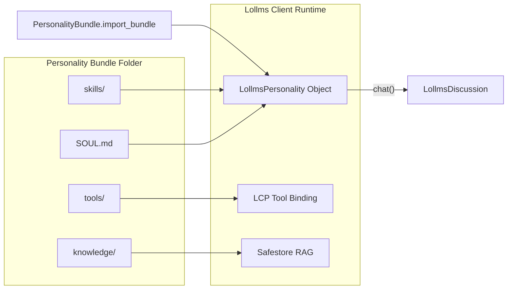

# 🧠 LollmsPersonality & Bundle Architecture

The `LollmsPersonality` system provides a sovereign, null-safe, and self-contained architecture for defining AI personas, attaching tools, and managing Retrieval-Augmented Generation (RAG) data sources. 

With the introduction of **Personality Bundles**, agents can now be fully packaged into structured folders, making them portable, shareable, and easy to version control.

---

## 📦 1. The Personality Bundle Format

A Personality Bundle is a standard directory containing a `SOUL.md` file and optional resource folders. The folder name should be the `snake_case` representation of the agent's name.

### Directory Structure
```text
my_cinema_agent/
├── SOUL.md                  # Core identity & system prompt (Hugging Face format)
├── tools/                   # Optional: Custom LCP Tools
│   ├── tool_pitch_writer.py # Single-file tool format
│   └── tool_scanner/        # Folder-based tool format
│       └── TOOL.py
├── skills/                  # Optional: Persistent AI skills
│   └── script_analysis/
│       └── SKILL.md
├── knowledge/               # Optional: Safestore RAG database
│   └── knowledge.db
└── assets/                  # Optional: Media assets
    ├── logo.png             # Agent icon
    └── voice.wav            # TTS voice sample
```

### The `SOUL.md` File
The `SOUL.md` file uses a Hugging Face Model Card format. It contains a YAML frontmatter block for metadata, followed by the raw system prompt.

**Example `SOUL.md`:**
```markdown
---
name: Cinema Concept Catalyst
author: lpm prompted by Bill
version: '1.0'
category: art_writing
temperature: 0.7
description: The Cinema Concept Catalyst is an ingenious and resourceful storyteller...
---

Act as the Cinematic Storyteller, an imaginative and resourceful artist who breathes life into stories...
```

---

## 🔄 2. Import & Export Workflow



### Importing a Bundle

To load a personality from a folder, use `PersonalityBundle.import_bundle`. It automatically parses the `SOUL.md`, mounts tools, loads skills, and initializes the RAG database.

```python
from lollms_client.lollms_personality import PersonalityBundle
from lollms_client import LollmsClient

client = LollmsClient(llm_binding_name="ollama", ...)

# Load the bundle
personality = PersonalityBundle.import_bundle(
    bundle_path="./personalities/my_cinema_agent",
    lollms_client=client
)

# Use it in a discussion
response = discussion.chat(
    user_message="Pitch me a sci-fi movie about time travel.",
    personality=personality
)
```

### Exporting a Bundle

You can serialize an existing `LollmsPersonality` object back into a folder structure.

```python
from lollms_client.lollms_personality import PersonalityBundle, LollmsPersonality

# 1. Create a personality programmatically
personality = LollmsPersonality(
    name="Code Reviewer",
    author="DevTeam",
    category="development",
    description="Reviews code for bugs and style.",
    system_prompt="You are an expert code reviewer..."
)

# 2. Export to disk
bundle_path = PersonalityBundle.export_bundle(
    personality=personality,
    output_dir="./exported_personalities"
)
print(f"Exported to: {bundle_path}")
```

---

## 🛠️ 3. Architecture & Deep Specification

### Null-Safety Doctrine
The `LollmsPersonality` is designed to be strictly null-safe. If no tools are provided, it uses a `_NullToolBinding`. If no data source is provided, `query_data()` returns an empty dictionary rather than raising an error. This allows the `ChatMixin` to execute without `if personality:` guards.

### Tool Resolution Matrix
The `tool_specs()` method resolves which tools the LLM is allowed to use based on the `tools` parameter passed during initialization.

| `tools` value | `_has_explicit_allowlist` | Behavior in `tool_specs()` |
| :--- | :--- | :--- |
| `None` | `False` | Expose ALL tools from the provided `client_binding`. |
| `LCPBinding` | `False` | Expose ALL tools from this specific binding instance. |
| `[]` (empty list) | `True` | Expose NO tools (empty allowlist). |
| `["tool_a", "tool_b"]` | `True` | Expose ONLY `tool_a` and `tool_b` from the binding. |

### Safestore RAG Integration
If a `knowledge/` folder containing a `knowledge.db` is found, the importer dynamically installs `safestore` via `pipmaster` (if not already installed) and wraps the search functionality into a standardized `data_source` callable.

```python
# Internal RAG wrapper generated by PersonalityBundle
def _rag_query(query: str) -> Dict[str, Any]:
    results = store.search(query, top_k=3)
    return {
        "success": True,
        "sources": [{"content": r["text"], "score": r["score"]}],
        "count": len(results),
        "query": query
    }
```

---

## 📚 4. API Reference

### `PersonalityBundle`

#### `PersonalityBundle.import_bundle(bundle_path, lollms_client=None) -> LollmsPersonality`
Imports a personality from a directory.
- **`bundle_path`**: Path to the personality folder.
- **`lollms_client`**: Optional client instance. Required for initializing Safestore RAG connections.
- **Returns**: A configured `LollmsPersonality` instance.

#### `PersonalityBundle.export_bundle(personality, output_dir) -> Path`
Exports a personality object to a directory.
- **`personality`**: The `LollmsPersonality` object to export.
- **`output_dir`**: The parent directory where the personality folder will be created.
- **Returns**: The `Path` to the newly created bundle folder.

#### `PersonalityBundle.parse_soul_md(soul_content) -> tuple[dict, str]`
Parses raw `SOUL.md` text into metadata and a system prompt.
- **`soul_content`**: The raw string content of the `SOUL.md` file.
- **Returns**: A tuple containing `(metadata_dict, system_prompt_str)`.

### `LollmsPersonality`

#### `__init__(...)`
- **`name`**: Display name of the agent.
- **`author`**: Creator string.
- **`category`**: Classification (e.g., `art_writing`, `development`).
- **`description`**: Human-readable summary.
- **`system_prompt`**: The core instructions for the LLM.
- **`icon`**: Path or URL to the agent's icon.
- **`tools`**: `None`, `LollmsToolBinding`, or `List[str]` of tool names.
- **`data_source`**: `None`, `str` (static context), or `Callable` (RAG function).
- **`script`**: Optional Python script string to execute custom logic.

#### `query_data(query: str) -> Dict[str, Any]`
Queries the attached RAG data source. Always returns a dictionary:
```python
{
    "success": bool,
    "sources": List[Dict[str, Any]],
    "count": int,
    "query": str
}
```

#### `tool_specs(client_binding=None) -> Dict[str, Dict[str, Any]]`
Resolves the tool allowlist against the available binding and returns the tool specifications formatted for the `LollmsDiscussion.chat()` method.
