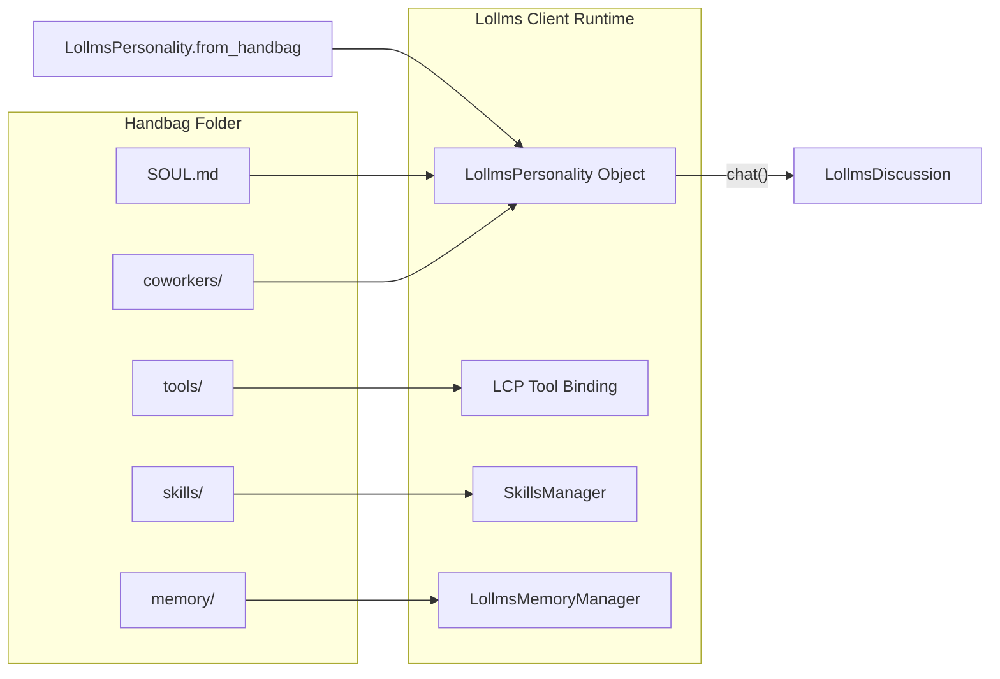

# 🧠 LollmsPersonality & The Handbag Architecture

The `LollmsPersonality` is the **sovereign universal execution unit** in `lollms_client`. It replaces the legacy bifurcation between stateless "prompt wrappers" and stateful "autonomous agents". A single `LollmsPersonality` scales progressively from a simple 5-line system prompt to a fully-armed, stateful, multi-persona **Crew Handbag** with tools, memory, skills, and multimodal assets.

---

## 📦 1. The Handbag (Portable Resource Folder)

The **Handbag** is a self-contained, portable directory that carries ALL of a personality's resources. It allows you to package multiple personas, tools, skills, RAG knowledge, memory, and multimodal assets into a single folder.

### Folder Structure
```text
my_handbag/
├── SOUL.md                  # Primary personality (YAML frontmatter + Markdown body)
├── handbag.yaml             # Optional manifest (memory scope, default settings)
├── coworkers/               # Multi-persona support (Crew Handbag)
│   ├── coder/
│   │   └── SOUL.md
│   └── researcher/
│       └── SOUL.md
├── tools/                   # LCP toolsets (one .py file per toolset library)
│   ├── python_execution.py
│   └── web_search.py
├── skills/                  # SKILL.md files (tiered visibility)
│   ├── python_patterns/
│   │   └── SKILL.md
│   └── advanced_algorithms/
│       └── SKILL.md
├── assets/                  # Multimodal assets (icons, voice samples, 3D models)
│   ├── logo.png
│   └── voice.wav
└── memory/                  # Optional: Independent Life memory database
    └── memory.db
```

### The `SOUL.md` File
The `SOUL.md` file uses a Hugging Face Model Card format. It contains a YAML frontmatter block for metadata, followed by the raw system prompt.

**Example `SOUL.md`:**
```markdown
---
name: Cinema Concept Catalyst
author: lpm prompted by Bill
version: '1.0'
category: art_writing
temperature: 0.7
description: The Cinema Concept Catalyst is an ingenious and resourceful storyteller...
---

Act as the Cinematic Storyteller, an imaginative and resourceful artist who breathes life into stories...
```

---

## 🔄 2. The Grand Unification Architecture


```mermaid
flowchart LR
    subgraph Handbag[Handbag Folder]
        direction TB
        SOUL[SOUL.md]
        Tools[tools/]
        Skills[skills/]
        Memory[memory/]
        Coworkers[coworkers/]
    end

    subgraph Runtime[Lollms Client Runtime]
        direction TB
        LP[LollmsPersonality Object]
        LCP[LCP Tool Binding]
        SM[SkillsManager]
        MM[LollmsMemoryManager]
    end

    LollmsPersonality.from_handbag --> LP
    Tools --> LCP
    Memory --> MM
    Skills --> SM
    SOUL --> LP
    Coworkers --> LP
    
    LP -- chat() --> LollmsDiscussion
```

### Progressive Enhancement
A personality does not require a full Handbag. It scales progressively:
1. **Simple Personality**: Created in code. Stateless. Contains a `SOUL` string and optional inline tools.
2. **Handbag Personality**: Created from a folder via `from_handbag()`. Stateful. Lazily instantiates `SkillsManager`, `LollmsMemoryManager`, and `LCPBinding` based on the folder structure.

### Loading a Handbag

To load a personality from a folder, use the `LollmsPersonality.from_handbag()` factory. It automatically parses the `SOUL.md`, mounts tools, loads skills, and initializes the memory database.

```python
from lollms_client.lollms_personality import LollmsPersonality

# Load a multi-persona handbag with its own persistent memory
crew_pers = LollmsPersonality.from_handbag("./my_crew_handbag")

# The primary persona is active. It has memory, tools, and skills.
# It can dynamically switch to "coder" using tool_switch_persona.
response = discussion.chat(user_message="Build a Python script.", personality=crew_pers)
```

### The Crew Handbag (Multi-Persona Routing)

A single Handbag can contain a `coworkers/` directory with subdirectories for each crewmate. When loaded, the primary `LollmsPersonality` object acts as a router.

All crewmates share the **same** Handbag tools, memory, and assets, but they have different system prompts (`SOUL.md`).

```python
# List all available personas in the crew
print("Available crewmates:", crew_pers.list_crewmates())

# Dynamically switch the active persona (tools and memory remain shared)
crew_pers.switch_crewmate("coder")
```

---

## 🛠️ 3. Architecture & Deep Specification

### Null-Safety Doctrine
The `LollmsPersonality` is designed to be strictly null-safe. If no tools are provided, it uses a `_NullToolBinding`. If no data source is provided, `query_data()` returns an empty dictionary rather than raising an error. This allows the `ChatMixin` to execute without `if personality:` guards.

If no personality is passed to a discussion, a `NullPersonality` is injected by default. `bool(NullPersonality())` evaluates to `False`, ensuring backward compatibility with legacy conditional checks while maintaining full null-safety.

### Tool Resolution Matrix
The `tool_specs()` method resolves which tools the LLM is allowed to use based on the `tools` parameter passed during initialization.

| `tools` value | `_has_explicit_allowlist` | Behavior in `tool_specs()` |
| :--- | :--- | :--- |
| `None` | `False` | Expose ALL tools from the provided `client_binding`. |
| `LCPBinding` | `False` | Expose ALL tools from this specific binding instance. |
| `[]` (empty list) | `True` | Expose NO tools (empty allowlist). |
| `["tool_a", "tool_b"]` | `True` | Expose ONLY `tool_a` and `tool_b` from the binding. |

### Data Source Normalization
The `data_source` parameter accepts `None`, a static `str`, or a `Callable`. During initialization, these are normalized into a unified `_query_data_fn(query: str) -> Dict[str, Any]` that guarantees the following return schema:

```python
{
    "success": bool,
    "sources": [{"content": str, "score": float, "source": str}],
    "count": int,
    "query": str
}
```

### Memory Scoping (Independent vs. System-Managed Life)
The `LollmsPersonality` supports two distinct memory paradigms:
1. **Independent Life**: If the Handbag contains a `memory/` folder, `from_handbag()` instantiates a `LollmsMemoryManager` and stores it in `personality.memory_manager`. The personality evolves continuously across any host application.
2. **System-Managed Life**: If the Handbag has no `memory/` folder, `personality.memory_manager` is `None`. The host application (`LollmsDiscussion`) provides its own `MemoryManager`. The personality resets to its baseline `SOUL.md` in new discussions, but the discussion itself remembers the user's interactions.

### Skill Efficiency (Tiered Visibility)
Skills are `SKILL.md` files managed by the `SkillsManager`. They use a tiered visibility system to manage context budget across personalities with 1 to 10,000 skills:
*   **`visible`**: Automatically loaded into the system prompt. Costs 0 turns.
*   **`loadable`**: Listed in the prompt (name + description). The LLM uses `tool_load_skill` to pull the full content (Costs 1 turn).
*   **`searchable`**: Hidden from the prompt entirely. The LLM uses `tool_search_skills` then `tool_load_skill` (Costs 2 turns). Used for massive skill banks.

The `SkillsManager.build_skill_tools()` method dynamically registers `tool_load_skill` and `tool_search_skills` based on the presence of `loadable` and `searchable` skills.

---

## 📚 4. API Reference

### `LollmsPersonality`

#### `LollmsPersonality.from_handbag(path: Union[str, Path]) -> 'LollmsPersonality'`
Factory to construct a personality from a Handbag folder.
- **`path`**: Path to the Handbag directory.
- **Returns**: A configured `LollmsPersonality` instance with lazily instantiated stateful components.

#### `__init__(...)`
- **`name`**: Display name of the agent.
- **`author`**: Creator string.
- **`category`**: Classification (e.g., `art_writing`, `development`).
- **`description`**: Human-readable summary.
- **`system_prompt`**: The core instructions for the LLM.
- **`metadata`**: YAML frontmatter from `SOUL.md`.
- **`tools`**: `None`, `LollmsToolBinding`, or `List[str]` of tool names.
- **`data_source`**: `None`, `str` (static context), or `Callable` (RAG function).
- **`handbag_path`**: Path to the Handbag folder (if loaded from one).
- **`skills_manager`**: `SkillsManager` instance (if loaded from Handbag).
- **`memory_manager`**: `LollmsMemoryManager` instance (Independent Life).
- **`workspace_path`**: Optional workspace path for standalone mode.
- **`enable_git_management`**: If `True`, dynamically mounts Git Manager Toolset if `.git` is detected.

#### `tool_specs(client_binding=None, **discover_kwargs) -> Dict[str, Dict[str, Any]]`
Resolves the tool allowlist against the available binding and returns the tool specifications formatted for the `LollmsDiscussion.chat()` method.

#### `query_data(query: str) -> Dict[str, Any]`
Queries the attached RAG data source. Always returns a normalized dictionary, never raises an exception.

#### `has_data` (property)
Returns `True` when any data source or RAG callback is configured.

### `PersonalityBundle`

#### `PersonalityBundle.import_bundle(bundle_path, lollms_client=None) -> LollmsPersonality`
Imports a legacy personality bundle from a directory. (Note: `from_handbag()` is the modern equivalent).

#### `PersonalityBundle.export_bundle(personality, output_dir) -> Path`
Exports a personality object to a directory.

#### `PersonalityBundle.parse_soul_md(soul_content) -> tuple[dict, str]`
Parses raw `SOUL.md` text into metadata and a system prompt.

### `NullPersonality`
A no-op personality substituted when `personality=None` is passed to `chat()`. It bypasses the full `__init__` to avoid side-effects and evaluates to `False` when used in boolean contexts.