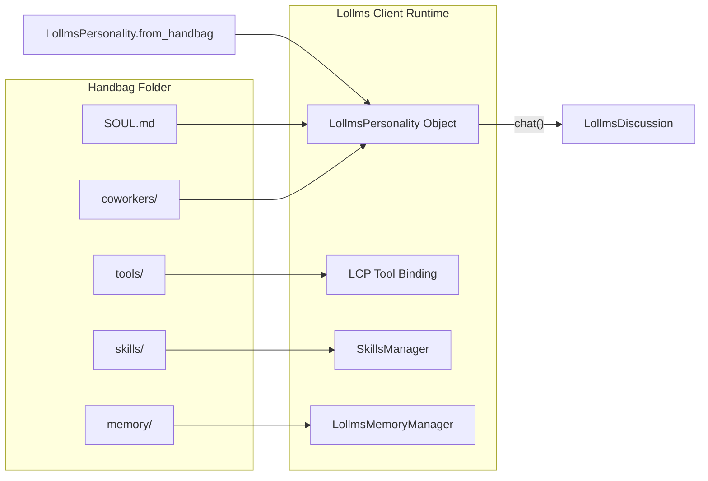

# 🧠 LollmsPersonality & The Handbag Architecture

The `LollmsPersonality` is the **sovereign universal execution unit** in `lollms_client`. It replaces the legacy bifurcation between stateless "prompt wrappers" and stateful "autonomous agents". A single `LollmsPersonality` scales progressively from a simple 5-line system prompt to a fully-armed, stateful, multi-persona **Crew Handbag** with tools, memory, skills, and multimodal assets.

---

## 📦 1. The Handbag (Portable Resource Folder)

The **Handbag** is a self-contained, portable directory that carries ALL of a personality's resources. It allows you to package multiple personas, tools, skills, RAG knowledge, memory, and multimodal assets into a single folder.

### Folder Structure
```text
my_handbag/
├── SOUL.md                  # Primary personality (YAML frontmatter + Markdown body)
├── handbag.yaml             # Optional manifest (memory scope, default settings)
├── coworkers/               # Multi-persona support (Crew Handbag)
│   ├── coder/
│   │   └── SOUL.md
│   └── researcher/
│       └── SOUL.md
├── tools/                   # LCP toolsets (one .py file per toolset library)
│   ├── python_execution.py
│   └── web_search.py
├── skills/                  # SKILL.md files (tiered visibility)
│   ├── python_patterns/
│   │   └── SKILL.md
│   └── advanced_algorithms/
│       └── SKILL.md
├── assets/                  # Multimodal assets (icons, voice samples, 3D models)
│   ├── logo.png
│   └── voice.wav
└── memory/                  # Optional: Independent Life memory database
    └── memory.db
```

### The `SOUL.md` File
The `SOUL.md` file uses a Hugging Face Model Card format. It contains a YAML frontmatter block for metadata, followed by the raw system prompt.

**Example `SOUL.md`:**
```markdown
---
name: Cinema Concept Catalyst
author: lpm prompted by Bill
version: '1.0'
category: art_writing
temperature: 0.7
description: The Cinema Concept Catalyst is an ingenious and resourceful storyteller...
---

Act as the Cinematic Storyteller, an imaginative and resourceful artist who breathes life into stories...
```

---

## 🔄 2. The Grand Unification Architecture


```mermaid
flowchart LR
    subgraph Handbag[Handbag Folder]
        direction TB
        SOUL[SOUL.md]
        Tools[tools/]
        Skills[skills/]
        Memory[memory/]
        Coworkers[coworkers/]
    end

    subgraph Runtime[Lollms Client Runtime]
        direction TB
        LP[LollmsPersonality Object]
        LCP[LCP Tool Binding]
        SM[SkillsManager]
        MM[LollmsMemoryManager]
    end

    LollmsPersonality.from_handbag --> LP
    Tools --> LCP
    Memory --> MM
    Skills --> SM
    SOUL --> LP
    Coworkers --> LP
    
    LP -- chat() --> LollmsDiscussion
```

### Progressive Enhancement
A personality does not require a full Handbag. It scales progressively:
1. **Simple Personality**: Created in code. Stateless. Contains a `SOUL` string and optional inline tools.
2. **Handbag Personality**: Created from a folder via `from_handbag()`. Stateful. Lazily instantiates `SkillsManager`, `LollmsMemoryManager`, and `LCPBinding` based on the folder structure.

### Loading a Handbag

To load a personality from a folder, use the `LollmsPersonality.from_handbag()` factory. It automatically parses the `SOUL.md`, mounts tools, loads skills, and initializes the memory database.

```python
from lollms_client.lollms_personality import LollmsPersonality

# Load a multi-persona handbag with its own persistent memory
crew_pers = LollmsPersonality.from_handbag("./my_crew_handbag")

# The primary persona is active. It has memory, tools, and skills.
# It can dynamically switch to "coder" using tool_switch_persona.
response = discussion.chat(user_message="Build a Python script.", personality=crew_pers)
```

### The Crew Handbag (Multi-Persona Routing)

A single Handbag can contain a `coworkers/` directory with subdirectories for each crewmate. When loaded, the primary `LollmsPersonality` object acts as a router.

All crewmates share the **same** Handbag tools, memory, and assets, but they have different system prompts (`SOUL.md`).

```python
# List all available personas in the crew
print("Available crewmates:", crew_pers.list_crewmates())

# Dynamically switch the active persona (tools and memory remain shared)
crew_pers.switch_crewmate("coder")
```

---

## 📝 Document Editing & Annotation (PDF / DOCX / PPTX)

The `document_editor` toolset provides autonomous capabilities for surgically modifying and annotating documents without destroying the underlying file structure. 

### Available Tools

#### `tool_edit_document_text`
Surgically edits text content in a PDF, DOCX, or PPTX document.
- **`file_name`**: The path to the document file.
- **`operation`**: `"insert"`, `"update"`, or `"remove"`.
- **`search_text`**: The exact text to search for. For `"insert"`, this is the anchor text after which the new text is added.
- **`replacement_text`**: The new text (required for `"update"` and `"insert"`).
- **`pages`**: (PDF only) Pages to apply the edit, e.g., `"1-3, 5"`. Empty means all pages.
- **`match_case`**: Boolean for case-sensitive matching.
- **`whole_word`**: Boolean for whole-word matching.

#### `tool_annotate_document`
Adds highlights or comments to a PDF or DOCX document.
- **`file_name`**: The path to the document file.
- **`annotation_type`**: `"comment"` or `"highlight"`.
- **`search_text`**: The text to locate for annotation.
- **`comment`**: The comment text (required for `"comment"` type).
- **`pages`**: (PDF only) Pages to apply the annotation.
- **`highlight_color`**: `"yellow"`, `"red"`, `"green"`, or `"blue"`.

### Technical Notes
- **PDFs**: Uses `PyMuPDF` (`fitz`) redactions for `update` and `remove` operations to permanently remove underlying text, ensuring clean modifications. Annotations are native PDF annotations.
- **DOCX**: Uses `python-docx`. Highlighting applies native Word highlighting. Comments are currently inserted as inline `[COMMENT: ...]` runs for stability.
- **PPTX**: Uses `python-pptx`. Edits are applied at the run level to preserve slide formatting.

## 🛠️ 3. Architecture & Deep Specification

### Null-Safety Doctrine
The `LollmsPersonality` is designed to be strictly null-safe. If no tools are provided, it uses a `_NullToolBinding`. If no data source is provided, `query_data()` returns an empty dictionary rather than raising an error. This allows the `ChatMixin` to execute without `if personality:` guards.

If no personality is passed to a discussion, a `NullPersonality` is injected by default. `bool(NullPersonality())` evaluates to `False`, ensuring backward compatibility with legacy conditional checks while maintaining full null-safety.

### Tool Resolution Matrix
The `tool_specs()` method resolves which tools the LLM is allowed to use based on the `tools` parameter passed during initialization.

| `tools` value | `_has_explicit_allowlist` | Behavior in `tool_specs()` |
| :--- | :--- | :--- |
| `None` | `False` | Expose ALL tools from the provided `client_binding`. |
| `LCPBinding` | `False` | Expose ALL tools from this specific binding instance. |
| `[]` (empty list) | `True` | Expose NO tools (empty allowlist). |
| `["tool_a", "tool_b"]` | `True` | Expose ONLY `tool_a` and `tool_b` from the binding. |

### Multi-Source RAG Architecture (`RAGDataSource`)
`LollmsPersonality` supports registering multiple named, described RAG knowledge bases. Each data source specifies its purpose, allowing both automated turn pre-hydration and on-demand agentic querying via `tool_query_rag`.

#### `RAGDataSource` Schema
```python
from lollms_client.lollms_personality import RAGDataSource

ds = RAGDataSource(
    name="tech_manuals",                      # Unique identifier
    description="Architecture & API guides",  # Exposed to LLM for cognitive routing
    query_fn=my_query_callback,               # Retrieval function
    store=my_vector_store,                    # Underlying storage instance (passed as `ss` or `store`)
    auto_query=True                           # Pre-hydrate on turn start (True) or tool-only (False)
)
```

#### Multi-Source Registration Patterns
```python
# 1. Using explicit list of RAGDataSource objects
personality = LollmsPersonality(
    name="ResearchSpecialist",
    data_sources=[
        RAGDataSource(name="manuals", description="Product user manuals", query_fn=query_rag_callback, store=manuals_store, auto_query=True),
        RAGDataSource(name="code_repos", description="Source code indexing", query_fn=query_rag_callback, store=code_store, auto_query=False)
    ]
)

# 2. Using dictionary definitions
personality = LollmsPersonality(
    name="Assistant",
    data_sources={
        "customer_faq": {"description": "Customer support FAQ", "query_fn": faq_engine, "auto_query": True},
        "legal_terms": {"description": "Terms of service and GDPR compliance", "query_fn": legal_engine, "auto_query": False}
    }
)

# 3. Dynamic runtime registration
personality.add_data_source(
    name="live_telemetry",
    description="Real-time server logs and metrics",
    query_fn=logs_query_fn,
    auto_query=False
)
```

#### Flexible Calling Conventions & Signature Resolution
The query dispatcher automatically resolves caller signatures via `inspect.signature`, supporting functions like:
- `fn(query)`
- `fn(query, ss, ...)`
- `fn(query, store, rag_top_k=..., rag_min_similarity_percent=..., mode=...)`

All raw outputs (dictionaries with `sources`, lists of chunk dictionaries with `chunk_text`, `file_path`, `similarity_percent`, `document_metadata`, or plain strings) are normalized to:

```python
{
    "success": bool,
    "sources": [
        {
            "content": str,
            "score": float,
            "source": str,
            "title": str,
            "metadata": dict,
            "datasource_name": str
        }
    ],
    "count": int,
    "query": str
}
```

#### On-Demand RAG Tooling (`tool_query_rag`)
When a personality has RAG data sources, `build_rag_tools()` generates the `tool_query_rag` tool and `build_rag_system_block()` injects an overview into the system prompt:
```xml
<tool>{"name": "tool_query_rag", "parameters": {"query": "JWT token expiration", "datasource_name": "tech_manuals"}}</tool>
```

### Memory Scoping (Independent vs. System-Managed Life)
The `LollmsPersonality` supports two distinct memory paradigms:
1. **Independent Life**: If the Handbag contains a `memory/` folder, `from_handbag()` instantiates a `LollmsMemoryManager` and stores it in `personality.memory_manager`. The personality evolves continuously across any host application.
2. **System-Managed Life**: If the Handbag has no `memory/` folder, `personality.memory_manager` is `None`. The host application (`LollmsDiscussion`) provides its own `MemoryManager`. The personality resets to its baseline `SOUL.md` in new discussions, but the discussion itself remembers the user's interactions.

### Skill Efficiency (Tiered Visibility)
Skills are `SKILL.md` files managed by the `SkillsManager`. They use a tiered visibility system to manage context budget across personalities with 1 to 10,000 skills:
*   **`visible`**: Automatically loaded into the system prompt. Costs 0 turns.
*   **`loadable`**: Listed in the prompt (name + description). The LLM uses `tool_load_skill` to pull the full content (Costs 1 turn).
*   **`searchable`**: Hidden from the prompt entirely. The LLM uses `tool_search_skills` then `tool_load_skill` (Costs 2 turns). Used for massive skill banks.

The `SkillsManager.build_skill_tools()` method dynamically registers `tool_load_skill` and `tool_search_skills` based on the presence of `loadable` and `searchable` skills.

---

## ⚡ 4. Buffered Execution Strategy & Streaming Protocol

The `LollmsPersonality.chat()` method uses a **Buffered Execution Strategy** managed by the `_AgentStreamState` interceptor. This strategy allows the LLM to emit multiple functional tags (`<tool>`, `<artifact>`, `<unlock_file>`, etc.) within a single response, which are buffered and executed sequentially at the end of the message.

### The Dependency Constraint (CRITICAL)
While the agent can batch multiple independent calls in a single response, **dependent calls must be split across separate rounds**. If the agent needs the result of Tool A to construct the parameters for Tool B, it MUST emit Tool A, end its response, and wait for the system to return the result before emitting Tool B in the next round.

### Rolling Window Compaction & Base Context Sync (Critical for Anti-Amnesia)

To balance KV-cache efficiency with long-term context coherence during multi-step artifact creation, `LollmsPersonality` implements a **Rolling Window Compaction Protocol**.

**The Problem**: In long agentic loops (e.g., 10+ rounds of code refactoring), keeping the full XML body of every `<artifact>` tag in `virtual_history` quickly exhausts the context window. However, simply stripping old artifact bodies to placeholders causes "amnesia" — the LLM forgets the code it wrote 3 steps ago.

**The Solution**: 
1. **Eviction Limit**: We maintain a rolling window of the **last 4 consecutive artifact operations** in `virtual_history`. 
2. **Base Context Sync**: When a 5th artifact operation occurs, the oldest artifact round is **evicted** (popped) from `virtual_history`. To prevent amnesia, the system **rebuilds the Base Context** (the initial system prompt + workspace tree injected into the first user message). The workspace tree is refreshed from disk, meaning the newly created/modified file's full content is now loaded into the Base Context under `[C] Fully Loaded File Contents`.
3. **Trade-off**: This destroys the KV-cache up to the start of the current turn, but it guarantees the LLM always has full visibility of the current workspace state without infinitely growing the history.

**Full History Compaction (95% Limit)**:
If the context window hits 95% capacity despite the rolling window, the system autonomously summarizes the entire `virtual_history` into a dense paragraph. Before injecting this summary, it forces a **full Base Context Sync**, ensuring all artifacts on disk are reflected in the workspace tree before the old history is discarded.

**Example of CORRECT behavior (Independent calls batched):**
```xml
I will search for the files and check the git status simultaneously.
<tool>{"name": "tool_find_files", "parameters": {"pattern": "*.py"}}</tool>
<tool>{"name": "tool_execute_shell_command", "parameters": {"command": "git status"}}</tool>
```

**Example of CORRECT behavior (Dependent calls split):**
```xml
Let me find the file first.
<tool>{"name": "tool_find_files", "parameters": {"pattern": "config.yaml"}}</tool>
```
*(System returns `config.yaml` found at `./src/config.yaml`)*
```xml
Now I will read it.
<tool>{"name": "tool_read_file", "parameters": {"path": "./src/config.yaml"}}</tool>
```

## 📚 4. API Reference

### `LollmsPersonality`

#### `LollmsPersonality.from_handbag(path: Union[str, Path]) -> 'LollmsPersonality'`
Factory to construct a personality from a Handbag folder.
- **`path`**: Path to the Handbag directory.
- **Returns**: A configured `LollmsPersonality` instance with lazily instantiated stateful components.

#### `__init__(...)`
- **`name`**: Display name of the agent.
- **`author`**: Creator string.
- **`category`**: Classification (e.g., `art_writing`, `development`).
- **`description`**: Human-readable summary.
- **`system_prompt`**: The core instructions for the LLM.
- **`metadata`**: YAML frontmatter from `SOUL.md`.
- **`tools`**: `None`, `LollmsToolBinding`, or `List[str]` of tool names.
- **`data_source`**: `None`, `str` (static context), or `Callable` (RAG function).
- **`handbag_path`**: Path to the Handbag folder (if loaded from one).
- **`skills_manager`**: `SkillsManager` instance (if loaded from Handbag).
- **`memory_manager`**: `LollmsMemoryManager` instance (Independent Life).
- **`workspace_path`**: Optional workspace path for standalone mode.
- **`enable_git_management`**: If `True`, dynamically mounts Git Manager Toolset if `.git` is detected.

#### `tool_specs(client_binding=None, **discover_kwargs) -> Dict[str, Dict[str, Any]]`
Resolves the tool allowlist against the available binding and returns the tool specifications formatted for the `LollmsDiscussion.chat()` method.

#### `query_data(query: str) -> Dict[str, Any]`
Queries the attached RAG data source. Always returns a normalized dictionary, never raises an exception.

#### `has_data` (property)
Returns `True` when any data source or RAG callback is configured.

### `PersonalityBundle`

#### `PersonalityBundle.import_bundle(bundle_path, lollms_client=None) -> LollmsPersonality`
Imports a legacy personality bundle from a directory. (Note: `from_handbag()` is the modern equivalent).

#### `PersonalityBundle.export_bundle(personality, output_dir) -> Path`
Exports a personality object to a directory.

#### `PersonalityBundle.parse_soul_md(soul_content) -> tuple[dict, str]`
Parses raw `SOUL.md` text into metadata and a system prompt.

### `NullPersonality`
A no-op personality substituted when `personality=None` is passed to `chat()`. It bypasses the full `__init__` to avoid side-effects and evaluates to `False` when used in boolean contexts.

---

## 📡 5. Event Modes & Streaming Protocol (Live Telemetry)

When using the independent `LollmsPersonality.chat()` method (outside of a `LollmsDiscussion`), you can control how execution telemetry is reported to the `streaming_callback` using the `event_mode` parameter.

### The `event_mode` Parameter
The `event_mode` parameter accepts an `EventMode` enum value (imported from `lollms_client.lollms_types`).

| Mode | Behavior | Use Case |
| :--- | :--- | :--- |
| **`EventMode.PROCESSING_TAG_MODE`** (Default) | Injects `<processing>` tags into the conversational text stream (`MSG_TYPE_CHUNK`). The tag opens when an action is detected, live chunks stream inside it, and a status marker (`<status>success</status>` or `<status>failure</status>`) is appended before closing. | CLI applications or simple text renderers that parse `<processing>` blocks to display tool execution progress. |
| **`EventMode.FULL_CALLBACK_MODE`** | Emits specific `MSG_TYPE_*` lifecycle events (`START`, `CHUNK`, `END`) via the callback with structured metadata. **No `<processing>` tags are injected into the text stream.** | Rich UI applications (like `lollms_code`) that render dedicated panels for tool execution and artifact building based on structured event types. |
| **`EventMode.MIXED_MODE`** | Emits both `<processing>` tags in the text stream AND specific `MSG_TYPE_*` lifecycle events. | Transitioning applications or debugging environments where both raw text and structured panels are needed. |
| **`EventMode.SILENT_MODE`** | Suppresses all event reporting. Only the final conversational text is streamed. | Background tasks or silent processing where telemetry is irrelevant. |

### Lifecycle Event Specification

When actions are detected in the LLM's output stream, the following lifecycle events are dispatched. The system distinguishes between **Stream Events** (generated by the interceptor as it parses the LLM) and **Execution Events** (generated by the host after it runs the tool or applies the patch).

When a functional tag is detected, a `START` event is sent. As chunks arrive, they are streamed. When the tag closes, a stream-complete `END` event is sent. Text continues to stream normally between tags. If a `<done/>` tag is detected, the buffered actions are executed in the order they were received, and the final output is handed to the user. If no `<done/>` is found, a new round is spun up.

#### 1. Tool Execution (`<tool>`)
**Stream Events:**
*   **`MSG_TYPE_TOOL_START`**: Fired immediately when the opening `<tool>` tag is detected.
    *   Meta: `{"tool_name": "pending", "parameters": {}}`
*   **`MSG_TYPE_CHUNK`**: Raw chunks of the tool JSON are streamed with meta `{"live_tool_chunk": True}`.
*   **`MSG_TYPE_TOOL_END`**: Fired when the `</tool>` tag is detected and the JSON is parsed.
    *   Meta: `{"tool_name": str, "success": True, "output": None, "error": None, "stream_complete": True}`

**Execution Events (Host-Generated):**
*   **`MSG_TYPE_TOOL_START`**: Fired just before the host executes the callable.
    *   Meta: `{"tool_name": str, "parameters": dict, "executing": True}`
*   **`MSG_TYPE_TOOL_END`**: Fired after the tool executes. Contains the final result.
    *   Meta: `{"tool_name": str, "success": bool, "output": str, "error": str|None}`

#### 2. Artefact Building (`<artifact>`)
**Stream Events:**
*   **`MSG_TYPE_ARTEFACT_BUILD_START`**: Fired immediately when the opening `<artifact>` tag is detected.
    *   Meta: `{"title": str, "art_type": "code", "language": str|None, "is_patch": bool}`
*   **`MSG_TYPE_CHUNK`**: Raw chunks of the artifact content are streamed with meta `{"live_artifact_chunk": True}`.
*   **`MSG_TYPE_ARTEFACT_BUILD_END`**: Fired when the `</artifact>` tag is detected.
    *   Meta: `{"title": str, "art_type": "code", "success": True, "error": None, "stream_complete": True}`

**Execution Events (Host-Generated):**
*   **`MSG_TYPE_ARTEFACT_BUILD_END`**: Fired after the artifact is written to disk or patched.
    *   Meta: `{"title": str, "art_type": "code", "version": int, "success": bool, "error": str|None}`

#### 3. Context Visibility (`<unlock_file>`, `<lock_file>`, etc.)
**Stream Events:**
*   **`MSG_TYPE_CONTEXT_UPDATE`**: Fired when visibility tags are detected.
    *   Meta: `{"action": str, "files": [], "status": "streaming"}`

**Execution Events (Host-Generated):**
*   **`MSG_TYPE_CONTEXT_UPDATE`**: Fired after the host applies the visibility changes.
    *   Meta: `{"action": str, "files": list[str], "status": "success"|"failure", "error": str|None}`

#### 4. Processing Tags (`PROCESSING_TAG_MODE` only)
When in `PROCESSING_TAG_MODE`, the stream interceptor automatically wraps execution in `<processing>` tags:
```xml
<processing type="tool" title="tool_execute_shell_command">
{"name": "tool_execute_shell_command", "parameters": {"command": "ls"}}
<status>success</status>
</processing>
```
If an execution fails, the status marker includes the error:
```xml
<processing type="tool" title="tool_execute_shell_command">
<status>failure</status>
<error>Command not found</error>
</processing>
```
**Example: Using `FULL_CALLBACK_MODE` in a standalone script**
```python
from lollms_client.lollms_types import MSG_TYPE, EventMode

def my_callback(chunk: str, msg_type: MSG_TYPE, meta: dict) -> bool:
    if msg_type == MSG_TYPE.MSG_TYPE_TOOL_START:
        if meta.get("executing"):
            print(f"\n[Executing Tool] {meta['tool_name']} with params: {meta['parameters']}")
        else:
            print(f"\n[Tool Stream Detected] {meta['tool_name']}")
    elif msg_type == MSG_TYPE.MSG_TYPE_TOOL_END:
        if meta.get("stream_complete"):
            print(f"\n[Tool Stream Complete] {meta['tool_name']}")
        else:
            print(f"\n[Tool Execution Finished] {meta['tool_name']} - Success: {meta['success']}")
    elif msg_type == MSG_TYPE.MSG_TYPE_CHUNK:
        # In FULL_CALLBACK_MODE, this will ONLY contain conversational text, no <processing> tags.
        print(chunk, end="", flush=True)
    return True

personality.chat(
    prompt="Analyze the data in data.csv",
    streaming_callback=my_callback,
    event_mode=EventMode.FULL_CALLBACK_MODE
)
```

---

## 📚 5. API Reference

### `LollmsPersonality`

#### `LollmsPersonality.from_handbag(path: Union[str, Path]) -> 'LollmsPersonality'`
Factory to construct a personality from a Handbag folder.
- **`path`**: Path to the Handbag directory.
- **Returns**: A configured `LollmsPersonality` instance with lazily instantiated stateful components.

#### `__init__(...)`
- **`name`**: Display name of the agent.
- **`author`**: Creator string.
- **`category`**: Classification (e.g., `art_writing`, `development`).
- **`description`**: Human-readable summary.
- **`system_prompt`**: The core instructions for the LLM.
- **`metadata`**: YAML frontmatter from `SOUL.md`.
- **`tools`**: `None`, `LollmsToolBinding`, or `List[str]` of tool names.
- **`data_source`**: `None`, `str` (static context), or `Callable` (RAG function).
- **`handbag_path`**: Path to the Handbag folder (if loaded from one).
- **`skills_manager`**: `SkillsManager` instance (if loaded from Handbag).
- **`memory_manager`**: `LollmsMemoryManager` instance (Independent Life).
- **`workspace_path`**: Optional workspace path for standalone mode.
- **`enable_git_management`**: If `True`, dynamically mounts Git Manager Toolset if `.git` is detected.

#### `tool_specs(client_binding=None, **discover_kwargs) -> Dict[str, Dict[str, Any]]`
Resolves the tool allowlist against the available binding and returns the tool specifications formatted for the `LollmsDiscussion.chat()` method.

#### `query_data(query: str) -> Dict[str, Any]`
Queries the attached RAG data source. Always returns a normalized dictionary, never raises an exception.

#### `has_data` (property)
Returns `True` when any data source or RAG callback is configured.

### `PersonalityBundle`

#### `PersonalityBundle.import_bundle(bundle_path, lollms_client=None) -> LollmsPersonality`
Imports a legacy personality bundle from a directory. (Note: `from_handbag()` is the modern equivalent).

#### `PersonalityBundle.export_bundle(personality, output_dir) -> Path`
Exports a personality object to a directory.

#### `PersonalityBundle.parse_soul_md(soul_content) -> tuple[dict, str]`
Parses raw `SOUL.md` text into metadata and a system prompt.

### `NullPersonality`
A no-op personality substituted when `personality=None` is passed to `chat()`. It bypasses the full `__init__` to avoid side-effects and evaluates to `False` when used in boolean contexts.